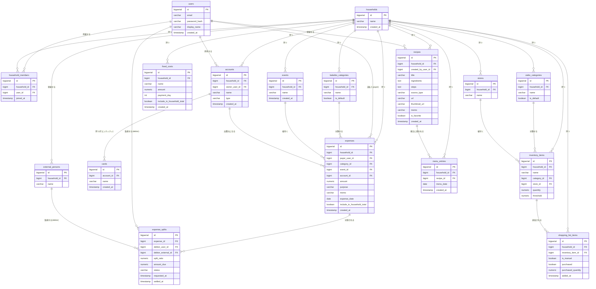

# データモデル

[← 要件定義書に戻る](../requirements.md)

要件定義段階のER図であり、実装時のテーブル名・カラム名は変更されうる（MyBatis Mapper実装時に確定させる）。

---

## 1. ER 図

---

## 2. テーブル定義

### users（ユーザー）

| カラム名 | 型 | 必須 | 備考 |
| --- | --- | --- | --- |
| id | BIGSERIAL | ○ | PK |
| email | VARCHAR(255) | ○ | UNIQUE。ログインに使用 |
| password_hash | VARCHAR(255) | ○ | BCryptによるハッシュ |
| display_name | VARCHAR(50) | ○ | 表示名 |
| created_at | TIMESTAMP | ○ | 登録日時 |

### households（世帯グループ）／household_members（世帯メンバー）

| カラム名 | 型 | 必須 | 備考 |
| --- | --- | --- | --- |
| households.id | BIGSERIAL | ○ | PK |
| households.name | VARCHAR(100) | ○ | 世帯グループ名 |
| household_members.household_id | BIGINT | ○ | FK → households.id |
| household_members.user_id | BIGINT | ○ | FK → users.id |

### external_persons（世帯外の精算相手）

| カラム名 | 型 | 必須 | 備考 |
| --- | --- | --- | --- |
| id | BIGSERIAL | ○ | PK |
| household_id | BIGINT | ○ | FK → households.id |
| name | VARCHAR(50) | ○ | 非アプリ利用者の表示名 |

### kakeibo_categories（家計簿カテゴリーマスタ）

| カラム名 | 型 | 必須 | 備考 |
| --- | --- | --- | --- |
| id | BIGSERIAL | ○ | PK |
| household_id | BIGINT | ○ | FK → households.id |
| name | VARCHAR(50) | ○ | カテゴリー名 |
| is_default | BOOLEAN | ○ | システムデフォルトか否か |

### accounts（口座）／cards（カード）

| カラム名 | 型 | 必須 | 備考 |
| --- | --- | --- | --- |
| accounts.id | BIGSERIAL | ○ | PK |
| accounts.household_id | BIGINT | ○ | FK → households.id |
| accounts.owner_user_id | BIGINT | ○ | FK → users.id（口座の所有者） |
| accounts.name | VARCHAR(50) | ○ | 口座名（例：〇〇銀行、PayPay 等） |
| accounts.type | VARCHAR(20) | ○ | 種別（`bank`/`e_money`等） |
| cards.id | BIGSERIAL | ○ | PK |
| cards.account_id | BIGINT | ○ | FK → accounts.id（カードは口座の子エンティティ） |
| cards.name | VARCHAR(50) | ○ | カード名 |

### expenses（支出）／expense_splits（割り勘内訳）

| カラム名 | 型 | 必須 | 備考 |
| --- | --- | --- | --- |
| expenses.id | BIGSERIAL | ○ | PK |
| expenses.household_id | BIGINT | ○ | FK → households.id |
| expenses.payer_user_id | BIGINT | ○ | FK → users.id（支払った人） |
| expenses.category_id | BIGINT | ○ | FK → kakeibo_categories.id |
| expenses.event_id | BIGINT | — | FK → events.id（イベント紐付け、任意） |
| expenses.account_id | BIGINT | — | FK → accounts.id（どの口座/カードから出費したか、任意） |
| expenses.amount | NUMERIC | ○ | 支出金額 |
| expenses.purpose | VARCHAR(100) | ○ | 使用用途 |
| expenses.memo | VARCHAR(255) | — | メモ |
| expenses.expense_date | DATE | ○ | 支出発生日 |
| expenses.include_in_household_total | BOOLEAN | ○ | 世帯合計支出への算入対象か（[common-notes.md](common-notes.md) 8章参照） |
| expense_splits.expense_id | BIGINT | ○ | FK → expenses.id |
| expense_splits.debtor_user_id | BIGINT | — | FK → users.id（世帯内の負担者） |
| expense_splits.debtor_external_id | BIGINT | — | FK → external_persons.id（世帯外の負担者） |
| expense_splits.split_ratio | NUMERIC(5,2) | ○ | 負担割合（%）。デフォルト50.00 |
| expense_splits.amount_due | NUMERIC | ○ | 負担額（split_ratioから自動計算） |
| expense_splits.status | VARCHAR(20) | ○ | `unpaid`/`requested`/`pending`/`settled` |
| expense_splits.settled_at | TIMESTAMP | — | 精算完了日時 |

※ `debtor_user_id` と `debtor_external_id` はどちらか一方のみ設定する（世帯内/世帯外の排他）。

### fixed_costs（固定費）

| カラム名 | 型 | 必須 | 備考 |
| --- | --- | --- | --- |
| id | BIGSERIAL | ○ | PK |
| household_id | BIGINT | ○ | FK → households.id |
| name | VARCHAR(50) | ○ | 固定費名（家賃、水道代 等） |
| amount | NUMERIC | ○ | 金額 |
| payment_day | INT | ○ | 毎月の支払日 |
| include_in_household_total | BOOLEAN | ○ | 世帯合計支出への算入対象か（[common-notes.md](common-notes.md) 8章参照） |

### events（イベント）

| カラム名 | 型 | 必須 | 備考 |
| --- | --- | --- | --- |
| id | BIGSERIAL | ○ | PK |
| household_id | BIGINT | ○ | FK → households.id |
| name | VARCHAR(50) | ○ | イベント名 |

### zaiko_categories（在庫カテゴリーマスタ）／stores（店舗マスタ）

| カラム名 | 型 | 必須 | 備考 |
| --- | --- | --- | --- |
| zaiko_categories.id | BIGSERIAL | ○ | PK |
| zaiko_categories.household_id | BIGINT | ○ | FK → households.id |
| zaiko_categories.name | VARCHAR(50) | ○ | カテゴリー名 |
| zaiko_categories.is_default | BOOLEAN | ○ | システムデフォルトか否か |
| stores.id | BIGSERIAL | ○ | PK |
| stores.household_id | BIGINT | ○ | FK → households.id |
| stores.name | VARCHAR(50) | ○ | 店舗名 |

### inventory_items（在庫アイテム）

| カラム名 | 型 | 必須 | 備考 |
| --- | --- | --- | --- |
| id | BIGSERIAL | ○ | PK |
| household_id | BIGINT | ○ | FK → households.id |
| name | VARCHAR(50) | ○ | 品名 |
| category_id | BIGINT | ○ | FK → zaiko_categories.id |
| store_id | BIGINT | — | FK → stores.id（任意） |
| quantity | NUMERIC(6,1) | ○ | 在庫個数（小数点第一位まで） |
| threshold | NUMERIC(6,1) | ○ | 買い物リスト追加閾値 |

### shopping_list_items（買い物リスト）

| カラム名 | 型 | 必須 | 備考 |
| --- | --- | --- | --- |
| id | BIGSERIAL | ○ | PK |
| household_id | BIGINT | ○ | FK → households.id |
| inventory_item_id | BIGINT | ○ | FK → inventory_items.id |
| is_manual | BOOLEAN | ○ | 手動追加か自動追加か |
| purchased | BOOLEAN | ○ | 購入済みチェック |
| purchased_quantity | NUMERIC(6,1) | — | 購入個数 |

### recipes（レシピ）

| カラム名 | 型 | 必須 | 備考 |
| --- | --- | --- | --- |
| id | BIGSERIAL | ○ | PK |
| household_id | BIGINT | ○ | FK → households.id |
| created_by_user_id | BIGINT | ○ | FK → users.id |
| title | VARCHAR(100) | ○ | レシピ名 |
| ingredients | TEXT | — | 材料（手動・画像解析登録の場合） |
| steps | TEXT | — | 手順（手動・画像解析登録の場合） |
| source_type | VARCHAR(20) | ○ | `manual`/`ocr`/`web` |
| url | VARCHAR(512) | — | WEBレシピのURL |
| thumbnail_url | VARCHAR(512) | — | WEBレシピのサムネイル |
| memo | VARCHAR(255) | — | WEBレシピへの独自メモ |
| is_favorite | BOOLEAN | ○ | お気に入り |

### menu_entries（献立表）

| カラム名 | 型 | 必須 | 備考 |
| --- | --- | --- | --- |
| id | BIGSERIAL | ○ | PK |
| household_id | BIGINT | ○ | FK → households.id |
| recipe_id | BIGINT | ○ | FK → recipes.id |
| menu_date | DATE | ○ | 献立の対象日（1日単位） |
