# データモデル

[← 要件定義書に戻る](../requirements.md)

要件定義段階のER図であり、実装時のテーブル名・カラム名は変更されうる（MyBatis Mapper実装時に確定させる）。

---

## 1. ER 図

```mermaid
erDiagram
    users {
        bigserial id PK
        varchar email
        varchar password_hash
        varchar display_name
        timestamp created_at
    }
    refresh_tokens {
        bigserial id PK
        bigint user_id FK
        varchar token_hash
        timestamp expires_at
        timestamp revoked_at
    }
    password_reset_tokens {
        bigserial id PK
        bigint user_id FK
        varchar token_hash
        timestamp expires_at
        timestamp used_at
    }
    user_settings {
        bigserial id PK
        bigint user_id FK
        jsonb dashboard_settings
        timestamp updated_at
    }
    households {
        bigserial id PK
        varchar name
        varchar invite_code
        timestamp created_at
    }
    household_members {
        bigserial id PK
        bigint household_id FK
        bigint user_id FK
        timestamp joined_at
    }
    external_persons {
        bigserial id PK
        bigint household_id FK
        varchar name
    }
    kakeibo_categories {
        bigserial id PK
        bigint household_id FK
        varchar name
        boolean is_default
    }
    accounts {
        bigserial id PK
        bigint household_id FK
        bigint owner_user_id FK
        varchar name
        varchar type
        numeric balance
        timestamp created_at
    }
    cards {
        bigserial id PK
        bigint account_id FK
        varchar name
        timestamp created_at
    }
    expenses {
        bigserial id PK
        bigint household_id FK
        bigint payer_user_id FK
        bigint category_id FK
        bigint event_id FK
        bigint account_id FK
        numeric amount
        varchar purpose
        varchar memo
        date expense_date
        boolean include_in_household_total
        timestamp created_at
    }
    expense_splits {
        bigserial id PK
        bigint expense_id FK
        bigint debtor_user_id FK
        bigint debtor_external_id FK
        varchar split_input_type
        numeric split_ratio
        numeric amount_due
        varchar status
        timestamp requested_at
        timestamp settled_at
    }
    fixed_cost_splits {
        bigserial id PK
        bigint fixed_cost_id FK
        bigint debtor_user_id FK
        varchar split_input_type
        numeric split_ratio
        numeric amount_due
    }
    fixed_costs {
        bigserial id PK
        bigint household_id FK
        bigint owner_user_id FK
        varchar name
        numeric amount
        int payment_day
        boolean include_in_household_total
        timestamp created_at
    }
    events {
        bigserial id PK
        bigint household_id FK
        bigint owner_user_id FK
        varchar name
        date event_date
        boolean is_all_day
        time start_time
        time end_time
        varchar recurrence_type
        boolean notify_enabled
        numeric default_amount
        boolean show_on_dashboard
        timestamp created_at
    }
    zaiko_categories {
        bigserial id PK
        bigint household_id FK
        varchar name
        boolean is_default
    }
    stores {
        bigserial id PK
        bigint household_id FK
        varchar name
    }
    inventory_items {
        bigserial id PK
        bigint household_id FK
        varchar name
        bigint category_id FK
        bigint store_id FK
        numeric quantity
        numeric threshold
    }
    shopping_list_items {
        bigserial id PK
        bigint household_id FK
        bigint inventory_item_id FK
        boolean is_manual
        boolean purchased
        numeric purchased_quantity
        timestamp added_at
    }
    recipes {
        bigserial id PK
        bigint household_id FK
        bigint created_by_user_id FK
        varchar title
        text ingredients
        text steps
        varchar source_type
        varchar url
        varchar thumbnail_url
        varchar memo
        boolean is_favorite
        timestamp created_at
    }
    menu_entries {
        bigserial id PK
        bigint household_id FK
        bigint recipe_id FK
        varchar free_text_memo
        date week_start_date
        timestamp created_at
    }

    users ||--o{ refresh_tokens : "発行される"
    users ||--o{ password_reset_tokens : "発行される"
    users ||--|| user_settings : "表示設定を持つ"
    users ||--o{ household_members : "所属する"
    households ||--o{ household_members : "持つ"
    households ||--o{ external_persons : "登録する"
    households ||--o{ kakeibo_categories : "持つ"
    households ||--o{ expenses : "持つ"
    households ||--o{ fixed_costs : "持つ"
    fixed_costs ||--o{ fixed_cost_splits : "割り勘設定を持つ"
    users ||--o{ fixed_cost_splits : "負担する(debtor)"
    households ||--o{ accounts : "持つ"
    households ||--o{ events : "持つ"
    households ||--o{ zaiko_categories : "持つ"
    households ||--o{ stores : "持つ"
    households ||--o{ inventory_items : "持つ"
    households ||--o{ shopping_list_items : "持つ"
    households ||--o{ recipes : "持つ"
    households ||--o{ menu_entries : "持つ"

    users ||--o{ expenses : "支払う(payer)"
    kakeibo_categories ||--o{ expenses : "分類する"
    events ||--o{ expenses : "紐付く"
    accounts ||--o{ expenses : "出費元になる"
    users ||--o{ accounts : "所有する"
    accounts ||--o{ cards : "持つ(子エンティティ)"
    expenses ||--o{ expense_splits : "分割される"
    users ||--o{ expense_splits : "負担する(debtor)"
    external_persons ||--o{ expense_splits : "負担する(debtor)"

    zaiko_categories ||--o{ inventory_items : "分類する"
    stores ||--o{ inventory_items : "紐付く"
    inventory_items ||--o{ shopping_list_items : "追加される"

    users ||--o{ recipes : "登録する"
    recipes ||--o{ menu_entries : "献立に使われる"
```



---

## 2. テーブル定義

### users（ユーザー）

| カラム名 | 型 | 必須 | 備考 |
| --- | --- | --- | --- |
| id | BIGSERIAL | ○ | PK |
| email | VARCHAR(255) | ○ | UNIQUE。ログインに使用 |
| password_hash | VARCHAR(255) | ○ | BCryptによるハッシュ |
| display_name | VARCHAR(50) | ○ | 表示名 |
| created_at | TIMESTAMP | ○ | 登録日時 |

### refresh_tokens（リフレッシュトークン）

| カラム名 | 型 | 必須 | 備考 |
| --- | --- | --- | --- |
| id | BIGSERIAL | ○ | PK |
| user_id | BIGINT | ○ | FK → users.id |
| token_hash | VARCHAR(255) | ○ | トークンのハッシュ値（平文は保存しない） |
| expires_at | TIMESTAMP | ○ | 有効期限（発行から7日） |
| revoked_at | TIMESTAMP | — | 失効日時（ログアウト時に設定） |

### password_reset_tokens（パスワードリセットトークン）

| カラム名 | 型 | 必須 | 備考 |
| --- | --- | --- | --- |
| id | BIGSERIAL | ○ | PK |
| user_id | BIGINT | ○ | FK → users.id |
| token_hash | VARCHAR(255) | ○ | トークンのハッシュ値（平文は保存しない） |
| expires_at | TIMESTAMP | ○ | 有効期限（発行から30分） |
| used_at | TIMESTAMP | — | 使用日時（設定済みなら再利用不可） |

### user_settings（ユーザー設定）

| カラム名 | 型 | 必須 | 備考 |
| --- | --- | --- | --- |
| id | BIGSERIAL | ○ | PK |
| user_id | BIGINT | ○ | FK → users.id。UNIQUE（ユーザーと1:1） |
| dashboard_settings | JSONB | ○ | トップ画面の表示設定（下記構造）。デフォルトは全カード・全項目true |
| updated_at | TIMESTAMP | ○ | 更新日時 |

`dashboard_settings` は「カード（親）」と「カード内項目（子）」の2階層構造で持つ。カード内項目が増減してもスキーマ変更が不要なようJSONBとする。

```json
{
  "cards": { "today": true, "money": true, "finance": true, "stock": true, "calendar": true },
  "items": {
    "today":    { "balance": true, "menu": true, "events": true },
    "money":    { "personal": true, "householdTotal": true, "unsettled": true, "eventSummary": true },
    "stock":    { "shoppingCount": true, "lowStock": true, "commonItems": true },
    "calendar": { "events": true, "balance": true }
  }
}
```

- カードのフラグがfalseの場合、そのカードは項目の設定に関わらず非表示（項目の設定値自体は保持される）。
- 「個人の財政」は表示項目が1つ（口座残高合計）のためカード単位のフラグのみ持つ。
- 設定画面（S-21、[wireframes.md](wireframes.md)参照）で編集する。ユーザーごとの設定であり、他の世帯メンバーの表示には影響しない。

### households（世帯グループ）／household_members（世帯メンバー）

| カラム名 | 型 | 必須 | 備考 |
| --- | --- | --- | --- |
| households.id | BIGSERIAL | ○ | PK |
| households.name | VARCHAR(100) | ○ | 世帯グループ名 |
| households.invite_code | VARCHAR(16) | ○ | UNIQUE。世帯作成時に自動発行するランダム英数字コード（他ユーザーの参加に使用） |
| household_members.household_id | BIGINT | ○ | FK → households.id |
| household_members.user_id | BIGINT | ○ | FK → users.id |

### external_persons（世帯外の精算相手）

| カラム名 | 型 | 必須 | 備考 |
| --- | --- | --- | --- |
| id | BIGSERIAL | ○ | PK |
| household_id | BIGINT | ○ | FK → households.id |
| name | VARCHAR(50) | ○ | 非アプリ利用者の表示名 |

### kakeibo_categories（家計簿カテゴリーマスタ）

| カラム名 | 型 | 必須 | 備考 |
| --- | --- | --- | --- |
| id | BIGSERIAL | ○ | PK |
| household_id | BIGINT | ○ | FK → households.id |
| name | VARCHAR(50) | ○ | カテゴリー名 |
| is_default | BOOLEAN | ○ | システムデフォルトか否か |

### accounts（口座）／cards（カード）

| カラム名 | 型 | 必須 | 備考 |
| --- | --- | --- | --- |
| accounts.id | BIGSERIAL | ○ | PK |
| accounts.household_id | BIGINT | ○ | FK → households.id |
| accounts.owner_user_id | BIGINT | ○ | FK → users.id（口座の所有者） |
| accounts.name | VARCHAR(50) | ○ | 口座名（例：〇〇銀行、PayPay 等） |
| accounts.type | VARCHAR(20) | ○ | 種別（`bank`/`e_money`等） |
| accounts.balance | NUMERIC | ○ | 残高。登録時の初期残高から、当該口座を指定した支出登録のたびに自動減算される。所有者本人のみ閲覧可能（[common-notes.md](common-notes.md) 2章） |
| cards.id | BIGSERIAL | ○ | PK |
| cards.account_id | BIGINT | ○ | FK → accounts.id（カードは口座の子エンティティ） |
| cards.name | VARCHAR(50) | ○ | カード名 |

### expenses（支出）／expense_splits（割り勘内訳）

| カラム名 | 型 | 必須 | 備考 |
| --- | --- | --- | --- |
| expenses.id | BIGSERIAL | ○ | PK |
| expenses.household_id | BIGINT | ○ | FK → households.id |
| expenses.payer_user_id | BIGINT | ○ | FK → users.id（支払った人） |
| expenses.category_id | BIGINT | ○ | FK → kakeibo_categories.id |
| expenses.event_id | BIGINT | — | FK → events.id（イベント紐付け、任意） |
| expenses.account_id | BIGINT | — | FK → accounts.id（どの口座/カードから出費したか、任意） |
| expenses.amount | NUMERIC | ○ | 支出金額 |
| expenses.purpose | VARCHAR(100) | ○ | 使用用途 |
| expenses.memo | VARCHAR(255) | — | メモ |
| expenses.expense_date | DATE | ○ | 支出発生日 |
| expenses.include_in_household_total | BOOLEAN | ○ | 世帯合計支出への算入対象か（[common-notes.md](common-notes.md) 8章参照） |
| expense_splits.expense_id | BIGINT | ○ | FK → expenses.id |
| expense_splits.debtor_user_id | BIGINT | — | FK → users.id（世帯内の負担者） |
| expense_splits.debtor_external_id | BIGINT | — | FK → external_persons.id（世帯外の負担者） |
| expense_splits.split_input_type | VARCHAR(10) | ○ | 入力モード。`ratio`（％入力）/`amount`（金額入力）。デフォルト`ratio`（[F04_kakeibo_warikan](features/F04_kakeibo_warikan.md) 7章参照） |
| expense_splits.split_ratio | NUMERIC(5,2) | ○ | 負担割合（%）。％入力時はユーザー入力値（デフォルト50.00）、金額入力時はamount_dueから逆算した参考値 |
| expense_splits.amount_due | NUMERIC | ○ | 負担額。％入力時はsplit_ratioから自動計算、金額入力時はユーザー入力値 |
| expense_splits.status | VARCHAR(20) | ○ | `unpaid`（未請求）/`requested`（請求中）/`approval_requested`（受領承認待ち：支払った人が受領を申請し、負担者の承認待ち）/`pending`（保留中）/`settled`（精算済み）。settledにするには負担者の承認が必要（[F04_kakeibo_warikan](features/F04_kakeibo_warikan.md)参照） |
| expense_splits.settled_at | TIMESTAMP | — | 精算完了日時 |

※ `debtor_user_id` と `debtor_external_id` はどちらか一方のみ設定する（世帯内/世帯外の排他）。

### fixed_costs（固定費）

| カラム名 | 型 | 必須 | 備考 |
| --- | --- | --- | --- |
| id | BIGSERIAL | ○ | PK |
| household_id | BIGINT | ○ | FK → households.id |
| owner_user_id | BIGINT | — | FK → users.id。NULL＝世帯共有（メンバー全員が閲覧可能）、設定時＝個人所有（本人のみ閲覧・編集可能）。登録時に選択する（[common-notes.md](common-notes.md) 2章） |
| name | VARCHAR(50) | ○ | 固定費名（家賃、水道代 等） |
| amount | NUMERIC | ○ | 金額 |
| payment_day | INT | ○ | 毎月の支払日 |
| include_in_household_total | BOOLEAN | ○ | 世帯合計支出への算入対象か（[common-notes.md](common-notes.md) 8章参照） |

### fixed_cost_splits（固定費の割り勘設定）

| カラム名 | 型 | 必須 | 備考 |
| --- | --- | --- | --- |
| id | BIGSERIAL | ○ | PK |
| fixed_cost_id | BIGINT | ○ | FK → fixed_costs.id |
| debtor_user_id | BIGINT | ○ | FK → users.id（負担者。登録者本人は含めない） |
| split_input_type | VARCHAR(10) | ○ | 入力モード。`ratio`（％入力）/`amount`（金額入力）。デフォルト`ratio` |
| split_ratio | NUMERIC(5,2) | ○ | 負担割合（%） |
| amount_due | NUMERIC | ○ | 負担額 |

※ 割り勘設定付きの固定費は、毎月の自動計上（[F05_kakeibo_fixedcost](features/F05_kakeibo_fixedcost.md)参照）で expenses を作成する際、この設定を雛形として expense_splits も同時に生成する。

### events（イベント）

| カラム名 | 型 | 必須 | 備考 |
| --- | --- | --- | --- |
| id | BIGSERIAL | ○ | PK |
| household_id | BIGINT | ○ | FK → households.id |
| owner_user_id | BIGINT | — | FK → users.id。NULL＝世帯共有（メンバー全員が閲覧可能）、設定時＝個人所有（本人のみ閲覧・編集可能）。登録時に選択する（[common-notes.md](common-notes.md) 2章） |
| name | VARCHAR(50) | ○ | イベント名 |
| event_date | DATE | ○ | イベントの基準日（トップ画面カレンダー表示に使用） |
| is_all_day | BOOLEAN | ○ | 終日イベントかどうか。デフォルトtrue |
| start_time | TIME | — | 開始時刻（`is_all_day` = falseのとき）。時刻指定イベントでは必須 |
| end_time | TIME | — | 終了時刻（`is_all_day` = falseのとき、任意）。開始時刻のみ（終了未定）も可。終了のみの指定は不可、開始＞終了はエラー（[F06_kakeibo_event](features/F06_kakeibo_event.md)参照） |
| recurrence_type | VARCHAR(20) | ○ | 繰り返し設定：`none`/`daily`/`weekly`/`monthly`/`yearly` |
| notify_enabled | BOOLEAN | ○ | アプリ内通知の有無 |
| default_amount | NUMERIC | — | 支出登録時に金額欄へ自動入力されるデフォルト金額（任意、[F06_kakeibo_event](features/F06_kakeibo_event.md)参照） |
| show_on_dashboard | BOOLEAN | ○ | トップ画面のイベント別支出サマリーに表示するか。デフォルトtrue（[F06_kakeibo_event](features/F06_kakeibo_event.md)参照） |

### zaiko_categories（在庫カテゴリーマスタ）／stores（店舗マスタ）

| カラム名 | 型 | 必須 | 備考 |
| --- | --- | --- | --- |
| zaiko_categories.id | BIGSERIAL | ○ | PK |
| zaiko_categories.household_id | BIGINT | ○ | FK → households.id |
| zaiko_categories.name | VARCHAR(50) | ○ | カテゴリー名 |
| zaiko_categories.is_default | BOOLEAN | ○ | システムデフォルトか否か |
| stores.id | BIGSERIAL | ○ | PK |
| stores.household_id | BIGINT | ○ | FK → households.id |
| stores.name | VARCHAR(50) | ○ | 店舗名 |

### inventory_items（在庫アイテム）

| カラム名 | 型 | 必須 | 備考 |
| --- | --- | --- | --- |
| id | BIGSERIAL | ○ | PK |
| household_id | BIGINT | ○ | FK → households.id |
| name | VARCHAR(50) | ○ | 品名 |
| category_id | BIGINT | ○ | FK → zaiko_categories.id |
| store_id | BIGINT | — | FK → stores.id（任意） |
| quantity | NUMERIC(6,1) | ○ | 在庫個数（小数点第一位まで） |
| threshold | NUMERIC(6,1) | ○ | 買い物リスト追加閾値 |

### shopping_list_items（買い物リスト）

| カラム名 | 型 | 必須 | 備考 |
| --- | --- | --- | --- |
| id | BIGSERIAL | ○ | PK |
| household_id | BIGINT | ○ | FK → households.id |
| inventory_item_id | BIGINT | ○ | FK → inventory_items.id |
| is_manual | BOOLEAN | ○ | 手動追加か自動追加か |
| purchased | BOOLEAN | ○ | 購入済みチェック |
| purchased_quantity | NUMERIC(6,1) | — | 購入個数 |

### recipes（レシピ）

| カラム名 | 型 | 必須 | 備考 |
| --- | --- | --- | --- |
| id | BIGSERIAL | ○ | PK |
| household_id | BIGINT | ○ | FK → households.id |
| created_by_user_id | BIGINT | ○ | FK → users.id |
| title | VARCHAR(100) | ○ | レシピ名 |
| ingredients | TEXT | — | 材料（手動・画像解析登録の場合） |
| steps | TEXT | — | 手順（手動・画像解析登録の場合） |
| source_type | VARCHAR(20) | ○ | `manual`/`ocr`/`web` |
| url | VARCHAR(512) | — | WEBレシピのURL |
| thumbnail_url | VARCHAR(512) | — | WEBレシピのサムネイル |
| memo | VARCHAR(255) | — | WEBレシピへの独自メモ |
| is_favorite | BOOLEAN | ○ | お気に入り |

### menu_entries（献立表：週単位の作りたい料理リスト）

| カラム名 | 型 | 必須 | 備考 |
| --- | --- | --- | --- |
| id | BIGSERIAL | ○ | PK |
| household_id | BIGINT | ○ | FK → households.id |
| recipe_id | BIGINT | — | FK → recipes.id（確定登録の場合に設定） |
| free_text_memo | VARCHAR(100) | — | ラフ登録時の自由メモ（例：「魚料理」） |
| week_start_date | DATE | ○ | 対象週の開始日（月曜日）。同じ週に複数行＝その週に作りたい料理のリスト。曜日への割り当ては持たない（[F10_kondate_menu](features/F10_kondate_menu.md)参照） |

※ `recipe_id` と `free_text_memo` はどちらか一方のみ設定する（確定登録/ラフ登録の排他）。
