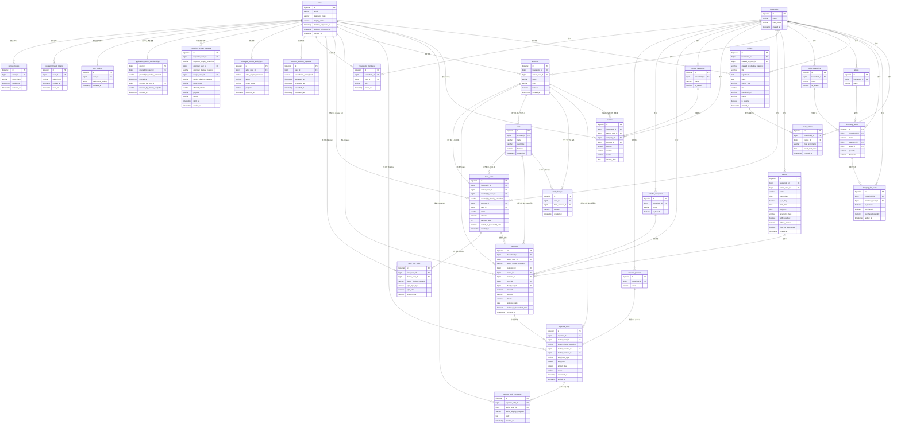

# データモデル

[← 要件定義書に戻る](../requirements.md)

要件定義段階のER図であり、実装時のテーブル名・カラム名は変更されうる（MyBatis Mapper実装時に確定させる）。Issue #160で追加した管理者・例外アクセス・退会関連のエンティティと列は要件上必要な論理モデルであり、物理スキーマ・マイグレーションは対応する実装Issueで確定する。

---

## 1. ER 図


```mermaid
erDiagram
    users {
        bigserial id PK
        varchar email
        varchar password_hash
        varchar display_name
        timestamp deletion_requested_at
        timestamp deletion_scheduled_at
        timestamp created_at
    }
    application_admin_memberships {
        bigint user_id PK
        bigint granted_by_user_id FK
        varchar granted_by_display_snapshot
        timestamp granted_at
        bigint revoked_by_user_id FK
        varchar revoked_by_display_snapshot
        timestamp revoked_at
    }
    exception_access_requests {
        bigserial id PK
        bigint requester_user_id FK
        varchar requester_display_snapshot
        bigint approver_user_id FK
        varchar approver_display_snapshot
        bigint subject_user_id FK
        varchar subject_display_snapshot
        varchar data_scope
        varchar allowed_actions
        varchar purpose
        varchar status
        timestamp starts_at
        timestamp expires_at
    }
    privileged_access_audit_logs {
        bigserial id PK
        bigint actor_user_id FK
        varchar actor_display_snapshot
        varchar action
        varchar target_scope
        varchar purpose
        timestamp occurred_at
    }
    account_deletion_requests {
        bigserial id PK
        bigint user_id FK
        varchar cancellation_token_hash
        timestamp requested_at
        timestamp scheduled_at
        timestamp cancelled_at
        timestamp completed_at
    }
    refresh_tokens {
        bigserial id PK
        bigint user_id FK
        varchar token_hash
        timestamp expires_at
        timestamp revoked_at
    }
    password_reset_tokens {
        bigserial id PK
        bigint user_id FK
        varchar token_hash
        timestamp expires_at
        timestamp used_at
    }
    user_settings {
        bigserial id PK
        bigint user_id FK
        jsonb dashboard_settings
        timestamp updated_at
    }
    households {
        bigserial id PK
        varchar name
        varchar invite_code
        timestamp created_at
    }
    household_members {
        bigserial id PK
        bigint household_id FK
        bigint user_id FK
        varchar role
        timestamp joined_at
    }
    external_persons {
        bigserial id PK
        bigint household_id FK
        varchar name
    }
    kakeibo_categories {
        bigserial id PK
        bigint household_id FK
        varchar name
        boolean is_default
    }
    accounts {
        bigserial id PK
        bigint household_id FK
        bigint owner_user_id FK
        varchar name
        varchar type
        numeric balance
        timestamp created_at
    }
    cards {
        bigserial id PK
        bigint account_id FK
        varchar name
        varchar card_type
        numeric balance
        timestamp created_at
    }
    card_charges {
        bigserial id PK
        bigint card_id FK
        bigint from_account_id FK
        numeric amount
        timestamp created_at
    }
    expenses {
        bigserial id PK
        bigint household_id FK
        bigint payer_user_id FK
        varchar payer_display_snapshot
        bigint category_id FK
        bigint event_id FK
        bigint account_id FK
        bigint card_id FK
        bigint fixed_cost_id FK
        numeric amount
        varchar purpose
        varchar memo
        date expense_date
        boolean include_in_household_total
        timestamp created_at
    }
    expense_splits {
        bigserial id PK
        bigint expense_id FK
        bigint debtor_user_id FK
        varchar debtor_display_snapshot
        bigint debtor_external_id FK
        bigint debtor_account_id FK
        varchar split_input_type
        numeric split_ratio
        numeric amount_due
        varchar status
        timestamp requested_at
        timestamp settled_at
    }
    expense_split_comments {
        bigserial id PK
        bigint expense_split_id FK
        bigint author_user_id FK
        varchar author_display_snapshot
        text body
        timestamp created_at
    }
    fixed_cost_splits {
        bigserial id PK
        bigint fixed_cost_id FK
        bigint debtor_user_id FK
        varchar debtor_display_snapshot
        varchar split_input_type
        numeric split_ratio
        numeric amount_due
    }
    fixed_costs {
        bigserial id PK
        bigint household_id FK
        bigint owner_user_id FK
        bigint created_by_user_id FK
        varchar created_by_display_snapshot
        bigint account_id FK
        bigint card_id FK
        varchar name
        numeric amount
        int payment_day
        boolean include_in_household_total
        timestamp created_at
    }
    events {
        bigserial id PK
        bigint household_id FK
        bigint owner_user_id FK
        varchar name
        date event_date
        boolean is_all_day
        time start_time
        time end_time
        varchar recurrence_type
        boolean notify_enabled
        numeric default_amount
        boolean show_on_dashboard
        timestamp created_at
    }
    income_categories {
        bigserial id PK
        bigint household_id FK
        varchar name
        boolean is_default
    }
    incomes {
        bigserial id PK
        bigint household_id FK
        bigint earner_user_id FK
        bigint category_id FK
        bigint account_id FK
        numeric amount
        varchar content
        varchar memo
        date income_date
    }
    zaiko_categories {
        bigserial id PK
        bigint household_id FK
        varchar name
        boolean is_default
    }
    stores {
        bigserial id PK
        bigint household_id FK
        varchar name
    }
    inventory_items {
        bigserial id PK
        bigint household_id FK
        varchar name
        bigint category_id FK
        bigint store_id FK
        numeric quantity
        numeric threshold
    }
    shopping_list_items {
        bigserial id PK
        bigint household_id FK
        bigint inventory_item_id FK
        boolean is_manual
        boolean purchased
        numeric purchased_quantity
        timestamp added_at
    }
    recipes {
        bigserial id PK
        bigint household_id FK
        bigint created_by_user_id FK
        varchar created_by_display_snapshot
        varchar title
        text ingredients
        text steps
        varchar source_type
        varchar url
        varchar thumbnail_url
        varchar memo
        boolean is_favorite
        timestamp created_at
    }
    menu_entries {
        bigserial id PK
        bigint household_id FK
        bigint recipe_id FK
        varchar free_text_memo
        date week_start_date
        timestamp created_at
    }

    users ||--o{ refresh_tokens : "発行される"
    users ||--o{ password_reset_tokens : "発行される"
    users ||--|| user_settings : "表示設定を持つ"
    users ||--o| application_admin_memberships : "アプリ全体管理者"
    users ||--o{ exception_access_requests : "申請/承認/対象"
    users ||--o{ privileged_access_audit_logs : "特権操作"
    users ||--o{ account_deletion_requests : "削除申請"
    users ||--o{ household_members : "所属する"
    households ||--o{ household_members : "持つ"
    households ||--o{ external_persons : "登録する"
    households ||--o{ kakeibo_categories : "持つ"
    households ||--o{ expenses : "持つ"
    households ||--o{ income_categories : "持つ"
    households ||--o{ incomes : "持つ"
    households ||--o{ fixed_costs : "持つ"
    fixed_costs ||--o{ fixed_cost_splits : "割り勘設定を持つ"
    users ||--o{ fixed_cost_splits : "負担する(debtor)"
    users ||--o{ fixed_costs : "登録する(created_by)"
    fixed_costs ||--o{ expenses : "自動計上する"
    accounts ||--o{ fixed_costs : "引き落とし元(任意)"
    cards ||--o{ fixed_costs : "引き落とし元(任意)"
    households ||--o{ accounts : "持つ"
    households ||--o{ events : "持つ"
    households ||--o{ zaiko_categories : "持つ"
    households ||--o{ stores : "持つ"
    households ||--o{ inventory_items : "持つ"
    households ||--o{ shopping_list_items : "持つ"
    households ||--o{ recipes : "持つ"
    households ||--o{ menu_entries : "持つ"

    users ||--o{ expenses : "支払う(payer)"
    kakeibo_categories ||--o{ expenses : "分類する"
    events ||--o{ expenses : "紐付く"
    accounts ||--o{ expenses : "出費元になる"
    users ||--o{ accounts : "所有する"
    accounts ||--o{ cards : "持つ(子エンティティ)"
    cards ||--o{ expenses : "出費元になる(charge型)"
    accounts ||--o{ card_charges : "チャージ元になる"
    cards ||--o{ card_charges : "チャージ先になる"
    expenses ||--o{ expense_splits : "分割される"
    users ||--o{ expense_splits : "負担する(debtor)"
    external_persons ||--o{ expense_splits : "負担する(debtor)"
    accounts ||--o{ expense_splits : "支払い元になる(精算時)"
    expense_splits ||--o{ expense_split_comments : "コメントされる"
    users ||--o{ expense_split_comments : "投稿する(author)"

    users ||--o{ incomes : "得る(earner)"
    income_categories ||--o{ incomes : "分類する"
    accounts ||--o{ incomes : "入金先になる(割り勘精算)"

    zaiko_categories ||--o{ inventory_items : "分類する"
    stores ||--o{ inventory_items : "紐付く"
    inventory_items ||--o{ shopping_list_items : "追加される"

    users ||--o{ recipes : "登録する"
    recipes ||--o{ menu_entries : "献立に使われる"
```

---

## 2. テーブル定義

### users（ユーザー）

| カラム名 | 型 | 必須 | 備考 |
| --- | --- | --- | --- |
| id | BIGSERIAL | ○ | PK |
| email | VARCHAR(255) | ○ | UNIQUE。ログインに使用 |
| password_hash | VARCHAR(255) | ○ | BCryptによるハッシュ |
| display_name | VARCHAR(50) | ○ | 表示名 |
| deletion_requested_at | TIMESTAMP | — | 削除申請日時。設定中は通常の認証済みAPIとトークン更新を拒否する |
| deletion_scheduled_at | TIMESTAMP | — | 削除予定日時（申請から30日後） |
| created_at | TIMESTAMP | ○ | 登録日時 |

削除確定時は本人専用データを削除し、世帯に残す共有記録から利用者IDとの紐付けを解除した後にユーザー識別情報を削除する。共有記録に必要な表示名は「退会したユーザー」とし、ユーザーアカウントへの外部キーを残さない。具体的な対象列は下記共有データの項で示す。

### application_admin_memberships（アプリ全体管理者）

アプリ全体の管理者を世帯ロールと分離して保持する。複数人を許可し、付与/解除を行った既存管理者と日時を監査できるようにする。唯一のアプリ全体管理者は後任の付与と同時でなければ解除できない。削除された管理者の過去の付与/解除履歴が必要な場合は、ユーザーIDとの紐付けを解除し表示名を「退会したユーザー」とする。最初の管理者を設定する方法は運用設計で確定する。

| 項目 | 要件レベルの定義 |
| --- | --- |
| 対象利用者 | `users.id`。有効な割当ては利用者ごとに最大1件 |
| 付与/解除 | 付与者・解除者と日時を保存し、操作を監査ログへ記録 |
| データ閲覧 | ロールだけではユーザーコンテンツを閲覧できない。例外アクセスの有効な許可が別途必要 |

### exception_access_requests（例外アクセス）

申請・承認・有効期間・対象・操作範囲・理由を記録する論理エンティティ。削除済み利用者に関わる過去の申請・承認履歴を保持する必要がある場合は、user IDとの紐付けを解除して表示名を「退会したユーザー」とする。物理スキーマや個別エンドポイントは実装Issueで確定する。

| 項目 | 必須 | 備考 |
| --- | --- | --- |
| requester_user_id | ○ | 申請者 |
| requester_display_snapshot | — | 履歴を保持する場合の表示名。退会後は「退会したユーザー」 |
| approver_user_id | — | 承認者。申請者本人による自己承認は禁止 |
| approver_display_snapshot | — | 履歴を保持する場合の表示名。退会後は「退会したユーザー」 |
| subject_user_id / data_scope | ○ | 対象利用者と対象データ範囲。最小範囲に限定 |
| subject_display_snapshot | — | 履歴を保持する場合の表示名。退会後は「退会したユーザー」 |
| allowed_actions / purpose | ○ | 許可する操作と業務上の理由 |
| status | ○ | 申請中/承認/拒否/失効/取消等の状態 |
| starts_at / expires_at | ○ | 開始と有効期限。期限到来後はサーバー側で必ず拒否 |

### privileged_access_audit_logs（特権操作監査ログ）

アプリ全体管理者のロール変更、例外アクセスの申請・承認・利用・失効等を記録する。少なくとも実行者、操作、対象範囲、理由、日時、結果を保持する。認証情報や家計本文等の機微な内容はログへ複製しない。退会後も監査記録を保持する必要がある場合、actor_user_idはNULLにし、表示名は「退会したユーザー」とする。保持期間・閲覧者・改ざん対策は運用設計で確定する。

### account_deletion_requests（アカウント削除申請）

削除申請日時、30日後の削除予定日時、取消日時、処理完了日時を追跡する。申請中はユーザーの通常アクセスとトークン更新を拒否する。取消は通常APIとは別の専用手段とし、ワンタイムの取消資格情報を用いてハッシュ化して保管する。処理完了時はuser_idとの紐付けと取消資格情報を削除し、詳細な有効期限・再発行方式はメール送信基盤を含めて実装Issueで確定する。

### 退会時に保持する共有記録の帰属

本人専用の家計・口座等は削除する。世帯運営に必要な共有記録を保持する場合は、記録の主体を特定するusers.idの外部キーを必須にせず、削除確定時にNULLへ変更する。履歴表示に必要な場合だけ表示名スナップショットを保持し、その値を「退会したユーザー」に置換する。この扱いの対象には少なくとも世帯共有の固定費作成者、共有レシピ作成者、精算コメント投稿者、固定費/精算内訳の退会済み負担者、監査ログの退会済み実行者を含める。未精算の義務・共有履歴を削除または保持する条件は、削除完了前に解決し、具体的な保持対象を実装Issueで確定する。

共有精算に使われた支出と内訳は個人専用の家計データとは分けて扱う。保持する場合は`expenses.payer_user_id`および`expense_splits.debtor_user_id`をNULLにし、表示名を「退会したユーザー」に置き換える。`account_id`、`card_id`、`debtor_account_id`など退会者の個人口座への参照も解除する。共有精算と無関係な本人専用の支出・収入・口座は削除対象とする。

### refresh_tokens（リフレッシュトークン）

| カラム名 | 型 | 必須 | 備考 |
| --- | --- | --- | --- |
| id | BIGSERIAL | ○ | PK |
| user_id | BIGINT | ○ | FK → users.id |
| token_hash | VARCHAR(255) | ○ | トークンのハッシュ値（平文は保存しない） |
| expires_at | TIMESTAMP | ○ | 有効期限（発行から7日） |
| revoked_at | TIMESTAMP | — | 失効日時（ログアウト時に設定） |

### password_reset_tokens（パスワードリセットトークン）

| カラム名 | 型 | 必須 | 備考 |
| --- | --- | --- | --- |
| id | BIGSERIAL | ○ | PK |
| user_id | BIGINT | ○ | FK → users.id |
| token_hash | VARCHAR(255) | ○ | トークンのハッシュ値（平文は保存しない） |
| expires_at | TIMESTAMP | ○ | 有効期限（発行から30分） |
| used_at | TIMESTAMP | — | 使用日時（設定済みなら再利用不可） |

### user_settings（ユーザー設定）

| カラム名 | 型 | 必須 | 備考 |
| --- | --- | --- | --- |
| id | BIGSERIAL | ○ | PK |
| user_id | BIGINT | ○ | FK → users.id。UNIQUE（ユーザーと1:1） |
| dashboard_settings | JSONB | ○ | トップ画面の表示設定（下記構造）。デフォルトは全カード・全項目true |
| updated_at | TIMESTAMP | ○ | 更新日時 |

`dashboard_settings` は「カード（親）」と「カード内項目（子）」の2階層構造で持つ。カード内項目が増減してもスキーマ変更が不要なようJSONBとする。

```json
{
  "cards": { "today": true, "money": true, "finance": true, "stock": true, "calendar": true },
  "items": {
    "today":    { "balance": true, "menu": true, "events": true },
    "money":    { "personal": true, "householdTotal": true, "unsettled": true, "eventSummary": true },
    "stock":    { "shoppingCount": true, "lowStock": true, "commonItems": true },
    "calendar": { "events": true, "balance": true }
  }
}
```

- カードのフラグがfalseの場合、そのカードは項目の設定に関わらず非表示（項目の設定値自体は保持される）。
- 「個人の財政」は表示項目が1つ（口座残高合計）のためカード単位のフラグのみ持つ。
- 設定画面（S-21、[wireframes.md](wireframes.md)参照）で編集する。ユーザーごとの設定であり、他の世帯メンバーの表示には影響しない。

### households（世帯グループ）／household_members（世帯メンバー）

| カラム名 | 型 | 必須 | 備考 |
| --- | --- | --- | --- |
| households.id | BIGSERIAL | ○ | PK |
| households.name | VARCHAR(100) | ○ | 世帯グループ名 |
| households.invite_code | VARCHAR(16) | ○ | UNIQUE。世帯作成時に自動発行するランダム英数字コード（他ユーザーの参加に使用） |
| household_members.household_id | BIGINT | ○ | FK → households.id |
| household_members.user_id | BIGINT | ○ | FK → users.id |
| household_members.role | VARCHAR(20) | ○ | `admin` / `member`。作成者を`admin`で登録。既存管理者のみが変更でき、変更者・日時を監査する。最後の管理者を単独で降格・解除できない |

### external_persons（世帯外の精算相手）

| カラム名 | 型 | 必須 | 備考 |
| --- | --- | --- | --- |
| id | BIGSERIAL | ○ | PK |
| household_id | BIGINT | ○ | FK → households.id |
| name | VARCHAR(50) | ○ | 非アプリ利用者の表示名 |

### kakeibo_categories（家計簿カテゴリーマスタ）

| カラム名 | 型 | 必須 | 備考 |
| --- | --- | --- | --- |
| id | BIGSERIAL | ○ | PK |
| household_id | BIGINT | ○ | FK → households.id |
| name | VARCHAR(50) | ○ | カテゴリー名 |
| is_default | BOOLEAN | ○ | システムデフォルトか否か |

### accounts（口座）／cards（カード）

| カラム名 | 型 | 必須 | 備考 |
| --- | --- | --- | --- |
| accounts.id | BIGSERIAL | ○ | PK |
| accounts.household_id | BIGINT | ○ | FK → households.id |
| accounts.owner_user_id | BIGINT | ○ | FK → users.id（口座の所有者） |
| accounts.name | VARCHAR(50) | ○ | 口座名（例：〇〇銀行、PayPay 等） |
| accounts.type | VARCHAR(20) | ○ | 種別（`bank`/`e_money`等） |
| accounts.balance | NUMERIC | ○ | 残高。登録時の初期残高から、当該口座を指定した支出登録のたびに自動減算される。所有者本人のみ閲覧可能（[common-notes.md](common-notes.md) 2章） |
| cards.id | BIGSERIAL | ○ | PK |
| cards.account_id | BIGINT | ○ | FK → accounts.id（カードは口座の子エンティティ） |
| cards.name | VARCHAR(50) | ○ | カード名 |
| cards.card_type | VARCHAR(10) | ○ | 種別（`credit`/`charge`、既定`credit`）。登録後は変更不可 |
| cards.balance | NUMERIC | ○ | `charge`型カードの残高（`credit`型は常に0で未使用）。所有者本人のみ閲覧可能 |

### card_charges（カードチャージ履歴）

| カラム名 | 型 | 必須 | 備考 |
| --- | --- | --- | --- |
| card_charges.id | BIGSERIAL | ○ | PK |
| card_charges.card_id | BIGINT | ○ | FK → cards.id（チャージ先のchargeカード） |
| card_charges.from_account_id | BIGINT | ○ | FK → accounts.id（チャージ元口座） |
| card_charges.amount | NUMERIC | ○ | チャージ金額 |
| card_charges.created_at | TIMESTAMP | ○ | チャージ実行日時 |

家計簿の支出・収入（収支）とは別に、口座→カードの資金移動履歴として記録する。

### expenses（支出）／expense_splits（割り勘内訳）

| カラム名 | 型 | 必須 | 備考 |
| --- | --- | --- | --- |
| expenses.id | BIGSERIAL | ○ | PK |
| expenses.household_id | BIGINT | ○ | FK → households.id |
| expenses.payer_user_id | BIGINT | — | FK → users.id（支払った人）。個人用支出は退会時に削除し、共有精算記録として保持する行では退会確定時にNULLにする |
| expenses.payer_display_snapshot | VARCHAR(50) | — | 共有精算記録の支払者表示。退会確定後は「退会したユーザー」 |
| expenses.category_id | BIGINT | ○ | FK → kakeibo_categories.id |
| expenses.event_id | BIGINT | — | FK → events.id（イベント紐付け、任意） |
| expenses.account_id | BIGINT | — | FK → accounts.id（口座直接指定 または credit型カード選択時の親口座、任意） |
| expenses.card_id | BIGINT | — | FK → cards.id（charge型カード選択時のみ設定。この場合account_idはNULL、カード自身の残高から減算） |
| expenses.fixed_cost_id | BIGINT | — | FK → fixed_costs.id（固定費の毎月自動計上により作成された支出のみ設定。固定費削除時はNULLになる） |
| expenses.amount | NUMERIC | ○ | 支出金額 |
| expenses.purpose | VARCHAR(100) | ○ | 使用用途 |
| expenses.memo | VARCHAR(255) | — | メモ |
| expenses.expense_date | DATE | ○ | 支出発生日 |
| expenses.include_in_household_total | BOOLEAN | ○ | 世帯合計支出への算入対象か（[common-notes.md](common-notes.md) 8章参照） |
| expense_splits.expense_id | BIGINT | ○ | FK → expenses.id |
| expense_splits.debtor_user_id | BIGINT | — | FK → users.id（世帯内の負担者）。共有精算記録を残して退会者を削除する場合はNULLにする |
| expense_splits.debtor_display_snapshot | VARCHAR(50) | — | 共有精算記録の負担者表示。退会確定後は「退会したユーザー」 |
| expense_splits.debtor_external_id | BIGINT | — | FK → external_persons.id（世帯外の負担者） |
| expense_splits.split_input_type | VARCHAR(10) | ○ | 入力モード。`ratio`（％入力）/`amount`（金額入力）。デフォルト`ratio`（[F04_kakeibo_warikan](features/F04_kakeibo_warikan.md) 7章参照） |
| expense_splits.split_ratio | NUMERIC(5,2) | ○ | 負担割合（%）。％入力時はユーザー入力値（デフォルト50.00）、金額入力時はamount_dueから逆算した参考値 |
| expense_splits.amount_due | NUMERIC | ○ | 負担額。％入力時はsplit_ratioから自動計算、金額入力時はユーザー入力値 |
| expense_splits.debtor_account_id | BIGINT | — | FK → accounts.id（負担者が「支払う」時に選んだ支払い元口座。精算確定まで保持。任意） |
| expense_splits.status | VARCHAR(20) | ○ | `unpaid`（未請求）/`requested`（請求中：立替者が請求）/`payment_reported`（負担者が「支払った」と報告し、立替者の受領確定待ち）/`pending`（保留中）/`settled`（精算済み）。settledにするには立替者（受領側）の受領確定が必要（[F04_kakeibo_warikan](features/F04_kakeibo_warikan.md)参照） |
| expense_splits.settled_at | TIMESTAMP | — | 精算完了日時 |

※ `debtor_user_id` と `debtor_external_id` はどちらか一方のみ設定する（世帯内/世帯外の排他）。

### expense_split_comments（割り勘内訳のコメント）

| カラム名 | 型 | 必須 | 備考 |
| --- | --- | --- | --- |
| id | BIGSERIAL | ○ | PK |
| expense_split_id | BIGINT | ○ | FK → expense_splits.id |
| author_user_id | BIGINT | — | FK → users.id（投稿者）。退会者を識別できない形で共有履歴を残す場合はNULLにする |
| author_display_snapshot | VARCHAR(50) | — | 共有履歴表示用の投稿者名。削除完了後は「退会したユーザー」 |
| body | VARCHAR(500) | ○ | コメント本文（最大500文字） |
| created_at | TIMESTAMP | ○ | 投稿日時 |

割り勘内訳（負担者が保留にした場合等）についての立替者・負担者間の連絡用スレッド。`expense_splits.status` を
問わず常時閲覧・投稿可能（[F04_kakeibo_warikan](features/F04_kakeibo_warikan.md)参照）。

### income_categories（収入カテゴリーマスタ）

| カラム名 | 型 | 必須 | 備考 |
| --- | --- | --- | --- |
| id | BIGSERIAL | ○ | PK |
| household_id | BIGINT | ○ | FK → households.id |
| name | VARCHAR(50) | ○ | カテゴリー名 |
| is_default | BOOLEAN | ○ | システムデフォルトか否か |

### incomes（収入）

| カラム名 | 型 | 必須 | 備考 |
| --- | --- | --- | --- |
| id | BIGSERIAL | ○ | PK |
| household_id | BIGINT | ○ | FK → households.id |
| earner_user_id | BIGINT | ○ | FK → users.id（収入を得た人。常に登録者本人。[F13_kakeibo_income](features/F13_kakeibo_income.md) 6章参照） |
| category_id | BIGINT | ○ | FK → income_categories.id |
| account_id | BIGINT | — | FK → accounts.id（割り勘精算による収入のみ設定される入金先口座。通常の収入登録では常にNULL。[F04_kakeibo_warikan](features/F04_kakeibo_warikan.md) 8章参照） |
| amount | NUMERIC | ○ | 収入金額 |
| content | VARCHAR(100) | ○ | 収入内容（例：〇月分給与） |
| memo | VARCHAR(255) | — | メモ |
| income_date | DATE | ○ | 収入発生日 |

### fixed_costs（固定費）

| カラム名 | 型 | 必須 | 備考 |
| --- | --- | --- | --- |
| id | BIGSERIAL | ○ | PK |
| household_id | BIGINT | ○ | FK → households.id |
| owner_user_id | BIGINT | — | FK → users.id。NULL＝世帯共有（メンバー全員が閲覧可能）、設定時＝個人所有（本人のみ閲覧・編集可能）。登録時に選択する（[common-notes.md](common-notes.md) 2章） |
| created_by_user_id | BIGINT | — | FK → users.id（登録者）。共有記録を残して作成者を削除する場合はNULLにする。自動計上時の表示主体は別途確定する |
| created_by_display_snapshot | VARCHAR(50) | — | 共有履歴表示用。作成者が退会した場合は「退会したユーザー」 |
| account_id | BIGINT | — | FK → accounts.id（引き落とし元の口座直接指定 または credit型カード選択時の親口座、任意）。登録者本人が所有する口座に限る |
| card_id | BIGINT | — | FK → cards.id（charge型カード選択時のみ設定。この場合account_idはNULL、カード自身の残高から減算）。登録者本人が所有するカードに限る |
| name | VARCHAR(50) | ○ | 固定費名（家賃、水道代 等） |
| amount | NUMERIC | ○ | 金額 |
| payment_day | INT | ○ | 毎月の支払日 |
| include_in_household_total | BOOLEAN | ○ | 世帯合計支出への算入対象か（[common-notes.md](common-notes.md) 8章参照） |

### fixed_cost_splits（固定費の割り勘設定）

| カラム名 | 型 | 必須 | 備考 |
| --- | --- | --- | --- |
| id | BIGSERIAL | ○ | PK |
| fixed_cost_id | BIGINT | ○ | FK → fixed_costs.id |
| debtor_user_id | BIGINT | — | FK → users.id（負担者。共有設定を残して負担者を削除する場合はNULL） |
| debtor_display_snapshot | VARCHAR(50) | — | 共有の固定費設定で退会した負担者を示す場合は「退会したユーザー」 |
| split_input_type | VARCHAR(10) | ○ | 入力モード。`ratio`（％入力）/`amount`（金額入力）。デフォルト`ratio` |
| split_ratio | NUMERIC(5,2) | ○ | 負担割合（%） |
| amount_due | NUMERIC | ○ | 負担額 |

※ 割り勘設定付きの固定費は、毎月の自動計上（[F05_kakeibo_fixedcost](features/F05_kakeibo_fixedcost.md)参照）で expenses を作成する際、この設定を雛形として expense_splits も同時に生成する。

### events（イベント）

| カラム名 | 型 | 必須 | 備考 |
| --- | --- | --- | --- |
| id | BIGSERIAL | ○ | PK |
| household_id | BIGINT | ○ | FK → households.id |
| owner_user_id | BIGINT | — | FK → users.id。NULL＝世帯共有（メンバー全員が閲覧可能）、設定時＝個人所有（本人のみ閲覧・編集可能）。登録時に選択する（[common-notes.md](common-notes.md) 2章） |
| name | VARCHAR(50) | ○ | イベント名 |
| event_date | DATE | ○ | イベントの基準日（トップ画面カレンダー表示に使用） |
| is_all_day | BOOLEAN | ○ | 終日イベントかどうか。デフォルトtrue |
| start_time | TIME | — | 開始時刻（`is_all_day` = falseのとき）。時刻指定イベントでは必須 |
| end_time | TIME | — | 終了時刻（`is_all_day` = falseのとき、任意）。開始時刻のみ（終了未定）も可。終了のみの指定は不可、開始＞終了はエラー（[F06_kakeibo_event](features/F06_kakeibo_event.md)参照） |
| recurrence_type | VARCHAR(20) | ○ | 繰り返し設定：`none`/`daily`/`weekly`/`monthly`/`yearly` |
| notify_enabled | BOOLEAN | ○ | アプリ内通知の有無 |
| default_amount | NUMERIC | — | 支出登録時に金額欄へ自動入力されるデフォルト金額（任意、[F06_kakeibo_event](features/F06_kakeibo_event.md)参照） |
| show_on_dashboard | BOOLEAN | ○ | トップ画面のイベント別支出サマリーに表示するか。デフォルトtrue（[F06_kakeibo_event](features/F06_kakeibo_event.md)参照） |

### zaiko_categories（在庫カテゴリーマスタ）／stores（店舗マスタ）

| カラム名 | 型 | 必須 | 備考 |
| --- | --- | --- | --- |
| zaiko_categories.id | BIGSERIAL | ○ | PK |
| zaiko_categories.household_id | BIGINT | ○ | FK → households.id |
| zaiko_categories.name | VARCHAR(50) | ○ | カテゴリー名 |
| zaiko_categories.is_default | BOOLEAN | ○ | システムデフォルトか否か |
| stores.id | BIGSERIAL | ○ | PK |
| stores.household_id | BIGINT | ○ | FK → households.id |
| stores.name | VARCHAR(50) | ○ | 店舗名 |

### inventory_items（在庫アイテム）

| カラム名 | 型 | 必須 | 備考 |
| --- | --- | --- | --- |
| id | BIGSERIAL | ○ | PK |
| household_id | BIGINT | ○ | FK → households.id |
| name | VARCHAR(50) | ○ | 品名 |
| category_id | BIGINT | ○ | FK → zaiko_categories.id |
| store_id | BIGINT | — | FK → stores.id（任意） |
| quantity | NUMERIC(6,1) | ○ | 在庫個数（小数点第一位まで） |
| threshold | NUMERIC(6,1) | ○ | 買い物リスト追加閾値 |

### shopping_list_items（買い物リスト）

| カラム名 | 型 | 必須 | 備考 |
| --- | --- | --- | --- |
| id | BIGSERIAL | ○ | PK |
| household_id | BIGINT | ○ | FK → households.id |
| inventory_item_id | BIGINT | ○ | FK → inventory_items.id |
| is_manual | BOOLEAN | ○ | 手動追加か自動追加か |
| purchased | BOOLEAN | ○ | 購入済みチェック |
| purchased_quantity | NUMERIC(6,1) | — | 購入個数 |

### recipes（レシピ）

| カラム名 | 型 | 必須 | 備考 |
| --- | --- | --- | --- |
| id | BIGSERIAL | ○ | PK |
| household_id | BIGINT | ○ | FK → households.id |
| created_by_user_id | BIGINT | — | FK → users.id。共有レシピを残して作成者を削除する場合はNULLにする |
| created_by_display_snapshot | VARCHAR(50) | — | 共有レシピ表示用。作成者が退会した場合は「退会したユーザー」 |
| title | VARCHAR(100) | ○ | レシピ名 |
| ingredients | TEXT | — | 材料（手動・画像解析登録の場合） |
| steps | TEXT | — | 手順（手動・画像解析登録の場合） |
| source_type | VARCHAR(20) | ○ | `manual`/`ocr`/`web` |
| url | VARCHAR(512) | — | WEBレシピのURL |
| thumbnail_url | VARCHAR(512) | — | WEBレシピのサムネイル |
| memo | VARCHAR(255) | — | WEBレシピへの独自メモ |
| is_favorite | BOOLEAN | ○ | お気に入り |

### menu_entries（献立表：週単位の作りたい料理リスト）

| カラム名 | 型 | 必須 | 備考 |
| --- | --- | --- | --- |
| id | BIGSERIAL | ○ | PK |
| household_id | BIGINT | ○ | FK → households.id |
| recipe_id | BIGINT | — | FK → recipes.id（確定登録の場合に設定） |
| free_text_memo | VARCHAR(100) | — | ラフ登録時の自由メモ（例：「魚料理」） |
| week_start_date | DATE | ○ | 対象週の開始日（月曜日）。同じ週に複数行＝その週に作りたい料理のリスト。曜日への割り当ては持たない（[F10_kondate_menu](features/F10_kondate_menu.md)参照） |

※ `recipe_id` と `free_text_memo` はどちらか一方のみ設定する（確定登録/ラフ登録の排他）。
