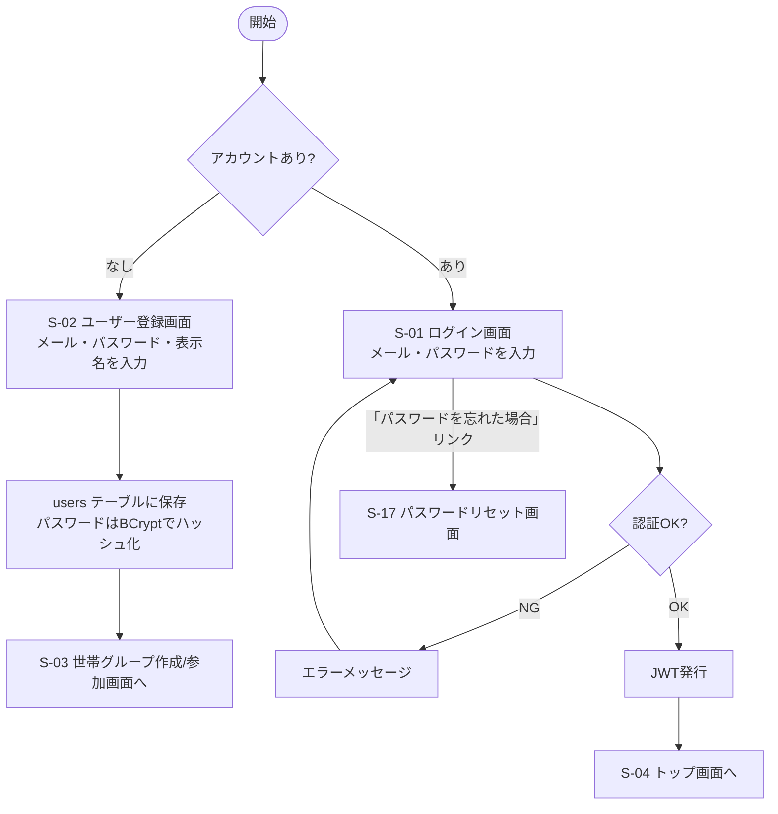
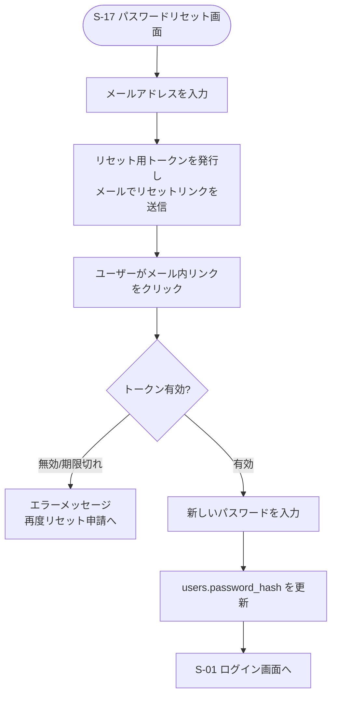

# F-01 認証（ユーザー登録・ログイン）

[← 要件定義書に戻る](../../requirements.md)

---

## 1. 概要

メールアドレス・パスワードによるユーザー登録とログイン。JWTによる認証を行う（[技術スタック.md](../../技術スタック.md)参照）。

## 1-1. JWT・リフレッシュトークンの方針

| 項目 | 内容 |
| --- | --- |
| アクセストークン有効期限 | 15分（`application.yml`の`jwt.access-expiration=900000`と一致） |
| リフレッシュトークン有効期限 | 7日（`application.yml`の`jwt.refresh-expiration=604800000`と一致） |
| リフレッシュトークンの保存方式 | `refresh_tokens`テーブルで管理する（DBに保存し、都度有効性を検証） |
| ログアウト時の扱い | 該当ユーザーの`refresh_tokens`を失効（`revoked_at`を設定）させ、以後そのリフレッシュトークンではアクセストークンを再発行できないようにする |
| アクセストークン再発行 | リフレッシュトークンが有効な間、クライアントはリフレッシュエンドポイントで新しいアクセストークンを取得できる |

## 2. 対象画面

| 画面ID | 画面名 |
| --- | --- |
| S-01 | ログイン画面 |
| S-02 | ユーザー登録画面 |
| S-17 | パスワードリセット画面 |

## 3. 業務フロー

## 3-1. パスワードリセットフロー

## 4. IPO

### ユーザー登録

| 項目 | 内容 |
| --- | --- |
| 入力 | メールアドレス・パスワード・表示名 |
| 処理 | 入力チェック → メール重複チェック → パスワードハッシュ化 → users テーブルに保存 |
| 出力 | 登録完了 / エラーメッセージ |

### ログイン

| 項目 | 内容 |
| --- | --- |
| 入力 | メールアドレス・パスワード |
| 処理 | ユーザー検索 → パスワード照合 → JWT発行 |
| 出力 | アクセストークン・リフレッシュトークン / エラーメッセージ |

### パスワードリセット申請

| 項目 | 内容 |
| --- | --- |
| 入力 | メールアドレス |
| 処理 | ユーザー検索 → `password_reset_tokens`にトークンを発行（有効期限30分） → メール送信 |
| 出力 | 送信完了メッセージ（メール存在有無に関わらず同一メッセージを返し、メールアドレスの存在を推測されないようにする） |

### パスワードリセット実行

| 項目 | 内容 |
| --- | --- |
| 入力 | リセットトークン・新しいパスワード |
| 処理 | `password_reset_tokens`でトークンの有効性・期限・使用済み(`used_at`)を確認 → users.password_hash を更新 → `used_at`を設定してトークンを無効化 |
| 出力 | リセット完了 / エラーメッセージ |

### パスワードリセットトークンの方針

| 項目 | 内容 |
| --- | --- |
| 保存方式 | `password_reset_tokens`テーブル（JWT等に埋め込まず、DBで一元管理） |
| 有効期限 | 発行から30分 |
| 使用済み管理 | `used_at`に日時を設定し、一度使用したトークンは再利用不可とする |
| 再発行時の扱い | 同一ユーザーが再度リセットを申請した場合、古い未使用トークンは無効化し、新しいトークンのみ有効とする |

## 5. 入力チェック仕様

| 項目 | 必須 | 形式・制約 |
| --- | --- | --- |
| メールアドレス | ○ | メール形式、UNIQUE |
| パスワード | ○ | 8文字以上、英字と数字を両方含む |
| 表示名 | ○ | 1〜50文字 |

## 6. データ設計（関連テーブル）

[data-model.md](../data-model.md) の `users`, `refresh_tokens`, `password_reset_tokens` テーブルを参照。

## 7. 今後の検討事項

- パスワードリセット・ログイン通知等のメール送信基盤の実装方式（送信サービスの選定は今後）
