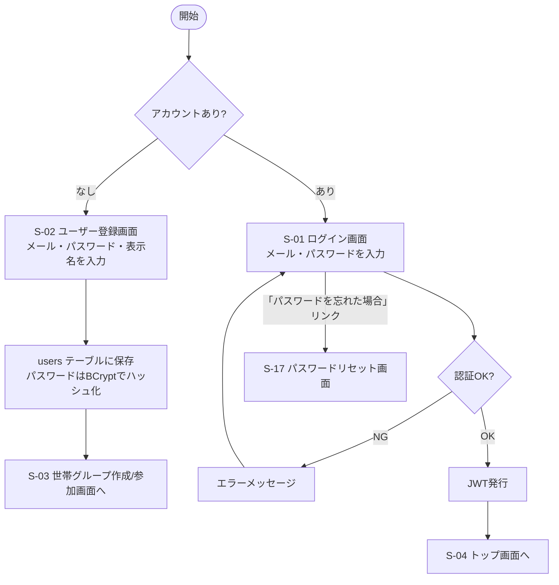
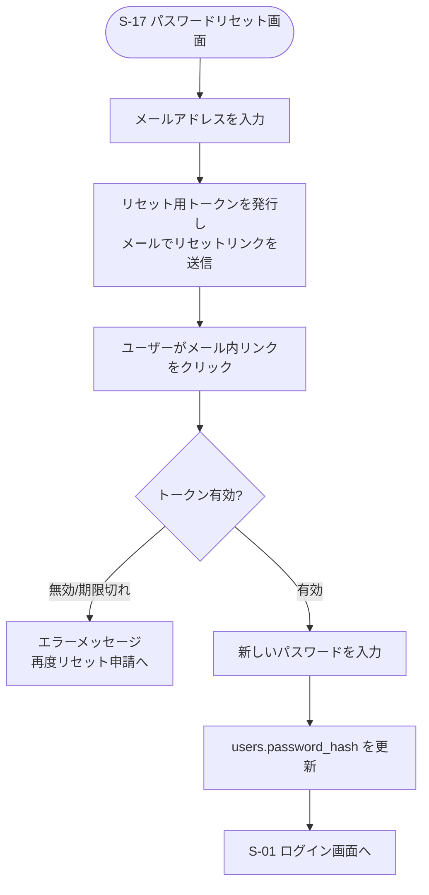

# F-01 認証（ユーザー登録・ログイン）

[← 要件定義書に戻る](../../requirements.md)

---

## 1. 概要

メールアドレス・パスワードによるユーザー登録とログイン。JWTによる認証を行う（[技術スタック.md](../../技術スタック.md)参照）。

## 1-1. JWT・リフレッシュトークンの方針

- JWT署名鍵（`jwt.secret`）はアプリケーション設定のデフォルト値をローカル開発専用とし、共有環境・本番環境では必ず環境変数`JWT_SECRET`で上書きする。デフォルト値のまま運用すると、鍵を知る第三者が任意のユーザーIDでアクセストークンを偽造できてしまう。

| 項目 | 内容 |
| --- | --- |
| アクセストークン有効期限 | 15分（`application.yml`の`jwt.access-expiration=900000`と一致） |
| リフレッシュトークン有効期限 | 7日（`application.yml`の`jwt.refresh-expiration=604800000`と一致） |
| リフレッシュトークンの保存方式 | `refresh_tokens`テーブルで管理する（DBに保存し、都度有効性を検証） |
| ログアウト時の扱い | 該当ユーザーの`refresh_tokens`を失効（`revoked_at`を設定）させ、以後そのリフレッシュトークンではアクセストークンを再発行できないようにする |
| アクセストークン再発行 | リフレッシュトークンが有効な間、クライアントはリフレッシュエンドポイントで新しいアクセストークンを取得できる |

## 2. 対象画面

| 画面ID | 画面名 |
| --- | --- |
| S-01 | ログイン画面 |
| S-02 | ユーザー登録画面 |
| S-17 | パスワードリセット画面 |

## 3. 業務フロー

```mermaid
flowchart TD
    A([開始]) --> B{アカウントあり?}
    B -- なし --> C[S-02 ユーザー登録画面\nメール・パスワード・表示名を入力]
    C --> D[users テーブルに保存\nパスワードはBCryptでハッシュ化]
    D --> E[S-03 世帯グループ作成/参加画面へ]
    B -- あり --> F[S-01 ログイン画面\nメール・パスワードを入力]
    F --> G{認証OK?}
    G -- NG --> H[エラーメッセージ]
    H --> F
    G -- OK --> I[JWT発行]
    I --> J[S-04 トップ画面へ]
    F -- 「パスワードを忘れた場合」リンク --> K[S-17 パスワードリセット画面]
```

## 3-1. パスワードリセットフロー

```mermaid
flowchart TD
    A([S-17 パスワードリセット画面]) --> B[メールアドレスを入力]
    B --> C[リセット用トークンを発行し\nメールでリセットリンクを送信]
    C --> D[ユーザーがメール内リンクをクリック]
    D --> E{トークン有効?}
    E -- 無効/期限切れ --> F[エラーメッセージ\n再度リセット申請へ]
    E -- 有効 --> G[新しいパスワードを入力]
    G --> H[users.password_hash を更新]
    H --> I[S-01 ログイン画面へ]
```

## 4. IPO

### ユーザー登録

| 項目 | 内容 |
| --- | --- |
| 入力 | メールアドレス・パスワード・表示名 |
| 処理 | 入力チェック → メール重複チェック → パスワードハッシュ化 → users テーブルに保存 |
| 出力 | 登録完了 / エラーメッセージ |

### ログイン

| 項目 | 内容 |
| --- | --- |
| 入力 | メールアドレス・パスワード |
| 処理 | ユーザー検索 → パスワード照合 → JWT発行 |
| 出力 | アクセストークン・リフレッシュトークン / エラーメッセージ |

### パスワードリセット申請

| 項目 | 内容 |
| --- | --- |
| 入力 | メールアドレス |
| 処理 | ユーザー検索 → `password_reset_tokens`にトークンを発行（有効期限30分） → メール送信 |
| 出力 | 送信完了メッセージ（メール存在有無に関わらず同一メッセージを返し、メールアドレスの存在を推測されないようにする） |

### パスワードリセット実行

| 項目 | 内容 |
| --- | --- |
| 入力 | リセットトークン・新しいパスワード |
| 処理 | `password_reset_tokens`でトークンの有効性・期限・使用済み(`used_at`)を確認 → users.password_hash を更新 → `used_at`を設定してトークンを無効化 |
| 出力 | リセット完了 / エラーメッセージ |

### パスワードリセットトークンの方針

| 項目 | 内容 |
| --- | --- |
| 保存方式 | `password_reset_tokens`テーブル（JWT等に埋め込まず、DBで一元管理） |
| 有効期限 | 発行から30分 |
| 使用済み管理 | `used_at`に日時を設定し、一度使用したトークンは再利用不可とする |
| 再発行時の扱い | 同一ユーザーが再度リセットを申請した場合、古い未使用トークンは無効化し、新しいトークンのみ有効とする |

## 5. 入力チェック仕様

| 項目 | 必須 | 形式・制約 |
| --- | --- | --- |
| メールアドレス | ○ | メール形式、UNIQUE |
| パスワード | ○ | 8文字以上、英字と数字を両方含む |
| 表示名 | ○ | 1〜50文字 |

## 6. データ設計（関連テーブル）

[data-model.md](../data-model.md) の `users`, `refresh_tokens`, `password_reset_tokens` テーブルを参照。

## 7. 今後の検討事項

- 同一ユーザーが同時にパスワードリセットを複数回申請した場合、DBレベルでの排他制御は行っていないため、稀に複数の有効なリセットトークンが並存しうる（アプリケーション層で「新しい申請時に既存トークンを無効化」は行うが、真の同時実行は防げない）。厳密に1件のみに制限する場合は、行ロックやDB制約による排他制御の追加を検討する
- パスワードリセット・ログイン通知等のメール送信基盤の実装方式（送信サービスの選定は今後）。実装されるまでの暫定措置として、環境変数`APP_PASSWORD_RESET_LOG_TOKEN_ENABLED=true`を設定したローカル開発環境に限り発行した生トークンをアプリケーションログに出力する（デフォルトはfalseで出力しない）。共有環境・本番環境では有効化せず、本番運用開始前にメール送信へ置き換える

## 8. アカウント情報の変更・削除

- メールアドレス変更・パスワード変更・アカウント削除は本人のみ実行でき、操作前に再認証を求める。
- メールアドレス変更は新しいメールアドレスの確認が完了した後に確定する。変更通知・旧アドレスからの復旧方法等の詳細は運用設計で確定する。
- アカウント削除は、本人の明示確認後に30日間の取消可能期間へ入り、その間は新規ログイン・通常API・トークン更新を停止する。申請時にリフレッシュトークンを全失効し、未失効のアクセストークンも各リクエストでアカウント状態を確認して拒否する。本人は期間内に専用の取消手段で削除申請を取り消せる。
- 未精算の割り勘・固定費負担を精算または引き継ぎ、世帯共有固定費の登録者と引き落とし元を後任に移す（または自動計上を停止・削除する）。その後、申請前に世帯から退出する。最後の世帯管理者の場合は後任を指定する。期限後に本人専用データとアカウント識別情報を削除し、世帯に残す必要のある共有記録は個人プロフィールとの紐付けを解除して「退会したユーザー」と表示する。詳細と未決事項は[common-notes.md](../common-notes.md) 12章を参照。
- 削除申請時に全リフレッシュトークンを失効させ、取消後に利用を再開する場合の再認証・アカウント復帰方法は実装設計で定める。
- メールアドレスはログイン・通知等に原文が必要となるため、単純なハッシュ化を要件としない。保存時の保護と閲覧権限の最小化は[common-notes.md](../common-notes.md) 12章に従う。
