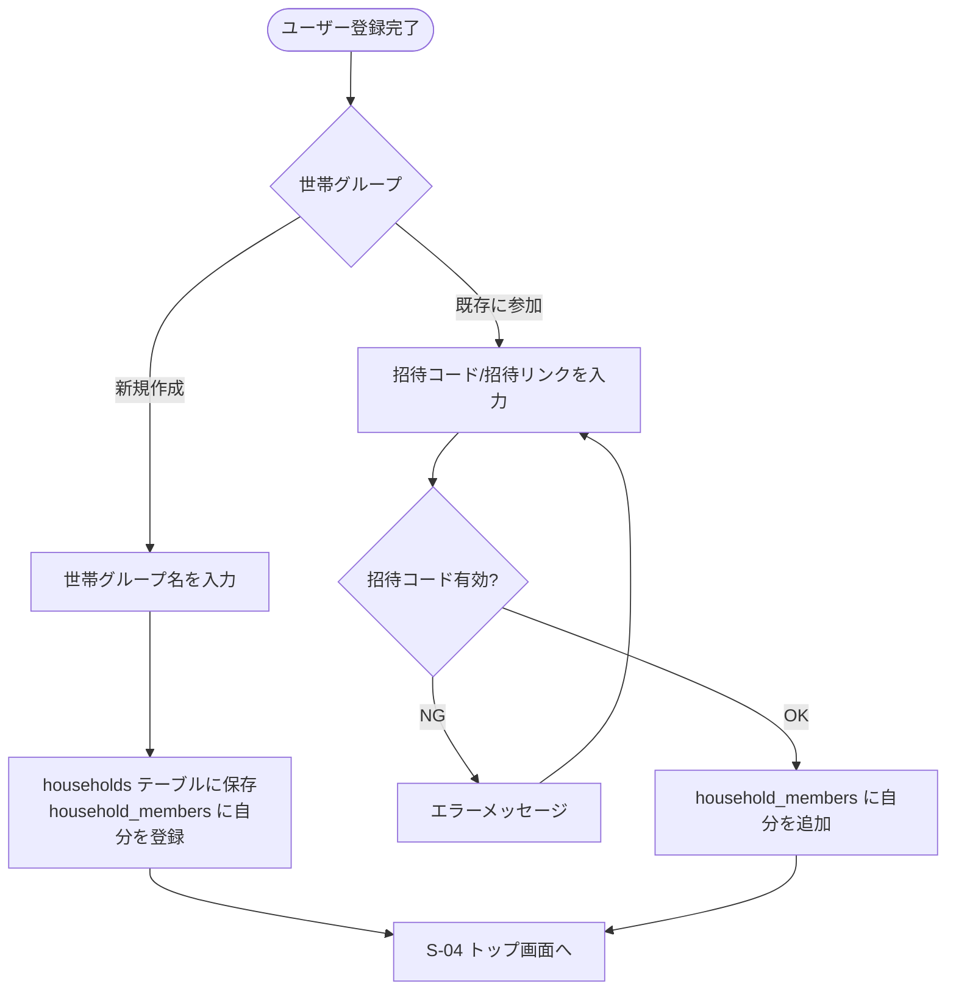

# F-02 世帯グループ管理

[← 要件定義書に戻る](../../requirements.md)

---

## 1. 概要

ユーザーが「世帯グループ」を作成・参加し、精算・在庫・献立を世帯単位で共有できるようにする（[common-notes.md](../common-notes.md) 1章参照）。個人の家計簿は世帯グループに関わらず個人管理のまま。

## 2. 対象画面

| 画面ID | 画面名 |
| --- | --- |
| S-03 | 世帯グループ作成/参加画面 |

## 3. 業務フロー

## 4. IPO

### 世帯グループ作成

| 項目 | 内容 |
| --- | --- |
| 入力 | 世帯グループ名 |
| 処理 | households テーブルに保存 → household_members に作成者を登録 |
| 出力 | 作成した世帯グループ / エラーメッセージ |

### 世帯グループ参加

| 項目 | 内容 |
| --- | --- |
| 入力 | 招待コード（形式は今後検討） |
| 処理 | 招待コードの有効性確認 → household_members に自分を追加 |
| 出力 | 参加完了 / エラーメッセージ |

## 5. データ設計（関連テーブル）

[data-model.md](../data-model.md) の `households`, `household_members` テーブルを参照。

## 6. 今後の検討事項

- 招待コード・招待リンクの発行方式
- 1ユーザーが複数の世帯グループに所属できるか（現状のデータモデルは多対多を許容）
- 世帯グループからの退出・メンバー削除フロー
