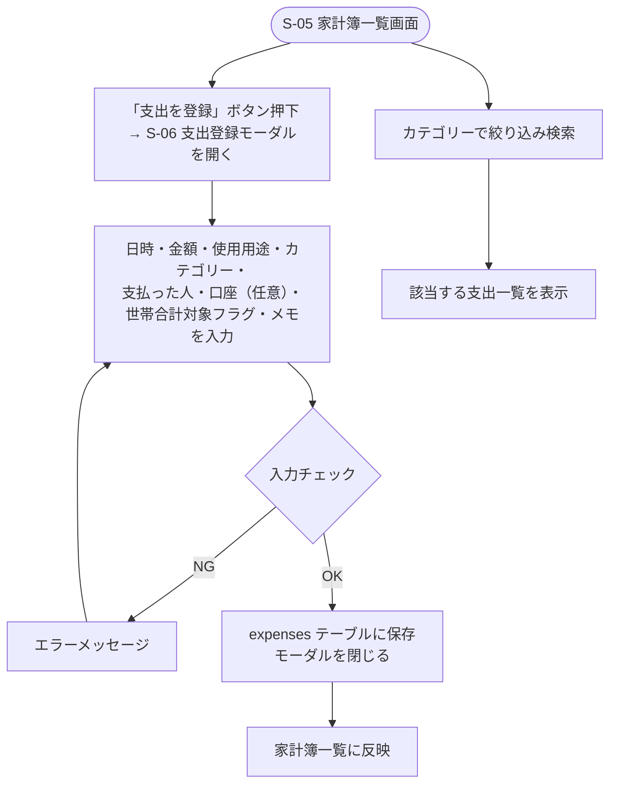

# F-03 個人支出管理

[← 要件定義書に戻る](../../requirements.md)

---

## 1. 概要

個人の日々の支出を記録し、カテゴリー別に検索できる（[common-notes.md](../common-notes.md) 2章：本人のみ編集可能）。

## 2. 対象画面

| 画面ID | 画面名 |
| --- | --- |
| S-05 | 家計簿一覧画面 |
| S-06 | 支出登録モーダル |

## 3. 業務フロー

## 4. IPO

### 支出登録

| 項目 | 内容 |
| --- | --- |
| 入力 | 日時（必須）・金額（必須）・使用用途（必須）・カテゴリー（必須）・支払った人（必須）・口座（任意）・世帯合計対象フラグ（必須、デフォルトは要検討）・メモ（任意） |
| 処理 | 入力チェック → expenses テーブルに保存 |
| 出力 | 登録した支出オブジェクト / エラーメッセージ |

### カテゴリー別検索

| 項目 | 内容 |
| --- | --- |
| 入力 | カテゴリーID |
| 処理 | expenses テーブルを category_id で検索 |
| 出力 | 該当する支出一覧 |

## 5. 入力チェック仕様

| 項目 | 必須 | 形式・制約 |
| --- | --- | --- |
| 日時 | ○ | 日付形式 |
| 金額 | ○ | 0より大きい整数 |
| 使用用途 | ○ | 1〜100文字 |
| カテゴリー | ○ | kakeibo_categories から選択 |
| 支払った人 | ○ | 世帯メンバーから選択 |
| 口座 | — | accounts / cards から選択（[F11_kakeibo_account](F11_kakeibo_account.md)参照） |
| 世帯合計対象フラグ | ○ | true/false（[common-notes.md](../common-notes.md) 8章参照） |
| メモ | — | 0〜255文字 |

## 6. データ設計（関連テーブル）

[data-model.md](../data-model.md) の `expenses`, `kakeibo_categories`, `accounts` テーブルを参照。

## 7. 今後の検討事項

- カテゴリーマスタの初期リスト内容（食費・日用品・交際費・光熱費・住居費・通信費 等の暫定案あり）
- 世帯合計対象フラグのデフォルト値の決め方（例：割り勘対象の支出は自動でtrue、それ以外はユーザー選択、等）
