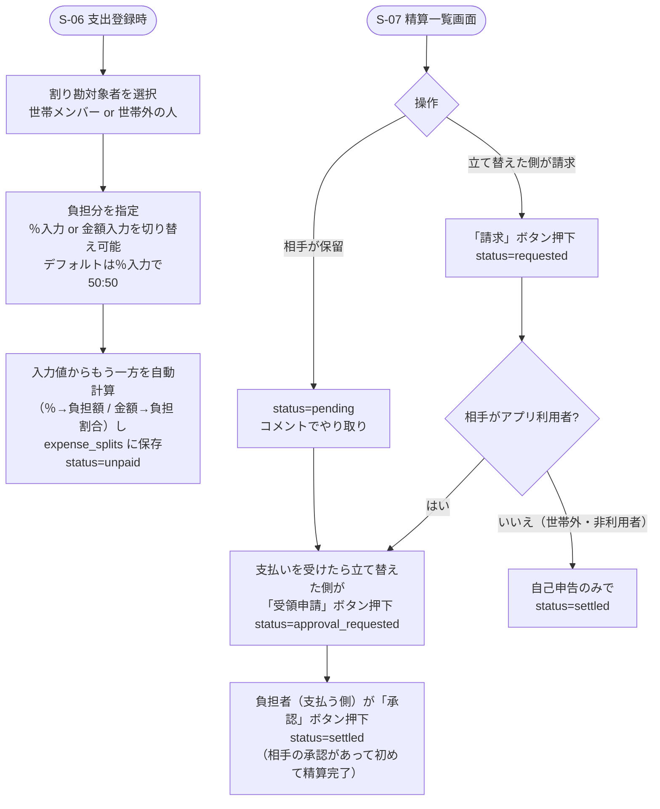

# F-04 割り勘・精算管理

[← 要件定義書に戻る](../../requirements.md)

---

## 1. 概要

支出登録時に割り勘対象者を指定し、各自の負担額を自動計算する。精算は相手側の承認（受領確認）があって初めて完了となる。世帯内メンバーだけでなく、世帯外の相手との精算も扱う。

## 2. 対象画面

| 画面ID | 画面名 |
| --- | --- |
| S-06 | 支出登録モーダル（割り勘対象者の指定） |
| S-07 | 割り勘精算一覧画面 |
| S-05 | 家計簿一覧画面（サマリーカードに未精算件数・金額を表示。詳細な一覧・操作はS-07で行う） |

## 3. 業務フロー

## 4. IPO

### 割り勘対象者の指定（支出登録時）

| 項目 | 内容 |
| --- | --- |
| 入力 | 支出ID・割り勘対象者（世帯メンバー or 世帯外の人）・入力モード（`ratio`＝％入力 / `amount`＝金額入力）・負担分（％または金額。デフォルトは％入力で50:50、変更可能） |
| 処理 | ％入力時：負担割合から負担額を自動計算。金額入力時：負担額から負担割合を逆算。両方を expense_splits テーブルに `status=unpaid` で保存 |
| 出力 | 割り勘内訳（負担割合・負担額） |

### 請求

| 項目 | 内容 |
| --- | --- |
| 入力 | expense_split ID |
| 処理 | `status` を `requested` に更新。相手がアプリ利用者の場合は通知（方式は今後検討） |
| 出力 | 更新後の状態 |

### 受領申請（立て替えた側）

| 項目 | 内容 |
| --- | --- |
| 入力 | expense_split ID |
| 処理 | `status` を `approval_requested` に更新。負担者に承認を求める |
| 出力 | 更新後の状態 |

### 承認（精算確定、負担者側）

| 項目 | 内容 |
| --- | --- |
| 入力 | expense_split ID |
| 処理 | `status` を `settled` に更新、`settled_at` を記録。負担者（支払う側）本人のみ操作可能（相手側の承認があって初めて精算済みになる、[common-notes.md](../common-notes.md) 2章） |
| 出力 | 更新後の状態 |

### 保留

| 項目 | 内容 |
| --- | --- |
| 入力 | expense_split ID・コメント |
| 処理 | `status` を `pending` に更新。コメントを記録（コメント用テーブルは今後設計） |
| 出力 | 更新後の状態 |

## 5. 世帯外の相手との精算

| ケース | 承認フロー |
| --- | --- |
| 相手がアプリ利用者 | 世帯メンバーと同じ承認フロー（相手の受領確認が必要） |
| 相手が非利用者 | 自己申告のみで `settled` 扱い |

## 6. データ設計（関連テーブル）

[data-model.md](../data-model.md) の `expense_splits`, `external_persons` テーブルを参照。

## 7. 負担分の入力仕様

### 入力モード

支出登録時、負担分の入力方法を **％入力（`ratio`）** と **金額入力（`amount`）** のトグルで切り替えられる。デフォルトは％入力。

| モード | ユーザー入力 | 自動計算 |
| --- | --- | --- |
| ％入力（`ratio`） | 各対象者の負担割合（%） | 負担額 ＝ 支出金額 × 割合（1円未満切り捨て、端数は代表者＝支払った人へ寄せる） |
| 金額入力（`amount`） | 各対象者の負担額（円） | 負担割合 ＝ 負担額 ÷ 支出金額 × 100（小数第3位を四捨五入して%表示。表示・集計用の参考値） |

### 入力チェック

- ％入力時：全対象者の割合の合計が 100% であること。
- 金額入力時：全対象者の負担額の合計が支出金額と一致すること（不一致の場合はエラーとし、差額を画面に表示する）。

### デフォルト値（％入力時）

- 対象者2人：50% : 50%
- 対象者3人以上：人数で均等割り（端数は代表者へ寄せる。例：3人なら33.34% / 33.33% / 33.33%）
- いずれもデフォルト値であり、支出登録時にユーザーが自由に調整できる（[common-notes.md](../common-notes.md) 11章参照）

## 8. 今後の検討事項

- 請求・保留発生時の通知方式（メール/アプリ内通知等）
- 保留中のコメントを格納するテーブル設計（現時点のER図には未反映）
