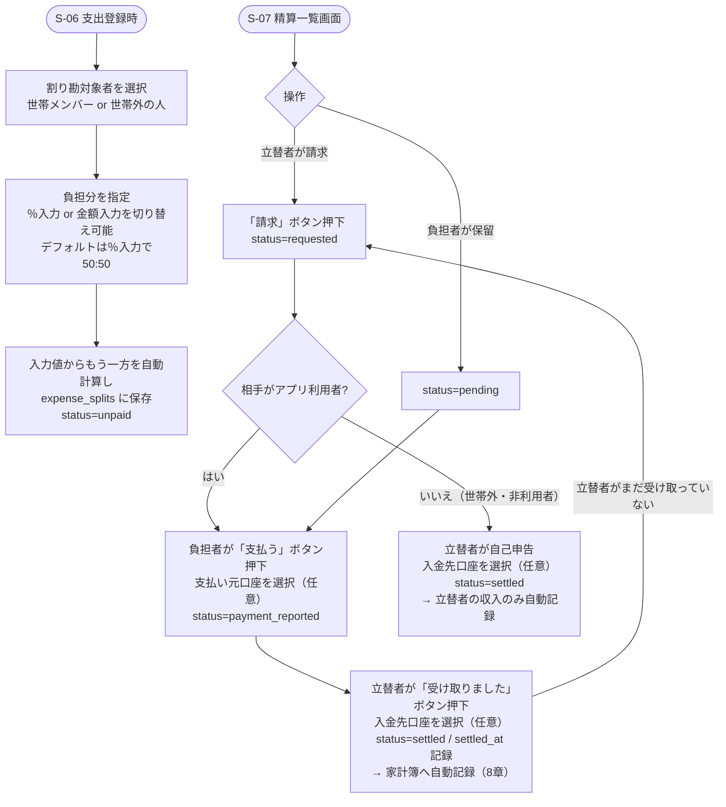

# F-04 割り勘・精算管理

[← 要件定義書に戻る](../../requirements.md)

---

## 1. 概要

支出登録時に割り勘対象者を指定し、各自の負担額を自動計算する。精算は相手側の承認（受領確認）があって初めて完了となる。世帯内メンバーだけでなく、世帯外の相手との精算も扱う。

## 2. 対象画面

| 画面ID | 画面名 |
| --- | --- |
| S-06 | 支出登録モーダル（割り勘対象者の指定） |
| S-07 | 割り勘精算一覧画面 |
| S-05 | 家計簿一覧画面（サマリーカードに未精算件数・金額を表示。詳細な一覧・操作はS-07で行う） |

## 3. 業務フロー

立て替えた側（受領側）を「立替者」、割り勘対象として支払う側を「負担者」と呼ぶ。精算の確定操作は
**受領側（立替者）**が行う（相手が支払ったのを受けて「受け取った」と確認して初めて精算完了）。

```mermaid
flowchart TD
    A([S-06 支出登録時]) --> B[割り勘対象者を選択\n世帯メンバー or 世帯外の人]
    B --> C[負担分を指定\n％入力 or 金額入力を切り替え可能\nデフォルトは％入力で50:50]
    C --> C2[入力値からもう一方を自動計算し\nexpense_splits に保存\nstatus=unpaid]

    S07([S-07 精算一覧画面]) --> E{操作}
    E -- 立替者が請求 --> F[「請求」ボタン押下\nstatus=requested]
    F --> G{相手がアプリ利用者?}
    G -- はい --> H["負担者が「支払う」ボタン押下\n支払い元口座を選択（任意）\nstatus=payment_reported"]
    H --> I["立替者が「受け取りました」ボタン押下\n入金先口座を選択（任意）\nstatus=settled / settled_at 記録\n→ 家計簿へ自動記録（8章）"]
    G -- いいえ（世帯外・非利用者） --> J["立替者が自己申告\n入金先口座を選択（任意）\nstatus=settled\n→ 立替者の収入のみ自動記録"]

    E -- 負担者が保留 --> L["status=pending"]
    L --> H
    I -- 立替者がまだ受け取っていない --> F
```

## 4. IPO

### 割り勘対象者の指定（支出登録時）

| 項目 | 内容 |
| --- | --- |
| 入力 | 支出ID・割り勘対象者（世帯メンバー or 世帯外の人）・入力モード（`ratio`＝％入力 / `amount`＝金額入力）・負担分（％または金額。デフォルトは％入力で50:50、変更可能） |
| 処理 | ％入力時：負担割合から負担額を自動計算。金額入力時：負担額から負担割合を逆算。expense_splits テーブルに `status=unpaid` で保存 |
| 出力 | 割り勘内訳（負担割合・負担額） |

### 請求（立替者）

| 項目 | 内容 |
| --- | --- |
| 入力 | expense_split ID |
| 処理 | `status` を `requested` に更新。`payment_reported` からの請求は「まだ受け取っていない」という差し戻しの意味 |
| 出力 | 更新後の状態 |

### 支払報告（負担者）

| 項目 | 内容 |
| --- | --- |
| 入力 | expense_split ID・支払い元口座（任意） |
| 処理 | `status` を `payment_reported` に更新。選択した口座を `expense_splits.debtor_account_id` に保持（精算確定まで。家計簿への記録はまだ行わない） |
| 出力 | 更新後の状態 |

### 受領確定（立替者）

| 項目 | 内容 |
| --- | --- |
| 入力 | expense_split ID・入金先口座（任意） |
| 処理 | `status` を `settled` に更新、`settled_at` を記録。立替者（受領側）本人のみ操作可能。あわせて家計簿へ自動記録（8章） |
| 出力 | 更新後の状態 |

### 保留（負担者）

| 項目 | 内容 |
| --- | --- |
| 入力 | expense_split ID |
| 処理 | `status` を `pending` に更新。負担者・立替者はこの内訳のコメント欄で理由等をやり取りできる（下記「コメント（立替者・負担者）」参照） |
| 出力 | 更新後の状態 |

### コメント（立替者・負担者）

割り勘内訳ごとにコメントスレッドを持つ。負担者が保留にした際の連絡手段として主に使うが、
状態を問わず（精算済みでも）閲覧・投稿できる（過去のやり取りを残すため）。投稿できるのは
その内訳の立替者・負担者本人のみ（世帯外の負担者はログインできないため投稿不可）。第三者は
存在しないIDと同じ404となる。

| 項目 | 内容 |
| --- | --- |
| 入力 | コメント本文（1〜500文字） |
| 処理 | `expense_split_comments` に1行追加。閲覧・投稿権限はその内訳の立替者 or 負担者のみ（第三者は404） |
| 出力 | コメント一覧（投稿者・本文・投稿日時）を時系列（古い順）で表示 |

### 内訳の削除（立替者）

| 項目 | 内容 |
| --- | --- |
| 入力 | expense_split ID |
| 処理 | 未精算（`unpaid`/`requested`/`payment_reported`/`pending`）の内訳のみ削除可。`settled` は現金が動いた後なので削除不可（400） |
| 出力 | — |

## 5. 世帯外の相手との精算

| ケース | 精算フロー |
| --- | --- |
| 相手がアプリ利用者 | 上記フロー（負担者の支払報告 → 立替者の受領確定が必要） |
| 相手が非利用者 | 立替者の自己申告のみで `settled`。立替者の収入のみ家計簿へ自動記録（負担者はアプリ利用者ではないため支出は作らない） |

## 6. データ設計（関連テーブル）

[data-model.md](../data-model.md) の `expense_splits`, `external_persons`, `expense_split_comments` テーブルを参照。

## 7. 負担分の入力仕様

### 入力モード

支出登録時、負担分の入力方法を **％入力（`ratio`）** と **金額入力（`amount`）** のトグルで切り替えられる。デフォルトは％入力。

| モード | ユーザー入力 | 自動計算 |
| --- | --- | --- |
| ％入力（`ratio`） | 各対象者の負担割合（%） | 負担額 ＝ 支出金額 × 割合（1円未満切り捨て、端数は代表者＝支払った人へ寄せる） |
| 金額入力（`amount`） | 各対象者の負担額（円） | 負担割合 ＝ 負担額 ÷ 支出金額 × 100（小数第3位を四捨五入して%表示。表示・集計用の参考値） |

### 入力チェック

- ％入力時：全対象者の割合の合計が 100% であること。
- 金額入力時：全対象者の負担額の合計が支出金額と一致すること（不一致の場合はエラーとし、差額を画面に表示する）。

### デフォルト値（％入力時）

- 対象者2人：50% : 50%
- 対象者3人以上：人数で均等割り（端数は代表者へ寄せる。例：3人なら33.34% / 33.33% / 33.33%）
- いずれもデフォルト値であり、支出登録時にユーザーが自由に調整できる（[common-notes.md](../common-notes.md) 11章参照）

## 8. 精算完了時の家計簿への自動記録

割り勘は「立替者が全額を立て替え、負担者が後からその分を立替者に支払う」構造なので、精算が完了した
時点で双方の家計簿にお金の動きを記録する。

- `status` が `settled` になった時点（立替者の「受け取りました」＝ `confirm-receipt`、または世帯外相手の
  自己申告＝ `settle-self`）に、以下を **1つのトランザクションでまとめて** 作成する。
  - **立替者**：`incomes` に収入1件（負担者から受け取った金額）
  - **負担者**（アプリ利用者のときのみ）：`expenses` に支出1件（立替者へ支払った金額）
- カテゴリーは支出・収入それぞれの**デフォルトカテゴリー「割り勘精算」**（[common-notes.md](../common-notes.md) 11章）。
- 負担者の精算支出は **`include_in_household_total = false`**。元の共同支出（立替者が登録した支出）が
  すでに世帯合計の対象になっているため、精算支出も算入すると二重計上になる（[common-notes.md](../common-notes.md) 8章）。
- 精算モーダルで**口座を選択した場合のみ**、その口座の残高を増減させる（負担者の支払い元口座は
  `-負担額`、立替者の入金先口座は `+負担額`）。口座を選ばなければ家計簿の収支だけを記録する。
- 精算の記録日は精算確定日（JST基準の当日）。

## 9. 今後の検討事項

- 請求・保留発生時の通知方式（メール/アプリ内通知等）
