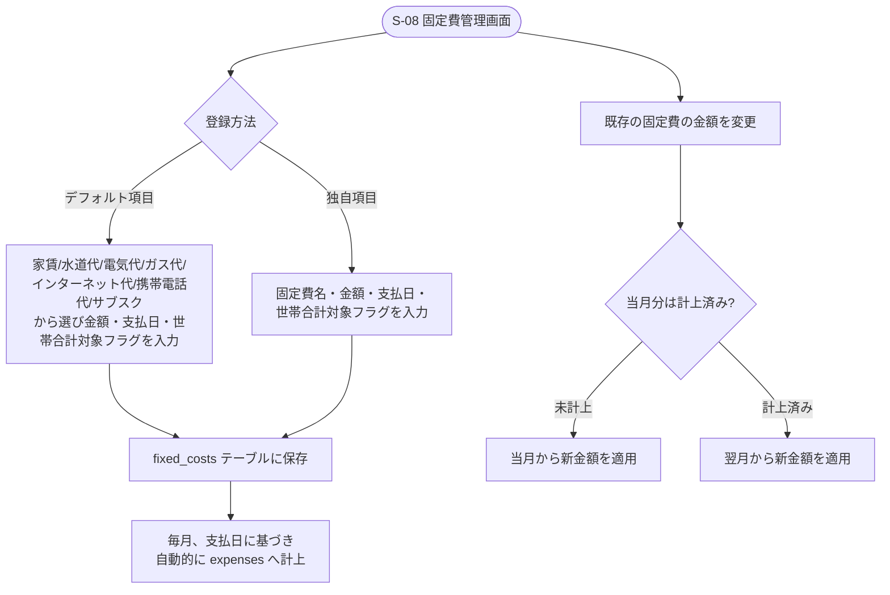

# F-05 固定費管理

[← 要件定義書に戻る](../../requirements.md)

---

## 1. 概要

家賃・水道代等の固定費を登録し、毎月自動的に支出として計上する。

## 2. 対象画面

| 画面ID | 画面名 |
| --- | --- |
| S-08 | 固定費管理画面 |
| S-05 | 家計簿一覧画面（サマリーカードに固定費予定額を表示。詳細な一覧・登録はS-08で行う） |

## 3. 業務フロー

## 4. IPO

### 固定費登録

| 項目 | 内容 |
| --- | --- |
| 入力 | 固定費名（デフォルト項目 or 独自入力）・金額・支払日・世帯合計対象フラグ・公開範囲（個人／世帯共有）・割り勘設定（任意、％/金額入力） |
| 処理 | S-08の固定費登録モーダルから fixed_costs テーブルに保存。公開範囲が「個人」の場合は `owner_user_id` に登録者を設定、「世帯共有」の場合はNULL。割り勘設定は fixed_cost_splits テーブルに保存（入力仕様・バリデーションは[F04_kakeibo_warikan](F04_kakeibo_warikan.md) 7章と同一） |
| 出力 | 登録した固定費 |

### 毎月の自動計上

| 項目 | 内容 |
| --- | --- |
| 入力 | なし（バッチ/スケジューラによる自動実行） |
| 処理 | 支払日に基づき fixed_costs から expenses へ自動でレコードを作成。割り勘設定（fixed_cost_splits）がある固定費は、その設定を雛形として expense_splits も同時に `status=unpaid` で作成する |
| 出力 | 作成された支出レコード（および割り勘設定がある場合は精算レコード） |

### 金額変更

| 項目 | 内容 |
| --- | --- |
| 入力 | fixed_cost ID・新しい金額 |
| 処理 | 当月分が未計上なら当月から、計上済みなら翌月から新金額を適用 |
| 出力 | 更新後の固定費 |

## 5. デフォルト固定費項目

家賃、水道代、電気代、ガス代、インターネット代、携帯電話代、サブスクリプション（動画・音楽配信等）

## 6. 世帯合計対象フラグ

固定費は世帯で共有する費用（例：家賃、水道代）と個人的な費用（例：個人サブスク）が混在しうるため、支出と同様に`include_in_household_total`フラグを持ち、世帯合計支出（[F12_kakeibo_household_summary](F12_kakeibo_household_summary.md)）への算入可否を制御する。

## 6-2. 公開範囲（個人／世帯共有）

- 固定費は登録時に公開範囲を選択する（[common-notes.md](../common-notes.md) 2章）。
  - **世帯共有**（`owner_user_id` = NULL）：家賃・水道代など。世帯メンバー全員が閲覧可能。
  - **個人**（`owner_user_id` = 登録者）：個人サブスクなど。本人のみ閲覧・編集可能で、他の世帯メンバーの一覧・固定費予定サマリーには表示されない。
- 公開範囲（明細の閲覧可否）と世帯合計対象フラグ（世帯合計金額への算入可否）は独立した設定であり、「個人所有だが世帯合計には含める」という組み合わせも可能。この場合、他の世帯メンバーには世帯合計支出（[F12_kakeibo_household_summary](F12_kakeibo_household_summary.md)）の**合計金額の一部としてのみ**反映され、固定費名・金額等の明細は開示されない。これは個人の支出（expenses）を`include_in_household_total=true`で登録した場合と同じ扱いである（[common-notes.md](../common-notes.md) 8章：世帯合計サマリーで開示するのは合計金額のみ）。

## 6-3. 割り勘設定

- 家賃・水道代など、毎月同じ割合で割り勘する固定費のために、固定費自体に割り勘設定を持たせられる（`fixed_cost_splits`）。
- 入力UI・バリデーション（％入力/金額入力トグル、合計100%・合計金額一致チェック、デフォルト均等割り）は支出の割り勘（[F04_kakeibo_warikan](F04_kakeibo_warikan.md) 7章）と同一。
- 毎月の自動計上時に、この設定を雛形として expenses と expense_splits（`status=unpaid`）を生成する。以降の請求・承認フローは通常の割り勘と同じ。

## 7. データ設計（関連テーブル）

[data-model.md](../data-model.md) の `fixed_costs`, `fixed_cost_splits` テーブルを参照。

## 8. 今後の検討事項

- 自動計上を実行するバッチ処理の実装方式（Spring Schedulerを想定、詳細は実装時に決定）
