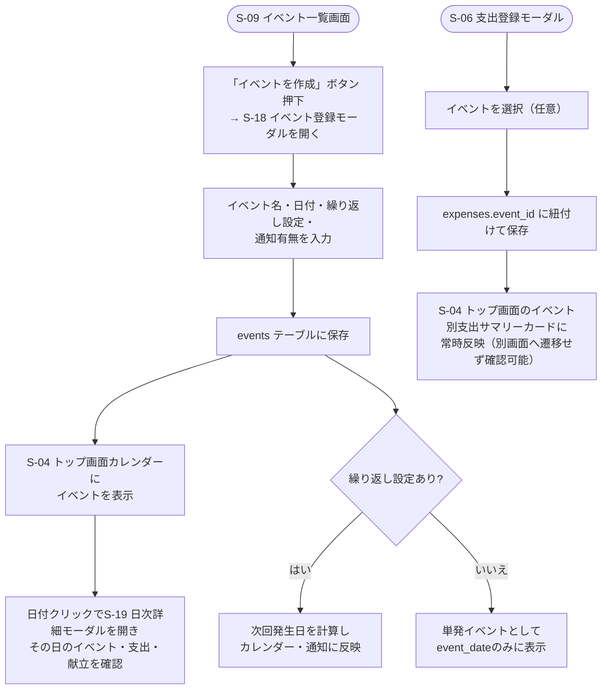

# F-06 イベント管理

[← 要件定義書に戻る](../../requirements.md)

---

## 1. 概要

イベント（例：父の日、推し活、旅行、学習などの習慣）を作成し、複数の支出を後から紐付けて集計できるようにする。イベントは日付を持ち、トップ画面の月間カレンダーに表示される。単発イベントだけでなく、毎日/毎週/毎月/毎年の繰り返し設定にも対応し、繰り返しイベントはアプリ内通知で知らせる。

## 2. 対象画面

| 画面ID | 画面名 |
| --- | --- |
| S-09 | イベント一覧・集計画面 |
| S-18 | イベント登録モーダル |
| S-06 | 支出登録モーダル（イベント紐付け） |
| S-04 | トップ画面（生活ダッシュボード。月間カレンダーへのイベント表示・イベント別支出サマリーカードを常設表示） |
| S-05 | 家計簿一覧画面（サマリーカードにイベント別支出サマリーを表示。詳細な一覧・登録はS-09で行う） |
| S-19 | 日次詳細モーダル（その日のイベント確認・追加） |

## 3. 業務フロー

## 4. IPO

### イベント作成

| 項目 | 内容 |
| --- | --- |
| 入力 | イベント名・日付（event_date）・終日フラグ（デフォルトON）・開始/終了時刻（終日OFF時）・繰り返し設定（`none`/`daily`/`weekly`/`monthly`/`yearly`）・通知有無・デフォルト金額（任意）・公開範囲（個人／世帯共有） |
| 処理 | events テーブルに保存。公開範囲が「個人」の場合は `owner_user_id` に登録者を設定、「世帯共有」の場合はNULL。終日OFFの場合は開始時刻必須（終了時刻のみの入力は不可）、終了時刻＜開始時刻はバリデーションエラー |
| 出力 | 作成したイベント |

### 支出とイベントの紐付け

| 項目 | 内容 |
| --- | --- |
| 入力 | 支出情報・イベントID（任意） |
| 処理 | S-06支出登録モーダルでイベントを選択すると、そのイベントの`default_amount`が設定されていれば支出の金額欄へ自動入力する（ユーザーは登録前に上書き可能）。保存時は expenses.event_id に設定して保存 |
| 出力 | イベントに紐付いた支出 |

### イベント別集計

トップ画面のイベント別支出サマリーは、「そのイベントにいくら使ったか」を確認する目的のため、対象期間を**今年／今月**から選択できるようにする（デフォルトは今年）。他の「今月のお金」カード内項目は今月固定だが、イベント別支出サマリーのみ期間セレクトを持つ。

また、全イベントを一律に表示するのではなく、**表示対象として選択したイベント（`show_on_dashboard` = true）のみ**を表示する。ON/OFF は S-18 イベント登録モーダル（デフォルト ON）および S-09 イベント一覧のトグルで切り替える。表示対象のイベントは、選択期間の支出が 0 円でも表示する（確認したいイベントであるため）。

| 項目 | 内容 |
| --- | --- |
| 入力 | イベントID・対象期間セレクト（`year`＝今年／`month`＝今月、デフォルト`year`） |
| 処理 | `show_on_dashboard` = true のイベントを対象に、event_id と expense_date が対象期間（今年 or 今月）に該当する expenses を集計しSUM(amount)を計算 |
| 出力 | イベント名：選択期間の合計金額（表示対象イベントのみ） |

### トップ画面カレンダーへの表示

| 項目 | 内容 |
| --- | --- |
| 入力 | 表示対象の年月 |
| 処理 | 対象月内の event_date を持つイベント、および繰り返し設定により対象月に発生日を持つイベントを抽出 |
| 出力 | 該当日にイベント名を表示するカレンダーデータ |

## 5. 繰り返し設定

| recurrence_type | 説明 |
| --- | --- |
| `none` | 単発イベント（event_dateの日のみ） |
| `daily` | 毎日繰り返す |
| `weekly` | event_dateと同じ曜日で毎週繰り返す |
| `monthly` | event_dateと同じ日で毎月繰り返す |
| `yearly` | event_dateと同じ月日で毎年繰り返す |

## 5-2. 時間帯（終日／開始・終了時刻）

- イベントは**終日**（`is_all_day` = true、デフォルト）か**時刻指定**（`is_all_day` = false）のいずれかで登録する。
- 時刻指定の場合、開始時刻（`start_time`）は必須、終了時刻（`end_time`）は任意（「9:00〜」のような終了未定の予定を許容する）。終了時刻のみの入力は不可、終了時刻＜開始時刻はエラーとする。
- 繰り返しイベントの場合、時間帯は毎回の発生日に同じ時間帯が適用される（例：毎日20:00〜21:00の学習）。
- 表示先：
  - S-09 イベント一覧：日付/繰り返しに時間帯を併記（終日は「終日」、時刻指定は「9:00〜12:00」「9:00〜」）。
  - S-19 日次詳細モーダル：イベント名に時間帯を併記。
  - S-04 カレンダーセル：スペースが限られるため時間帯は表示しない（日次詳細モーダルで確認する）。

## 6. 通知（アプリ内通知）

- 繰り返し設定・通知有無（`notify_enabled`）がtrueのイベントは、発生日にトップ画面上でバッジ等により通知する（メール・Push通知等のアプリ外通知は今回のスコープ外）。
- 通知の具体的なUI（バッジ・トースト等）は[wireframes.md](../wireframes.md) S-04を参照。

## 7. データ設計（関連テーブル）

[data-model.md](../data-model.md) の `events`, `expenses.event_id` を参照。

## 7-2. 公開範囲（個人／世帯共有）

- イベントは登録時に公開範囲を選択する（[common-notes.md](../common-notes.md) 2章）。
  - **世帯共有**（`owner_user_id` = NULL）：家族の誕生日・旅行など。世帯メンバー全員のカレンダー・一覧に表示される。
  - **個人**（`owner_user_id` = 登録者）：推し活・個人の学習習慣など。本人のみ閲覧・編集可能で、他の世帯メンバーのカレンダー・一覧・集計には表示されない。
- イベント別支出の集計は、公開範囲に関わらず「本人が支払った支出」のみを対象とする（支出データ自体が本人のみ閲覧可能なため）。

## 8. デフォルト金額について

- イベントの`default_amount`はあくまで「支出登録時の初期値」であり、予算管理・実績との比較機能ではない（今回のスコープ外、9章参照）。
- 未設定の場合、支出登録モーダルの金額欄はイベント選択の影響を受けない（空のまま）。

## 9. 今後の検討事項

- 繰り返しイベントの終了日・除外日（特定の回だけスキップする等）の指定機能
- メール・Push通知等、アプリ外通知への対応
- 時刻指定イベントの開始時刻前リマインド通知の要否
- トップ画面（S-04）のイベント別支出サマリーカードで、表示対象イベント数が多い場合の表示方法（上位N件＋「もっと見る」等）
- 世帯共有イベントの`show_on_dashboard`はイベント単位（世帯内共通）の設定とする。ユーザーごとに表示対象を選べるようにするか（別テーブル化）は今後の検討事項
- イベントのデフォルト金額と実績（紐づいた支出合計）を比較表示する予算管理機能の要否
