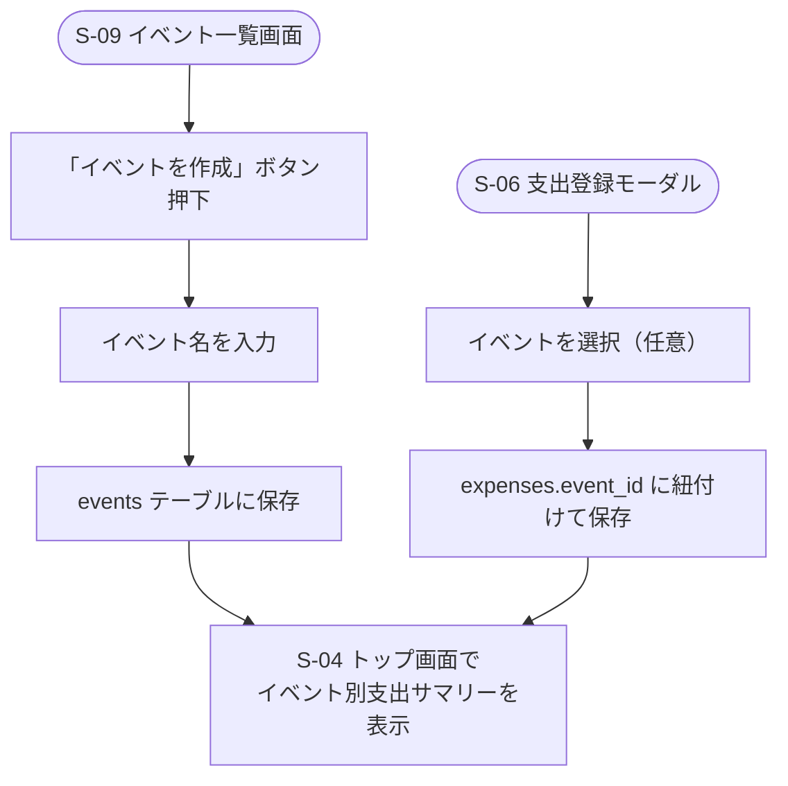

# F-06 イベント管理

[← 要件定義書に戻る](../../requirements.md)

---

## 1. 概要

イベント（例：父の日、推し活、旅行など）を先に作成し、複数の支出を後から紐付けて集計できるようにする。

## 2. 対象画面

| 画面ID | 画面名 |
| --- | --- |
| S-09 | イベント一覧・集計画面 |
| S-06 | 支出登録モーダル（イベント紐付け） |
| S-04 | トップ画面（イベント別支出サマリー表示） |

## 3. 業務フロー

## 4. IPO

### イベント作成

| 項目 | 内容 |
| --- | --- |
| 入力 | イベント名 |
| 処理 | events テーブルに保存 |
| 出力 | 作成したイベント |

### 支出とイベントの紐付け

| 項目 | 内容 |
| --- | --- |
| 入力 | 支出情報・イベントID（任意） |
| 処理 | expenses.event_id に設定して保存 |
| 出力 | イベントに紐付いた支出 |

### イベント別集計

| 項目 | 内容 |
| --- | --- |
| 入力 | イベントID |
| 処理 | event_id で expenses を集計しSUM(amount)を計算 |
| 出力 | イベント名：合計金額 |

## 5. データ設計（関連テーブル）

[data-model.md](../data-model.md) の `events`, `expenses.event_id` を参照。

## 6. 今後の検討事項

- トップ画面（S-04）でのイベント別サマリーの具体的な表示形式（[wireframes.md](../wireframes.md)参照、レイアウト未確定）
