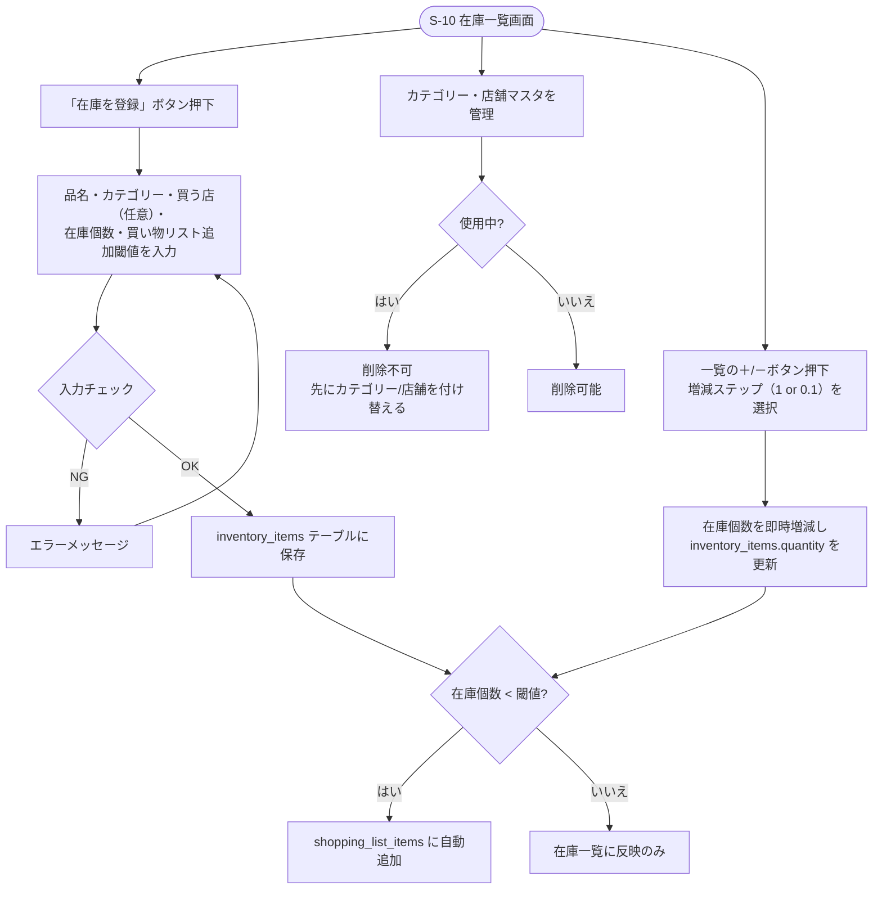

# F-07 在庫管理

[← 要件定義書に戻る](../../requirements.md)

---

## 1. 概要

世帯内の食材等の在庫を一元管理する。在庫が閾値を下回ると自動的に買い物リストへ連携される（[F08_zaiko_shoppinglist](F08_zaiko_shoppinglist.md)参照）。

## 2. 対象画面

| 画面ID | 画面名 |
| --- | --- |
| S-10 | 在庫・買い物リスト画面（在庫一覧パネル。買い物リストと同一画面内で同時表示、[common-notes.md](../common-notes.md) 9章参照） |

## 3. 業務フロー

## 4. IPO

### 在庫アイテム登録

| 項目 | 内容 |
| --- | --- |
| 入力 | 品名（必須）・カテゴリー（必須）・買う店（任意）・在庫個数（必須）・買い物リスト追加閾値（必須） |
| 処理 | 入力チェック → inventory_items テーブルに保存 → 閾値判定 → 該当すれば shopping_list_items へ自動追加 |
| 出力 | 登録した在庫アイテム |

### カテゴリー/店舗マスタ管理

| 項目 | 内容 |
| --- | --- |
| 入力 | カテゴリー名 or 店舗名 |
| 処理 | 追加・編集・削除（使用中のものは削除不可） |
| 出力 | 更新後のマスタ一覧 |

### 在庫個数の増減（＋/－ボタン）

| 項目 | 内容 |
| --- | --- |
| 入力 | 在庫アイテムID・増減方向（＋/－）・増減ステップ（1個単位 or 0.1単位、都度切り替え可能） |
| 処理 | inventory_items.quantity を即時更新（0未満にはならないよう制限） → 閾値判定 → 該当すれば shopping_list_items へ自動追加/除外 |
| 出力 | 更新後の在庫個数 |

## 5. 入力チェック仕様

| 項目 | 必須 | 形式・制約 |
| --- | --- | --- |
| 品名 | ○ | 1〜50文字 |
| カテゴリー | ○ | zaiko_categories から選択 |
| 買う店 | — | stores から選択 |
| 在庫個数 | ○ | 0以上、小数点第一位まで |
| 買い物リスト追加閾値 | ○ | 0以上、小数点第一位まで |

## 6. デフォルトカテゴリー

野菜、肉、魚介、乳製品、卵、調味料、飲料、冷凍食品、乾物、その他

## 7. データ設計（関連テーブル）

[data-model.md](../data-model.md) の `inventory_items`, `zaiko_categories`, `stores` テーブルを参照。

## 8. 今後の検討事項

- デフォルトカテゴリー（編集不可）について、ユーザーからの改称要望が出た場合の対応方針
