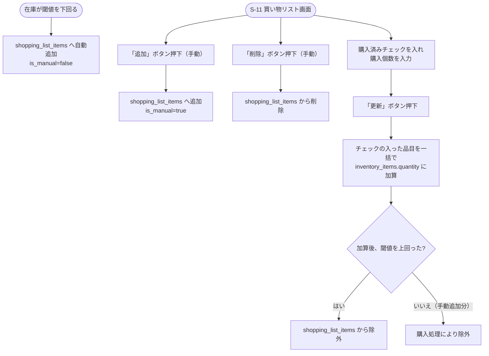

# F-08 買い物リスト

[← 要件定義書に戻る](../../requirements.md)

---

## 1. 概要

在庫管理と密連携する買い物リスト。在庫が閾値を下回った品目の自動追加、手動追加・削除、購入処理による在庫への一括反映を行う。

## 2. 対象画面

| 画面ID | 画面名 |
| --- | --- |
| S-11 | 買い物リスト画面 |

## 3. 業務フロー

## 4. IPO

### 自動追加

| 項目 | 内容 |
| --- | --- |
| 入力 | inventory_items の在庫個数更新イベント |
| 処理 | quantity < threshold を判定 → shopping_list_items へ `is_manual=false` で追加 |
| 出力 | 追加された買い物リスト項目 |

### 手動追加・削除

| 項目 | 内容 |
| --- | --- |
| 入力 | inventory_item ID |
| 処理 | shopping_list_items への追加（`is_manual=true`）または削除 |
| 出力 | 更新後の買い物リスト |

### 購入処理（一括更新）

| 項目 | 内容 |
| --- | --- |
| 入力 | 購入済みチェック・購入個数（品目ごと） |
| 処理 | チェックされた品目を一括で inventory_items.quantity に加算 → 閾値判定 → 条件を満たさなくなった品目を shopping_list_items から除外 |
| 出力 | 更新後の在庫・買い物リスト |

## 5. 並び替え

あいうえお順／カテゴリー順／買う店順

## 6. データ設計（関連テーブル）

[data-model.md](../data-model.md) の `shopping_list_items`, `inventory_items` テーブルを参照。
