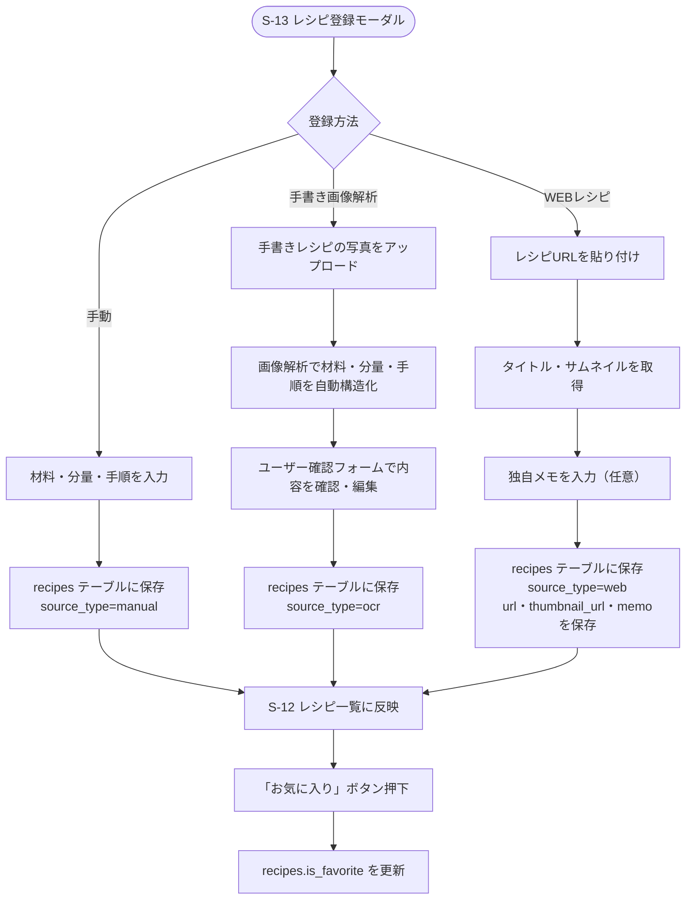

# F-09 レシピ登録・管理

[← 要件定義書に戻る](../../requirements.md)

---

## 1. 概要

レシピの手動登録・手書きレシピの画像解析登録・WEBレシピの引用登録・お気に入り管理を行う。

## 2. 対象画面

| 画面ID | 画面名 |
| --- | --- |
| S-12 | レシピ一覧画面 |
| S-13 | レシピ登録モーダル（手動/OCR/WEB） |

## 3. 業務フロー

## 4. IPO

### 手動登録

| 項目 | 内容 |
| --- | --- |
| 入力 | タイトル・材料・手順 |
| 処理 | recipes テーブルに `source_type=manual` で保存 |
| 出力 | 登録したレシピ |

### 手書き画像解析登録

| 項目 | 内容 |
| --- | --- |
| 入力 | 手書きレシピの画像ファイル |
| 処理 | 画像解析APIで材料・分量・手順を構造化 → ユーザー確認フォームに一時反映 → ユーザーが確認・編集 → recipes テーブルに `source_type=ocr` で保存 |
| 出力 | 登録したレシピ |

### WEBレシピ登録

| 項目 | 内容 |
| --- | --- |
| 入力 | レシピURL・独自メモ（任意） |
| 処理 | URLからタイトル・サムネイルを取得 → recipes テーブルに `source_type=web` で保存（材料・手順は保持しない） |
| 出力 | 登録したレシピ |

### お気に入り登録

| 項目 | 内容 |
| --- | --- |
| 入力 | recipe ID |
| 処理 | recipes.is_favorite を true/false に更新 |
| 出力 | 更新後のレシピ |

## 5. データ設計（関連テーブル）

[data-model.md](../data-model.md) の `recipes` テーブルを参照。

## 6. 今後の検討事項

- 手書きレシピ画像解析に使用する外部AI/OCRサービスの選定
- WEBレシピのタイトル・サムネイル自動取得方式（著作権・利用規約の確認含む）
