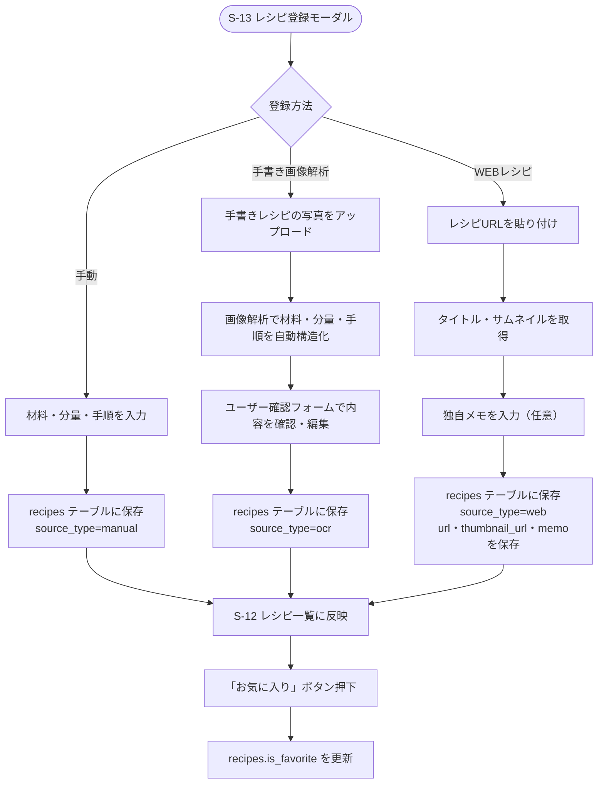

# F-09 レシピ登録・管理

[← 要件定義書に戻る](../../requirements.md)

---

## 1. 概要

レシピの手動登録・手書きレシピの画像解析登録・WEBレシピの引用登録・お気に入り管理を行う。

## 2. 対象画面

| 画面ID | 画面名 |
| --- | --- |
| S-12 | レシピ一覧画面 |
| S-13 | レシピ登録モーダル（手動/OCR/WEB） |

## 3. 業務フロー

```mermaid
flowchart TD
    A([S-13 レシピ登録モーダル]) --> B{登録方法}
    B -- 手動 --> C[材料・分量・手順を入力]
    C --> G[recipes テーブルに保存\nsource_type=manual]

    B -- 手書き画像解析 --> D[手書きレシピの写真をアップロード]
    D --> E[画像解析で材料・分量・手順を自動構造化]
    E --> F[ユーザー確認フォームで内容を確認・編集]
    F --> G2[recipes テーブルに保存\nsource_type=ocr]

    B -- WEBレシピ --> H[レシピURLを貼り付け]
    H --> I[タイトル・サムネイルを取得]
    I --> J[独自メモを入力（任意）]
    J --> K[recipes テーブルに保存\nsource_type=web\nurl・thumbnail_url・memoを保存]

    G --> L[S-12 レシピ一覧に反映]
    G2 --> L
    K --> L
    L --> M["「お気に入り」ボタン押下"]
    M --> N[recipes.is_favorite を更新]
```

## 4. IPO

### 手動登録

| 項目 | 内容 |
| --- | --- |
| 入力 | タイトル・材料・手順 |
| 処理 | recipes テーブルに `source_type=manual` で保存 |
| 出力 | 登録したレシピ |

### 手書き画像解析登録

| 項目 | 内容 |
| --- | --- |
| 入力 | 手書きレシピの画像ファイル |
| 処理 | 画像解析APIで材料・分量・手順を構造化 → ユーザー確認フォームに一時反映 → ユーザーが確認・編集 → recipes テーブルに `source_type=ocr` で保存 |
| 出力 | 登録したレシピ |

### WEBレシピ登録

| 項目 | 内容 |
| --- | --- |
| 入力 | レシピURL・独自メモ（任意） |
| 処理 | URLからタイトル・サムネイルを取得 → recipes テーブルに `source_type=web` で保存（材料・手順は保持しない） |
| 出力 | 登録したレシピ |

### お気に入り登録

| 項目 | 内容 |
| --- | --- |
| 入力 | recipe ID |
| 処理 | recipes.is_favorite を true/false に更新 |
| 出力 | 更新後のレシピ |

## 5. データ設計（関連テーブル）

[data-model.md](../data-model.md) の `recipes` テーブルを参照。

### WEBレシピのタイトル・サムネイル自動取得方式（実装済み）

`POST /api/recipes/from-url` に登録先URLを渡すと、サーバー側でそのURLをfetchし、
`HTMLRewriter` で `<meta property="og:title">` / `<meta property="og:image">` / `<title>` を
ストリーミング抽出する（レスポンスボディを丸ごとメモリに読み込まない）。

- タイトルは `og:title` → `<title>` → URL文字列 の優先順で必ず何か確定する
- サムネイルは `og:image` が無ければ保存しない（NULL）
- `http:`/`https:` 以外のスキーム、`localhost`/ループバック/プライベートIP帯を指定したURL、
  非HTMLレスポンス、fetch失敗（タイムアウト・DNS失敗・非2xx）は400エラーとする（SSRF対策）
- 取得したタイトル・サムネイル・元URL・任意メモを `source_type='web'` で保存する
  （材料・手順は保持しない）。以降の編集はメモのみ可能

### 共有ボタン連携（PWA、実装済み）

インストール済みPWA（主にAndroid Chrome）から、他アプリの共有メニュー経由でレシピURLを
HomeLogへ渡せる（Web Share Target）。共有すると `/recipes/share?url=...` に遷移し、
WEBタブが選択された状態でレシピ登録モーダルが自動的に開く。`url`パラメータが無い場合は
`text`パラメータからURLらしき文字列を正規表現で抽出してフォールバックする。
iOS SafariはWeb Share Target非対応のため、従来通りURLコピペで登録する。

## 6. 今後の検討事項

- 手書きレシピ画像解析に使用する外部AI/OCRサービスの選定
