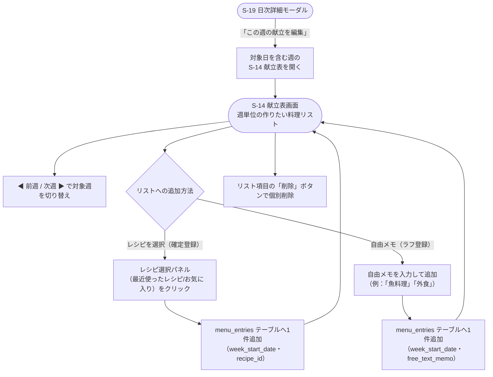

# F-10 献立表

[← 要件定義書に戻る](../../requirements.md)

---

## 1. 概要

献立は**週単位の「作りたい料理リスト」**として登録する。曜日への割り当ては行わない。献立表画面（S-14）でレシピを選択する（`recipe_id`を設定）か自由メモを入力する（`free_text_memo`を設定）と、その週のリストに1件ずつ追加されていく。リストの項目は個別に削除できる。日別・曜日別の登録画面は持たない。

データは週単位（`menu_entries`、`week_start_date`＝その週の月曜日、1行＝リストの1品）で保持する。トップ画面（S-04）・日次詳細モーダル（S-19）では「その週の献立リスト」として表示する（カレンダーの日付セルには献立を表示しない）。

## 2. 対象画面

| 画面ID | 画面名 |
| --- | --- |
| S-14 | 献立表画面（週単位の作りたい料理リスト） |

## 3. 業務フロー

## 4. IPO

### 献立リストへの追加

| 項目 | 内容 |
| --- | --- |
| 入力 | 対象週（week_start_date＝その週の月曜日）・レシピID（確定登録）または自由メモ（ラフ登録） |
| 処理 | menu_entries テーブルに1件追加。recipe_id と free_text_memo はどちらか一方のみ設定する。同じ週に複数件登録できる（リスト形式）。曜日への割り当ては行わない |
| 出力 | 追加後のその週の献立リスト |

### 献立リストからの削除

| 項目 | 内容 |
| --- | --- |
| 入力 | menu_entry ID |
| 処理 | 該当レコードを削除 |
| 出力 | 削除後のその週の献立リスト |

### 週の表示・切り替え

| 項目 | 内容 |
| --- | --- |
| 入力 | 基準日（デフォルトは今日を含む週。前週/次週ボタンで移動） |
| 処理 | 基準日から week_start_date（月曜日）を算出し、menu_entries を week_start_date で検索 |
| 出力 | 該当週の献立リスト（recipe_idがあればレシピ名、なければfree_text_memoを表示） |

## 5. ラフ登録と確定登録の使い分け

- リストの1品ごとに「確定登録（レシピ選択）」と「ラフ登録（自由メモ）」を使い分けられる。
- **ラフ登録**：自由メモ（例：「魚料理」「外食」）を素早く追加し、大枠の献立イメージを埋める。
- **確定登録**：レシピ選択パネル（最近使ったレシピ・お気に入り）から選択して追加する。
- ラフ登録の項目を確定に変えたい場合は、メモを削除してレシピを追加し直す。
- トップ画面（S-04「今日の状況」カード・S-19日次詳細モーダル）では「今週の献立」としてその週のリストを表示する。recipe_idが設定されていればレシピ名を、free_text_memoのみ設定されていればそのメモ文言を表示する、という共通ロジックで扱う。カレンダーの日付セルには献立を表示しない（曜日と紐付かないため）。

## 6. データ設計（関連テーブル）

[data-model.md](../data-model.md) の `menu_entries`, `recipes` テーブルを参照。

## 7. 今後の検討事項

- 週単位での献立コピー機能（前週のリストを次週へ複製する等）の要否
- 献立リストの「作った/まだ」のチェック（消し込み）機能の要否
- 献立リストから買い物リストへの材料連携の要否（現時点では連携なし、[common-notes.md](../common-notes.md) 6章）
