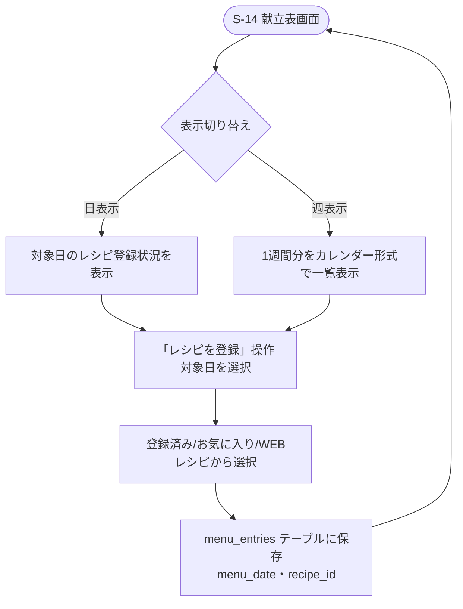

# F-10 献立表

[← 要件定義書に戻る](../../requirements.md)

---

## 1. 概要

登録済みレシピを1日単位で献立に登録する。表示は日表示・週表示（カレンダー形式）を切り替えられる。

## 2. 対象画面

| 画面ID | 画面名 |
| --- | --- |
| S-14 | 献立表画面（日/週表示） |

## 3. 業務フロー

## 4. IPO

### 献立登録

| 項目 | 内容 |
| --- | --- |
| 入力 | 対象日・レシピID |
| 処理 | menu_entries テーブルに保存 |
| 出力 | 登録した献立 |

### 表示切り替え

| 項目 | 内容 |
| --- | --- |
| 入力 | 表示モード（日/週）・基準日 |
| 処理 | menu_entries を menu_date で検索 |
| 出力 | 該当期間の献立一覧 |

## 5. データ設計（関連テーブル）

[data-model.md](../data-model.md) の `menu_entries`, `recipes` テーブルを参照。

## 6. 今後の検討事項

- 週単位での献立コピー機能の要否
