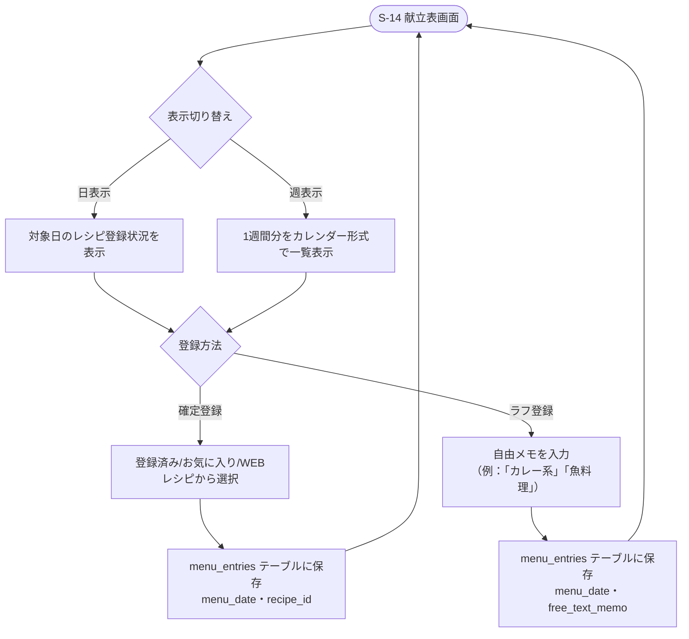

# F-10 献立表

[← 要件定義書に戻る](../../requirements.md)

---

## 1. 概要

献立を1日単位で登録する。登録方法は「レシピを確定登録する」（`recipe_id`を設定）と「自由メモでラフに登録する」（`free_text_memo`を設定）のどちらか一方を選べる。この2方式をテーブル上分けず同じ`menu_entries`に持たせることで、週単位でざっくり決めたい場合と、1日単位でしっかり決めたい場合の両方を1つのデータモデルで扱う。表示は日表示・週表示（カレンダー形式）を切り替えられる。

## 2. 対象画面

| 画面ID | 画面名 |
| --- | --- |
| S-14 | 献立表画面（日/週表示） |

## 3. 業務フロー

## 4. IPO

### 献立登録（確定／ラフ共通）

| 項目 | 内容 |
| --- | --- |
| 入力 | 対象日（必須）・レシピID（確定登録の場合）または自由メモ（ラフ登録の場合） |
| 処理 | menu_entries テーブルに保存。recipe_id と free_text_memo はどちらか一方のみ設定する |
| 出力 | 登録した献立 |

### 表示切り替え

| 項目 | 内容 |
| --- | --- |
| 入力 | 表示モード（日/週）・基準日 |
| 処理 | menu_entries を menu_date で検索 |
| 出力 | 該当期間の献立一覧（recipe_idがあればレシピ名、なければfree_text_memoを表示） |

## 5. ラフ登録と確定登録の使い分け

- **週単位ラフ版**：週表示画面で、各日に自由メモ（例：「カレー系」「魚料理」「外食」）だけを素早く入力する運用を想定。レシピを決めずに大枠の献立イメージだけ埋めたい場合に使う。
- **1日単位詳細版**：日表示画面（またはトップ画面S-04の日次詳細モーダルS-19）から、対象日のレシピを確定登録する運用を想定。
- 同じ日の`menu_entries`をラフ登録から確定登録へ更新する（free_text_memoをrecipe_idに置き換える）ことも可能。
- トップ画面カレンダー（[F06_kakeibo_event](F06_kakeibo_event.md)参照）でのセル表示は、recipe_idが設定されていればレシピ名を、free_text_memoのみ設定されていればそのメモ文言を表示する、という共通ロジックで扱う。

## 6. データ設計（関連テーブル）

[data-model.md](../data-model.md) の `menu_entries`, `recipes` テーブルを参照。

## 7. 今後の検討事項

- 週単位での献立コピー機能の要否
- ラフ登録（自由メモ）から確定登録（レシピ選択）へ変換する際のUI操作の詳細
