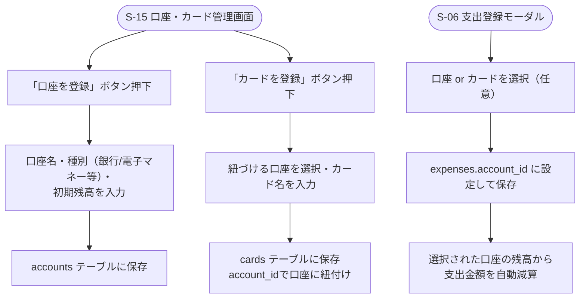

# F-11 口座・カード管理

[← 要件定義書に戻る](../../requirements.md)

---

## 1. 概要

銀行口座・PayPay等の電子マネーを「口座」として手動登録し、支出登録時にどの口座から出費したかを選択できるようにする。クレジットカードは口座に紐づく子エンティティとして扱う。今回のスコープは手動登録のみとし、外部API連携（銀行・カード会社・Money Forward ME・PayPay等）は対象外とする（[common-notes.md](../common-notes.md) 7章参照）。

口座は**残高**を持ち、個人の財政管理に用いる。残高は所有者本人のみ閲覧可能（[common-notes.md](../common-notes.md) 2章：個人データの権限方針）で、当該口座を指定した支出を登録するたびに自動的に減算される。

## 2. 対象画面

| 画面ID | 画面名 |
| --- | --- |
| S-15 | 口座・カード管理画面 |
| S-06 | 支出登録モーダル（口座・カードの選択） |
| S-04 | トップ画面（「個人の財政」カードに自分の口座残高合計を表示） |

## 3. 業務フロー

## 4. IPO

### 口座登録

| 項目 | 内容 |
| --- | --- |
| 入力 | 口座名・種別（`bank`/`e_money`等）・初期残高 |
| 処理 | accounts テーブルに保存（owner_user_idはログインユーザー、balanceに初期残高を設定） |
| 出力 | 登録した口座 |

### カード登録

| 項目 | 内容 |
| --- | --- |
| 入力 | 紐づける口座ID・カード名 |
| 処理 | cards テーブルに `account_id` を設定して保存 |
| 出力 | 登録したカード |

### 支出登録時の口座/カード選択

| 項目 | 内容 |
| --- | --- |
| 入力 | 支出情報・口座ID または カードID（任意） |
| 処理 | expenses.account_id に設定して保存 → 選択された口座（カード選択時はカードの親口座）のbalanceから支出金額を自動減算 |
| 出力 | 口座/カードが紐付いた支出、更新後の口座残高 |

## 5. 口座残高と個人財政管理

- 残高は口座の所有者（owner_user_id）本人のみが閲覧・登録・編集できる（他の世帯メンバーには表示しない）。在庫管理・献立表と異なり、口座・残高は世帯共有ではなく個人管理の情報として扱う。
- 支出登録時に口座/カードを選択すると、当該口座の残高が支出金額分だけ自動的に減算される。残高が支出金額を下回りマイナスになる場合の制御は設けない（今後の検討事項）。
- 個人全体の財政状況を一目で確認できるよう、トップ画面（S-04）の「個人の財政」カードに自分が所有する口座の残高合計を表示する（[wireframes.md](../wireframes.md) S-04参照）。

## 6. データ設計（関連テーブル）

[data-model.md](../data-model.md) の `accounts`, `cards`, `expenses.account_id` を参照。

## 7. 今後の検討事項

- 外部API連携（Money Forward ME等の家計簿連携サービス経由でのカード・PayPay利用明細の自動取得）
  - 銀行・カード会社の公式APIは提携審査・契約が必要なケースが多く、個人開発では実現のハードルが高いため、まずは家計簿連携サービスのAPI活用を軸に検討する
- 口座の所有者（owner_user_id）以外の世帯メンバーが、その口座を使った支出を登録できるかどうかの権限整理
- 残高がマイナスになる場合の入力制御・警告表示の要否
- 口座残高の手動修正（実際の残高とのズレを補正する機能）の要否
