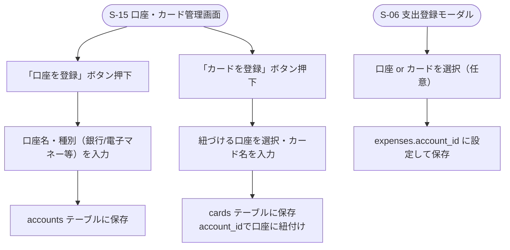

# F-11 口座・カード管理

[← 要件定義書に戻る](../../requirements.md)

---

## 1. 概要

銀行口座・PayPay等の電子マネーを「口座」として手動登録し、支出登録時にどの口座から出費したかを選択できるようにする。クレジットカードは口座に紐づく子エンティティとして扱う。今回のスコープは手動登録のみとし、外部API連携（銀行・カード会社・Money Forward ME・PayPay等）は対象外とする（[common-notes.md](../common-notes.md) 7章参照）。

## 2. 対象画面

| 画面ID | 画面名 |
| --- | --- |
| S-15 | 口座・カード管理画面 |
| S-06 | 支出登録モーダル（口座・カードの選択） |

## 3. 業務フロー

## 4. IPO

### 口座登録

| 項目 | 内容 |
| --- | --- |
| 入力 | 口座名・種別（`bank`/`e_money`等） |
| 処理 | accounts テーブルに保存（owner_user_idはログインユーザー） |
| 出力 | 登録した口座 |

### カード登録

| 項目 | 内容 |
| --- | --- |
| 入力 | 紐づける口座ID・カード名 |
| 処理 | cards テーブルに `account_id` を設定して保存 |
| 出力 | 登録したカード |

### 支出登録時の口座/カード選択

| 項目 | 内容 |
| --- | --- |
| 入力 | 支出情報・口座ID または カードID（任意） |
| 処理 | expenses.account_id に設定して保存 |
| 出力 | 口座/カードが紐付いた支出 |

## 5. データ設計（関連テーブル）

[data-model.md](../data-model.md) の `accounts`, `cards`, `expenses.account_id` を参照。

## 6. 今後の検討事項

- 外部API連携（Money Forward ME等の家計簿連携サービス経由でのカード・PayPay利用明細の自動取得）
  - 銀行・カード会社の公式APIは提携審査・契約が必要なケースが多く、個人開発では実現のハードルが高いため、まずは家計簿連携サービスのAPI活用を軸に検討する
- 口座の所有者（owner_user_id）以外の世帯メンバーが、その口座を使った支出を登録できるかどうかの権限整理
