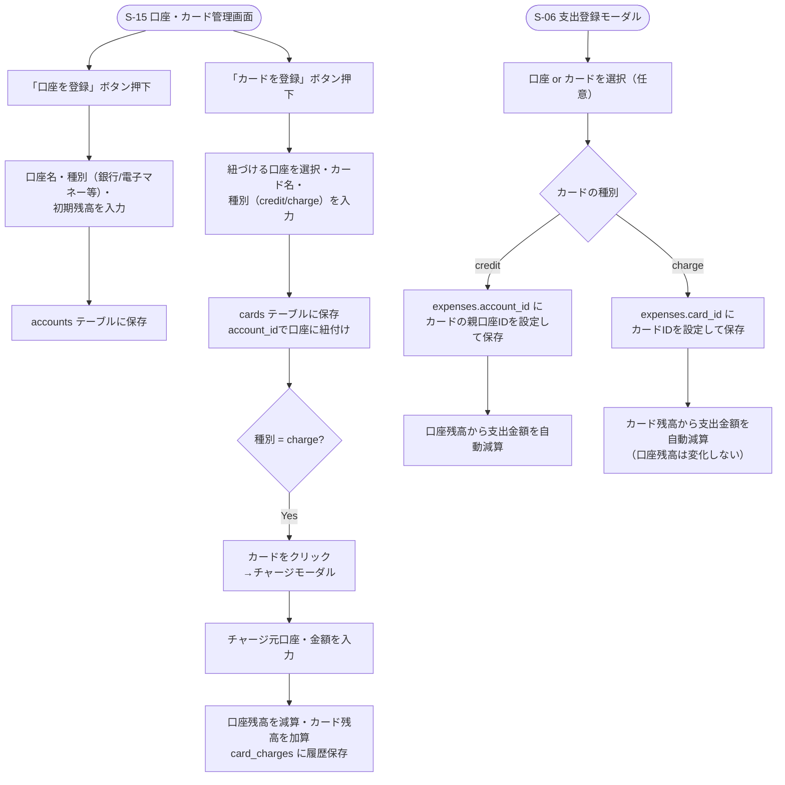

# F-11 口座・カード管理

[← 要件定義書に戻る](../../requirements.md)

---

## 1. 概要

銀行口座・PayPay等の電子マネーを「口座」として手動登録し、支出登録時にどの口座から出費したかを選択できるようにする。カードは口座に紐づく子エンティティとして扱い、以下2種別を持つ。

- **クレジットカード（`credit`）**：カード自体は残高を持たず、支払いは常に紐づく親口座から引き落とされる（従来仕様）。
- **チャージ型カード（`charge`）**：Suica等の電子マネーカードのように、カード自体が**独立した残高**を持つ。口座からチャージ（資金移動）することで残高が増え、支払いはカード自身の残高から減算される。

今回のスコープは手動登録のみとし、外部API連携（銀行・カード会社・Money Forward ME・PayPay等）は対象外とする（[common-notes.md](../common-notes.md) 7章参照）。

口座は**残高**を持ち、個人の財政管理に用いる。残高は所有者本人のみ閲覧可能（[common-notes.md](../common-notes.md) 2章：個人データの権限方針）で、当該口座を指定した支出を登録するたびに自動的に減算される。チャージ型カードの残高も同様に所有者本人のみ閲覧可能な個人財政情報として扱う。

## 2. 対象画面

| 画面ID | 画面名 |
| --- | --- |
| S-15 | 口座・カード管理画面 |
| S-06 | 支出登録モーダル（口座・カードの選択） |
| S-04 | トップ画面（「個人の財政」カードに自分の口座残高合計を表示） |

## 3. 業務フロー

```mermaid
flowchart TD
    A([S-15 口座・カード管理画面]) --> B["「口座を登録」ボタン押下"]
    B --> C[口座名・種別（銀行/電子マネー等）・\n初期残高を入力]
    C --> D[accounts テーブルに保存]

    A --> E["「カードを登録」ボタン押下"]
    E --> F[紐づける口座を選択・カード名・\n種別（credit/charge）を入力]
    F --> G[cards テーブルに保存\naccount_idで口座に紐付け]

    G --> L{"種別 = charge?"}
    L -->|Yes| M["カードをクリック\n→チャージモーダル"]
    M --> N[チャージ元口座・金額を入力]
    N --> O[口座残高を減算・カード残高を加算\ncard_charges に履歴保存]

    H([S-06 支出登録モーダル]) --> I[口座 or カードを選択（任意）]
    I --> P{"カードの種別"}
    P -->|credit| J[expenses.account_id に\nカードの親口座IDを設定して保存]
    J --> K[口座残高から支出金額を自動減算]
    P -->|charge| Q[expenses.card_id に\nカードIDを設定して保存]
    Q --> R[カード残高から支出金額を自動減算\n（口座残高は変化しない）]
```

## 4. IPO

### 口座登録

| 項目 | 内容 |
| --- | --- |
| 入力 | 口座名・種別（`bank`/`e_money`等）・初期残高 |
| 処理 | accounts テーブルに保存（owner_user_idはログインユーザー、balanceに初期残高を設定） |
| 出力 | 登録した口座 |

### カード登録

| 項目 | 内容 |
| --- | --- |
| 入力 | 紐づける口座ID・カード名・種別（`credit`/`charge`、既定は`credit`） |
| 処理 | cards テーブルに `account_id`・`card_type` を設定して保存（`charge`型は`balance`を0で初期化） |
| 出力 | 登録したカード |

種別は登録後に変更不可（`charge`型に残高が積まれた状態で`credit`型へ変更すると資金の扱いが不定になるため）。

### チャージ実行（charge型カードのみ）

| 項目 | 内容 |
| --- | --- |
| 入力 | 対象カードID・チャージ元口座ID・金額 |
| 処理 | チャージ元口座の残高からチャージ金額を減算し、対象カードの残高に加算する。`card_charges` テーブルに履歴として記録する（家計簿の支出・収入一覧とは別管理）。排他制御は口座→カードの順でロックを取得する |
| 出力 | 更新後の口座残高・カード残高、チャージ履歴 |

残高不足時の制御は設けない（5章の口座残高マイナス許容方針と同様）。

### 支出登録時の口座/カード選択

| 項目 | 内容 |
| --- | --- |
| 入力 | 支出情報・口座ID または カードID（任意） |
| 処理 | credit型カード or 口座直接指定の場合：expenses.account_id に設定して保存 → 選択された口座（カード選択時はカードの親口座）のbalanceから支出金額を自動減算。charge型カードの場合：expenses.card_id に設定して保存 → カード自身のbalanceから支出金額を自動減算（口座残高は変化しない） |
| 出力 | 口座/カードが紐付いた支出、更新後の口座またはカード残高 |

### 口座の取引履歴表示（S-15）

S-15 で口座名をクリックすると、その口座の取引履歴をモーダルで表示する。

| 項目 | 内容 |
| --- | --- |
| 入力 | 口座ID |
| 処理 | 口座の所有者本人のみ取得可能（他人の口座は404）。口座残高を増減させる次の3ソースを日付降順（同日は登録順の降順）で1つの一覧にまとめる：`expenses.account_id`（支出、出金）／`incomes.account_id`（収入、入金。現状は割り勘精算のみ）／`card_charges.from_account_id`（チャージ元、出金）。各行に「その取引直後の残高」を、現在残高から新しい取引順に符号付き差分を遡って再構成する（残高を動かすのはこの3ソースのみで、いずれも削除不可・口座編集は残高を変えないため正確に逆算できる） |
| 出力 | 現在残高、取引一覧（日付・内容・種別（支出/収入/チャージ）・金額（±）・取引後残高） |

## 5. 口座残高と個人財政管理

- 残高は口座の所有者（owner_user_id）本人のみが閲覧・登録・編集できる（他の世帯メンバーには表示しない）。在庫管理・献立表と異なり、口座・残高は世帯共有ではなく個人管理の情報として扱う。
- 支出登録時に口座/カードを選択すると、当該口座（またはchargeカード）の残高が支出金額分だけ自動的に減算される。残高が支出金額を下回りマイナスになる場合の制御は設けない（今後の検討事項）。
- 個人全体の財政状況を一目で確認できるよう、トップ画面（S-04）の「個人の財政」カードに自分が所有する口座の残高合計を表示する（[wireframes.md](../wireframes.md) S-04参照）。チャージ型カードの残高も口座からチャージされただけで個人資産であることに変わりないため、この合計に含める。

## 6. データ設計（関連テーブル）

[data-model.md](../data-model.md) の `accounts`, `cards`（`card_type`, `balance`列を含む）, `card_charges`, `expenses.account_id` / `expenses.card_id` を参照。

## 7. 今後の検討事項

- 外部API連携（Money Forward ME等の家計簿連携サービス経由でのカード・PayPay利用明細の自動取得）
  - 銀行・カード会社の公式APIは提携審査・契約が必要なケースが多く、個人開発では実現のハードルが高いため、まずは家計簿連携サービスのAPI活用を軸に検討する
- 口座の所有者（owner_user_id）以外の世帯メンバーが、その口座を使った支出を登録できるかどうかの権限整理
- 残高がマイナスになる場合の入力制御・警告表示の要否
- 口座残高の手動修正（実際の残高とのズレを補正する機能）の要否
- チャージ型カード自体の取引履歴（カードでの支出・チャージ入金）の一覧表示。口座側の取引履歴（4章）は実装済みだが、カード側は未対応
- チャージ履歴（`card_charges`）の一覧表示API・UI（今回は記録のみでUIは対象外）
- 口座間の直接振替（チャージ以外の資金移動）への拡張
