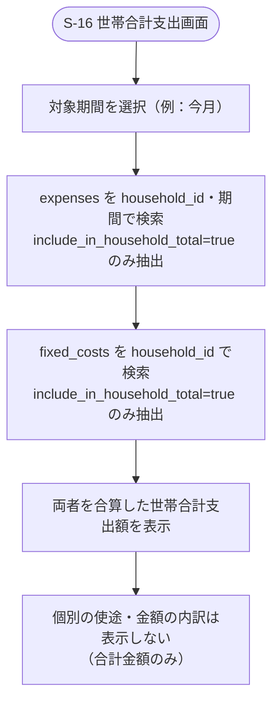

# F-12 世帯支出サマリー

[← 要件定義書に戻る](../../requirements.md)

---

## 1. 概要

世帯全体としてどれだけ支出があったかを、個人の支出内訳を非公開にしたまま合計金額のみで確認できるようにする機能（[common-notes.md](../common-notes.md) 8章参照）。世帯全体の合算家計簿（個別の支出管理）ではなく、あくまで集計値の閲覧に限定する。

## 2. 対象画面

| 画面ID | 画面名 |
| --- | --- |
| S-16 | 世帯合計支出画面 |

## 3. 業務フロー

## 4. IPO

### 世帯合計支出の取得

| 項目 | 内容 |
| --- | --- |
| 入力 | household_id・対象期間 |
| 処理 | expenses・fixed_costsのうち `include_in_household_total=true` のレコードを抽出しSUM(amount)を計算 |
| 出力 | 世帯合計支出額（内訳は含まない） |

## 5. データ設計（関連テーブル）

[data-model.md](../data-model.md) の `expenses.include_in_household_total`, `fixed_costs.include_in_household_total` を参照。

## 6. 今後の検討事項

- 対象期間の指定方法（月次固定か、期間を自由指定できるか）
- カテゴリー別など、内訳を出さない範囲での集計軸追加の要否
