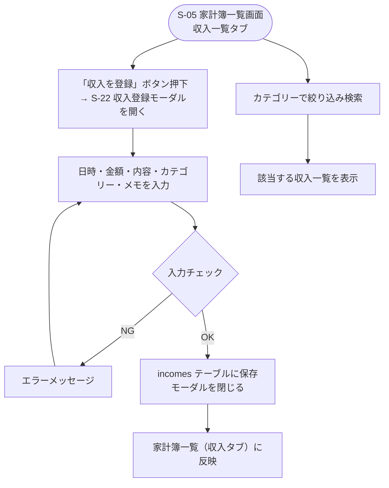

# F-13 個人収入管理

[← 要件定義書に戻る](../../requirements.md)

---

## 1. 概要

個人の収入（給与・ボーナス・副業収入等）を記録し、カテゴリー別に検索できる（[common-notes.md](../common-notes.md) 2章：本人のみ編集可能）。[F03_kakeibo_expense](F03_kakeibo_expense.md)（個人支出管理）と対になる機能で、トップ画面（S-04）の「収支」表示は収入合計－支出合計で算出する（[common-notes.md](../common-notes.md) 8章参照）。

世帯で管理したいのは「共同で行った買い物・イベント等の支出を割り勘・精算しやすくすること」「今月の共同支出の内訳を把握すること」であり、収入を世帯で合算・共有する必要はない。そのため収入は**純粋に個人管理**とし、支出のような世帯合計対象フラグ・世帯合計への算入の仕組みは持たない（[common-notes.md](../common-notes.md) 8章参照）。

## 2. 対象画面

| 画面ID | 画面名 |
| --- | --- |
| S-05 | 家計簿一覧画面（収入一覧タブ） |
| S-22 | 収入登録モーダル |
| S-23 | 家計簿カテゴリー管理画面 |

## 3. 業務フロー

## 4. IPO

### 収入登録

| 項目 | 内容 |
| --- | --- |
| 入力 | 日時（必須）・金額（必須）・内容（必須）・カテゴリー（必須）・メモ（任意） |
| 処理 | 入力チェック → incomes テーブルに保存 |
| 出力 | 登録した収入オブジェクト / エラーメッセージ |

### カテゴリー別検索

| 項目 | 内容 |
| --- | --- |
| 入力 | カテゴリーID |
| 処理 | incomes テーブルを category_id で検索 |
| 出力 | 該当する収入一覧 |

## 5. 入力チェック仕様

| 項目 | 必須 | 形式・制約 |
| --- | --- | --- |
| 日時 | ○ | 日付形式 |
| 金額 | ○ | 0より大きい整数 |
| 内容 | ○ | 1〜100文字 |
| カテゴリー | ○ | income_categories から選択 |
| メモ | — | 0〜255文字 |

## 6. 権限方針

支出（F-03）と同様、**本人のみ閲覧・編集可能**とする。他の世帯メンバーは個々の収入データを閲覧できない（[common-notes.md](../common-notes.md) 2章）。支払った人に相当する項目（＝収入を得た人）は本人固定とし、選択式にはしない（F-03の`payer_user_id`と同じ設計思想。他人を選択できてしまうと権限方針と矛盾するため）。

## 7. カテゴリーマスタ初期リスト

給与／ボーナス／副業／その他（[common-notes.md](../common-notes.md) 11章参照）

## 7-2. カテゴリー管理（追加・編集・削除）

S-05（家計簿一覧画面）ツールバーの「カテゴリー管理」リンクからS-23（家計簿カテゴリー管理画面）に遷移し、収入カテゴリーを自分で追加・編集・削除できる。

- 7章の初期リストは**デフォルトカテゴリー**として世帯単位で初回アクセス時に冪等シードされ、編集・削除できない。
- ユーザーは**カスタムカテゴリー**を追加できる。名前は1〜50文字必須。
- カスタムカテゴリーは編集（名前変更）・削除ができるが、既に収入（`incomes`）に紐づいて使用中のカテゴリーは削除できない（先に付け替えが必要）。
- API：`GET/POST/PATCH/DELETE /api/income-categories`（バックエンド実装済み。[api-design.md](../api-design.md)は現時点でMVPスコープのみを記載しているため、家計簿系エンドポイントは未追記）。

## 8. データ設計（関連テーブル）

[data-model.md](../data-model.md) の `incomes`, `income_categories` テーブルを参照。

## 9. 今後の検討事項

- 収入と口座（F-11）の紐付け（給与振込先口座への自動反映等）は今回のスコープ外
- 定期収入（毎月の給与等）の自動計上は今回のスコープ外（[F05_kakeibo_fixedcost](F05_kakeibo_fixedcost.md)の固定費のような自動計上の仕組みは持たない）
