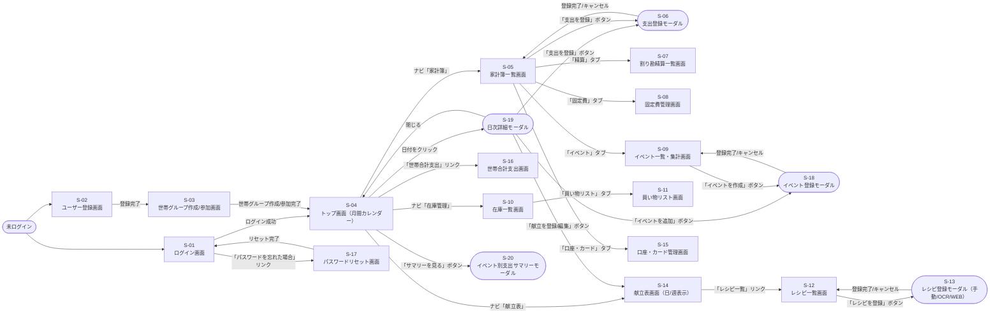

# 画面遷移図

[← 要件定義書に戻る](../requirements.md)

全画面のレイアウトは[wireframes.md](wireframes.md)を参照。

---

## 1. 全体の画面遷移

---

## 2. 画面一覧

| 画面ID | 種別 | 画面名 | 認証必要 | 詳細レイアウト |
| --- | --- | --- | --- | --- |
| S-01 | 画面 | ログイン画面 | 不要 | [wireframes.md](wireframes.md) 参照 |
| S-02 | 画面 | ユーザー登録画面 | 不要 | [wireframes.md](wireframes.md) 参照 |
| S-03 | 画面 | 世帯グループ作成/参加画面 | 必要 | [wireframes.md](wireframes.md) 参照 |
| S-04 | 画面 | トップ画面（月間カレンダー） | 必要 | [wireframes.md](wireframes.md) 参照 |
| S-05 | 画面 | 家計簿一覧画面 | 必要 | [wireframes.md](wireframes.md) 参照 |
| S-06 | モーダル | 支出登録モーダル | 必要 | [wireframes.md](wireframes.md) 参照 |
| S-07 | 画面 | 割り勘精算一覧画面 | 必要 | [wireframes.md](wireframes.md) 参照 |
| S-08 | 画面 | 固定費管理画面 | 必要 | [wireframes.md](wireframes.md) 参照 |
| S-09 | 画面 | イベント一覧・集計画面 | 必要 | [wireframes.md](wireframes.md) 参照 |
| S-10 | 画面 | 在庫一覧画面 | 必要 | [wireframes.md](wireframes.md) 参照 |
| S-11 | 画面 | 買い物リスト画面 | 必要 | [wireframes.md](wireframes.md) 参照 |
| S-12 | 画面 | レシピ一覧画面 | 必要 | [wireframes.md](wireframes.md) 参照 |
| S-13 | モーダル | レシピ登録モーダル | 必要 | [wireframes.md](wireframes.md) 参照 |
| S-14 | 画面 | 献立表画面（日/週表示） | 必要 | [wireframes.md](wireframes.md) 参照 |
| S-15 | 画面 | 口座・カード管理画面 | 必要 | [wireframes.md](wireframes.md) 参照 |
| S-16 | 画面 | 世帯合計支出画面 | 必要 | [wireframes.md](wireframes.md) 参照 |
| S-17 | 画面 | パスワードリセット画面 | 不要 | [wireframes.md](wireframes.md) 参照 |
| S-18 | モーダル | イベント登録モーダル | 必要 | [wireframes.md](wireframes.md) 参照 |
| S-19 | モーダル | 日次詳細モーダル | 必要 | [wireframes.md](wireframes.md) 参照 |
| S-20 | モーダル | イベント別支出サマリーモーダル | 必要 | [wireframes.md](wireframes.md) 参照 |
