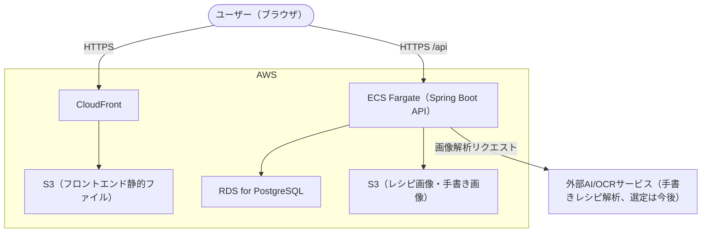

# システム構成図

[← 要件定義書に戻る](../requirements.md)

技術スタックの詳細は [技術スタック.md](../技術スタック.md) を参照。ここではAWS上の構成を図解する。

---

## 1. AWS構成図（想定）

---

## 2. IaC

Terraformで上記AWSリソース一式（ECS/RDS/S3/CloudFront）をコード管理する（詳細は[技術スタック.md](../技術スタック.md)参照）。

## 3. 運用フェーズによる構成の違い

| フェーズ | 構成 |
| --- | --- |
| 初期（家族利用） | 無料利用枠を最大限活用（RDS db.t3.micro等）。小規模構成 |
| 全国展開後 | ECS/RDSのスケールアップ、マルチAZ化等を再設計（詳細は今後） |
