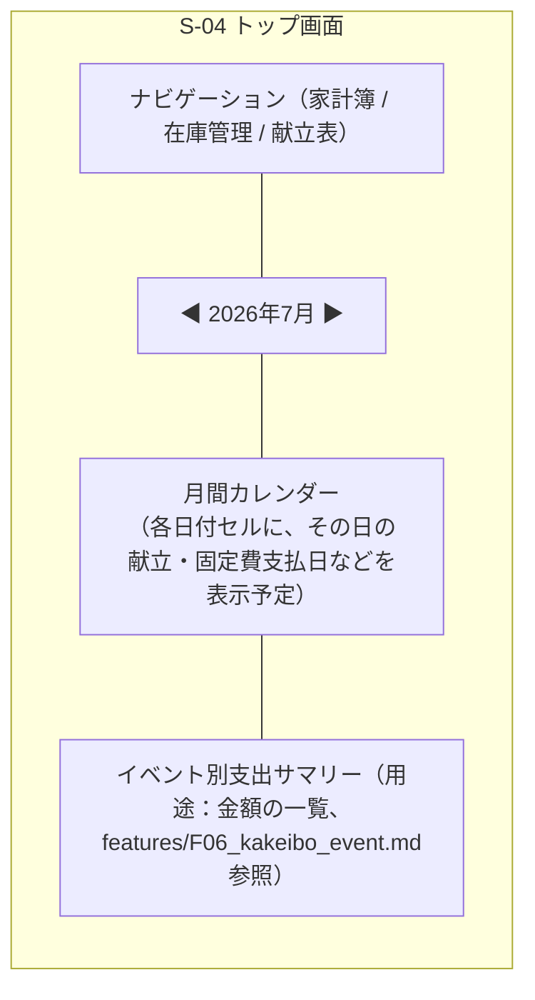

# ワイヤーフレーム

[← 要件定義書に戻る](../requirements.md)

現時点で具体化しているのは **S-04 トップ画面** のみ。他画面は今後の詳細検討時に追加する。

---

## S-04 トップ画面（月間カレンダー）

ログイン後の最初の画面。月間カレンダーを表示するイメージ。

- カレンダーの各日付セルに何を表示するか（献立の有無、固定費の支払日、支出額など）は未定。今後の詳細検討事項とする。
- イベント別支出サマリーの表示位置・形式も未定。

## その他の画面

S-01〜S-03, S-05〜S-14 のワイヤーフレームは未作成。[screen-transitions.md](screen-transitions.md) の画面一覧を参照し、各機能の詳細検討時に順次追加する。
