# ワイヤーフレーム

[← 要件定義書に戻る](../requirements.md)

S-01〜S-21の全画面について、要件定義段階の骨組みレベルでワイヤーフレームをまとめる。実際のUIデザイン（配色・フォント・詳細CSS）の決定前段階の「叩き台」として、ASCIIアート風のレイアウト図で画面内の要素配置・サイズ感を示し、補足としてMermaidのブロック図（要素の関係性）も併記する。各画面の項目は対応する[機能別要件定義書](../requirements.md#5-機能要件)の内容に基づく。

---

## S-01 ログイン画面

対応: [F01_auth](features/F01_auth.md)

```text
┌─────────────────────────────────┐
│            HomeLog              │
│                                  │
│  メールアドレス                  │
│  [_____________________________]│
│                                  │
│  パスワード                      │
│  [_____________________________]│
│                                  │
│          [   ログイン   ]        │
│                                  │
│  パスワードを忘れた場合          │
│  新規登録はこちら                │
└─────────────────────────────────┘
```

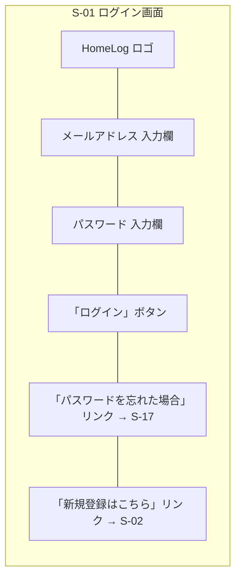

---

## S-02 ユーザー登録画面

対応: [F01_auth](features/F01_auth.md)

```text
┌─────────────────────────────────┐
│           新規登録               │
│                                  │
│  メールアドレス                  │
│  [_____________________________]│
│                                  │
│  パスワード                      │
│  [_____________________________]│
│                                  │
│  表示名                          │
│  [_____________________________]│
│                                  │
│          [  登録する  ]          │
│                                  │
│  ログインはこちら                │
└─────────────────────────────────┘
```

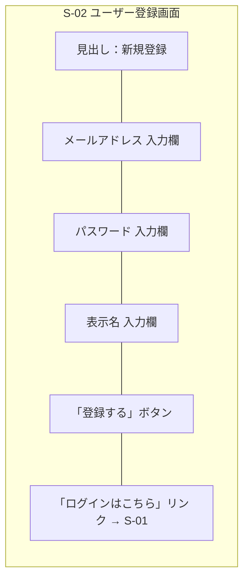

---

## S-03 世帯グループ作成/参加画面

対応: [F02_household](features/F02_household.md)

```text
┌─────────────────────────────────┐
│         世帯グループ             │
├───────────────┬─────────────────┤
│   新規作成     │   既存に参加    │
│               │                 │
│ 世帯グループ名  │  招待コード      │
│ [___________] │  [___________]  │
│               │                 │
│ [ 作成する ]   │  [ 参加する ]   │
└───────────────┴─────────────────┘
```

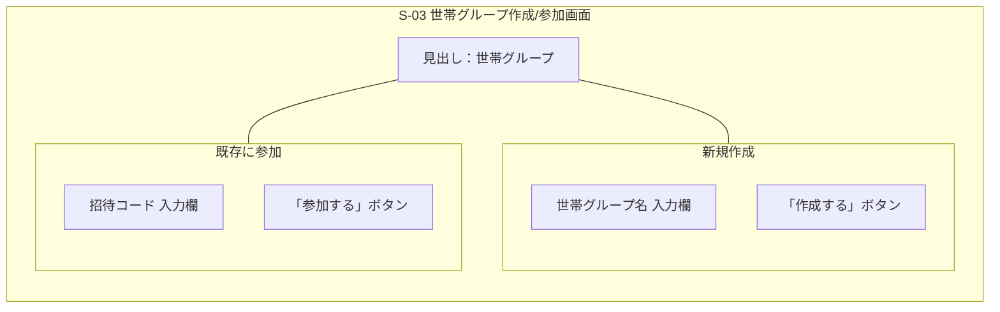

---

## S-04 トップ画面（生活ダッシュボード＋カレンダー）

対応: [F06_kakeibo_event](features/F06_kakeibo_event.md), [F12_kakeibo_household_summary](features/F12_kakeibo_household_summary.md), [F07_zaiko_inventory](features/F07_zaiko_inventory.md), [F08_zaiko_shoppinglist](features/F08_zaiko_shoppinglist.md), [F10_kondate_menu](features/F10_kondate_menu.md)

確認系の情報（今日の状況・今月のお金・買い物/在庫）を画面遷移なしで把握できる「生活ダッシュボード」として再定義する（[common-notes.md](common-notes.md) 9章の方針）。旧S-16（世帯合計支出画面）・旧S-20（イベント別支出サマリーモーダル）はここに統合し廃止した。

左サイドバーに確認系カードを縦に並べ、右側のメインエリアに月間カレンダーを大きく表示する2カラム構成とする。

```text
┌──────────────────────────────────────────────┐
│ [家計簿] [在庫管理] [献立表] [設定]        🔔2  │
├───────────────────┬──────────────────────────┤
│ ■ 今日の状況（7/10）│      ◀   2026年 7月   ▶   │
│  収支: -500円       ├────┬────┬────┬────┬────┬────┬────┤
│  今週の献立:カレー他 │ 日 │ 月 │ 火 │ 水 │ 木 │ 金 │ 土 │
│  イベント: 📌学習    ├────┼────┼────┼────┼────┼────┼────┤
├───────────────────┤    │    │  1 │  2 │  3 │  4 │  5 │
│ ■ 今月のお金        │    │    │    │    │📌学習│    │    │
│  個人支出:32,000円   │    │    │    │    │-500円│    │+0円│
│  世帯合計対象額:     ├────┼────┼────┼────┼────┼────┼────┤
│   45,300円          │  6 │  7 │  8 │  9 │ 10 │ 11 │ 12 │
│  未精算 受取予定:    │    │    │    │    │📌学習│    │🎉父の日│
│   1件・4,000円       │-1,200│-300│+0円│+0円│-500円│+0円│-3,000│
│  未精算 支払予定:    │  円 │ 円 │    │    │  円 │    │  円  │
│   1件・4,500円       ├────┴────┴────┴────┴────┴────┴────┤
│  イベント別支出      │（各セル：固定費支払日・             │
│  [今年▼]:            │ イベント名・その日の収支を表示予定。  │
│   父の日3,000円      │ 📌=繰り返しイベント。              │
├───────────────────┤ 日付クリックで日次詳細）            │
│ ■ 個人の財政         │                                    │
│  口座残高合計:       │                                    │
│   126,200円          │                                    │
│  （本人のみ表示）     │                                    │
├───────────────────┤                                    │
│ ■ 買い物・在庫       │                                    │
│  買い物リスト:3件     │                                    │
│  在庫不足:2件         │                                    │
│  よく使う品目:        │                                    │
│   卵・牛乳・醤油      │                                    │
└───────────────────┴──────────────────────────┘
```

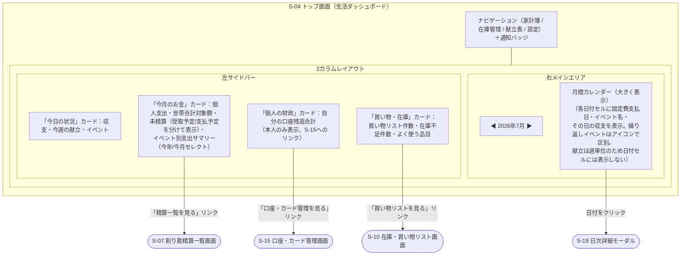

- カレンダーの各日付セルの具体的な情報密度・アイコンデザインは未定。今後の詳細検討事項とする。
- 通知バッジは、通知有効な繰り返しイベントの当日発生件数を表示するイメージ。
- 「今月のお金」カード内のイベント別支出サマリーのみ、**期間セレクト（今年／今月、デフォルト今年）**を持つ。他の項目（個人支出・世帯合計対象額・未精算）は今月固定。
- 未精算は「受取予定（自分が立て替えて相手から貰う分）」と「支払予定（自分が負担して相手に払う分）」を分けて表示する。
- 「個人の財政」カードは自分が所有する口座の残高合計を表示する。口座残高は本人のみ閲覧可能のため、このカードの内容もログインユーザー自身の情報のみで構成される（[common-notes.md](common-notes.md) 2章、[F11_kakeibo_account](features/F11_kakeibo_account.md)参照）。
- イベント別支出サマリーには全イベントではなく、**表示対象として選択したイベント（`show_on_dashboard` = true）のみ**を表示する。ON/OFFはS-18登録モーダル・S-09イベント一覧で切り替える（[F06_kakeibo_event](features/F06_kakeibo_event.md) 4章参照）。
- イベント別支出サマリーは、表示対象の件数が多い場合は上位数件＋「もっと見る」等の表示に将来対応する（今後の検討事項）。
- 各カードの数値・リンク先は、対応する各機能画面の情報をそのまま参照する（新たな計算ロジックは持たない）。
- どのカード（今日の状況／今月のお金／個人の財政／買い物・在庫／カレンダー）を表示するかに加え、カード内の項目単位（例：今日の状況の中の収支・今週の献立・イベント）でも、設定画面（S-21）でユーザーごとに表示を選択できる。全カードを非表示にした場合は設定画面への案内を表示する。

---

## S-05 家計簿一覧画面

対応: [F03_kakeibo_expense](features/F03_kakeibo_expense.md), [F04_kakeibo_warikan](features/F04_kakeibo_warikan.md)（未精算サマリー）, [F05_kakeibo_fixedcost](features/F05_kakeibo_fixedcost.md)（固定費予定サマリー）, [F06_kakeibo_event](features/F06_kakeibo_event.md)（イベント支出サマリー）, [F12_kakeibo_household_summary](features/F12_kakeibo_household_summary.md)（世帯合計対象額サマリー）

```text
┌──────────────────────────────────────────────┐
│ 今月支出:32,000円 世帯合計対象額:45,300円        │
│ 未精算 受取:4,000円/支払:4,500円  固定費予定:89,200円 イベント支出[今年▼]:15,000円│
├──────────────────────────────────────────────┤
│ [支出一覧] [精算] [固定費] [イベント] [口座]   │
├──────────────────────────────────────────────┤
│ カテゴリー: [ すべて ▼ ]      [ 支出を登録 ]  │
├────────┬────────┬────────┬──────┬────────────┤
│ 日時    │ 用途    │ カテゴリー│ 金額  │ 支払った人 │
├────────┼────────┼────────┼──────┼────────────┤
│ 7/01   │ スーパー│ 食費     │1,200円│ 自分       │
│ 7/03   │ 電気代  │ 光熱費   │8,000円│ パートナー │
└────────┴────────┴────────┴──────┴────────────┘
```

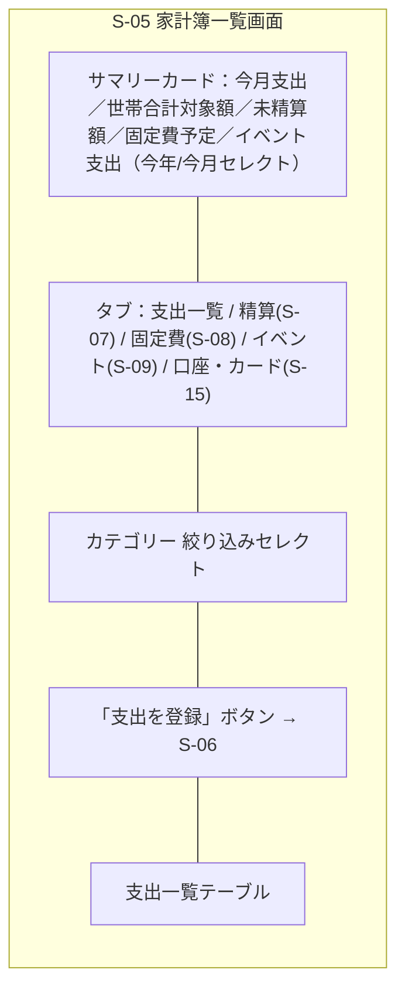

支出一覧テーブルの列例：

| 日時 | 使用用途 | カテゴリー | 金額 | 支払った人 | 口座 | メモ |
| --- | --- | --- | --- | --- | --- | --- |

---

## S-06 支出登録モーダル

対応: [F03_kakeibo_expense](features/F03_kakeibo_expense.md), [F04_kakeibo_warikan](features/F04_kakeibo_warikan.md), [F06_kakeibo_event](features/F06_kakeibo_event.md), [F11_kakeibo_account](features/F11_kakeibo_account.md)

```text
┌─────────────────────────────────┐
│        支出を登録                │
│ 日時       [__________]          │
│ 金額       [__________]          │
│ 使用用途   [__________]          │
│ カテゴリー [________▼]           │
│ 支払った人 [________▼]           │
│ 口座/カード[________▼]（任意）    │
│ イベント [＋イベント登録]         │
│           [________▼]（任意）    │
│  ※選択するとデフォルト金額を     │
│    金額欄へ自動入力（上書き可）   │
│  ※「＋イベント登録」でS-18を     │
│    重ねて開き、保存すると新イベント│
│    が選択状態になる（入力値は保持）│
│ □ 世帯合計に含める                │
│ メモ       [__________]（任意）   │
│ ── 割り勘設定（任意） ──          │
│ 対象者: [________▼]              │
│ 入力方法: (●)％ ( )金額           │
│ 負担割合: [50]% : [50]%          │
│  ※「金額」選択時は各自の負担額を  │
│    円で直接入力（合計＝支出金額）  │
│                                  │
│     [ 保存 ]    [ キャンセル ]    │
└─────────────────────────────────┘
```

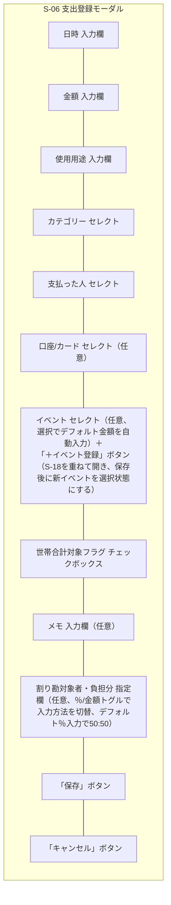

---

## S-07 割り勘精算一覧画面

対応: [F04_kakeibo_warikan](features/F04_kakeibo_warikan.md)

```text
┌──────────────────────────────────────────────┐
│           [ 世帯内 ] [ 世帯外 ]               │
├─────────────┬──────┬──────┬──────┬───────────┤
│ 支出内容      │ 相手  │ 割合  │ 金額  │ ステータス │
├─────────────┼──────┼──────┼──────┼───────────┤
│ スーパー買い物 │ 太郎  │ 50%  │2,500円│[請求][受領申請]│
│ 電気代        │ 花子  │ 50%  │4,000円│受領承認待ち[承認]│
│ 旅行代        │ 花子  │ 30%  │6,000円│ 保留中     │
└─────────────┴──────┴──────┴──────┴───────────┘
（立て替えた側：「請求」「受領申請」／負担者側：「承認」「保留」。
　精算済みにするには負担者の「承認」が必要）
```

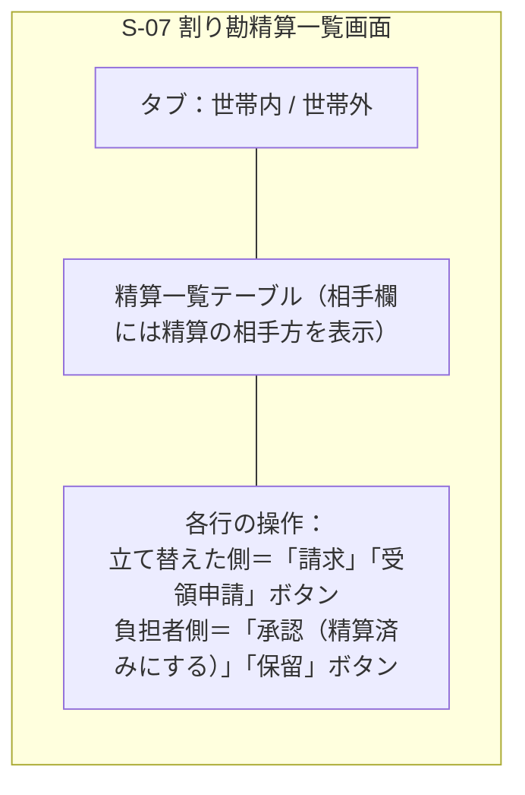

精算一覧テーブルの列例：

| 支出内容 | 相手 | 負担割合 | 負担額 | ステータス（unpaid/requested/approval_requested/pending/settled） |
| --- | --- | --- | --- | --- |

---

## S-08 固定費管理画面

対応: [F05_kakeibo_fixedcost](features/F05_kakeibo_fixedcost.md)

```text
┌──────────────────────────────────────────────┐
│ [ 固定費を登録 ] ← 固定費登録モーダルを開く    │
├──────────┬────────┬────────┬──────┬──────┬────────┤
│ 固定費名   │ 金額    │ 支払日  │ 公開  │世帯合計│ 割り勘  │
├──────────┼────────┼────────┼──────┼──────┼────────┤
│ 家賃      │80,000円 │ 27日   │世帯共有│ ○    │花子 50% │
│ 個人サブスク│1,200円 │ 5日    │個人   │ ×    │なし     │
└──────────┴────────┴────────┴──────┴──────┴────────┘
（公開範囲が「個人」の固定費は登録者本人にのみ表示される）

┌─ 固定費登録モーダル ─────────────┐
│ 固定費名 [___________▼ or 入力]   │
│ 金額     [___________]           │
│ 支払日   [___________]           │
│ 公開範囲 (●世帯共有 ○個人)        │
│ □ 世帯合計に含める                │
│ ── 割り勘設定（任意） ──          │
│ 入力方法: (●)％ ( )金額           │
│ 対象者と負担分（S-06と同一UI）     │
│  ※毎月の自動計上時にこの割合で    │
│    精算（expense_splits）を生成   │
│     [ 保存 ]    [ キャンセル ]    │
└─────────────────────────────────┘
```

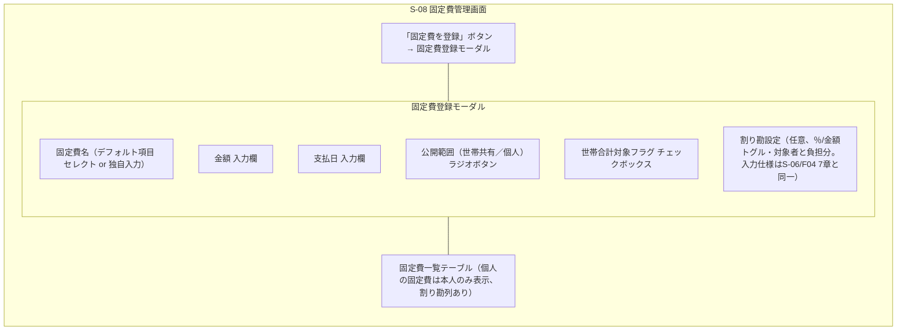

固定費一覧テーブルの列例：

| 固定費名 | 金額 | 支払日 | 公開範囲 | 世帯合計対象 | 割り勘 |
| --- | --- | --- | --- | --- | --- |

---

## S-09 イベント一覧・集計画面

対応: [F06_kakeibo_event](features/F06_kakeibo_event.md)

```text
┌──────────────────────────────────────────────┐
│ [ イベントを作成 ]                            │
├──────────────┬─────────────────────┬──────────┬─────────┤
│ イベント名     │ 日付/繰り返し・時間帯 │ 合計金額  │ DB表示  │
├──────────────┼─────────────────────┼──────────┼─────────┤
│ 父の日         │ 6/21（単発）終日      │ 3,000円  │ ☑      │
│ 学習           │ 毎日 🔔 20:00〜21:00 │ -        │ ☐      │
└──────────────┴─────────────────────┴──────────┴─────────┘
※ DB表示＝ダッシュボード表示（トップ画面のイベント別支出サマリーに表示するかのトグル）
※ 時間帯は終日イベントなら「終日」、時刻指定なら「20:00〜21:00」「9:00〜」（終了未定）と表示
```

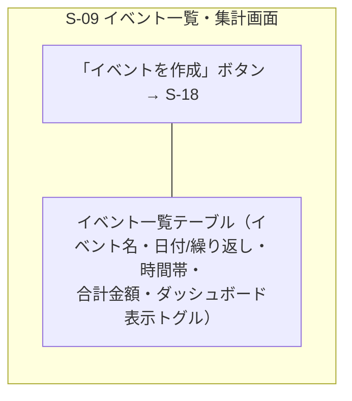

---

## S-10 在庫・買い物リスト画面

対応: [F07_zaiko_inventory](features/F07_zaiko_inventory.md), [F08_zaiko_shoppinglist](features/F08_zaiko_shoppinglist.md)

在庫管理と買い物リストは密連携するため、PCでは左右パネルで同時表示し、画面遷移せずに両方確認できるようにする（[common-notes.md](common-notes.md) 9章）。モバイル幅ではタブ切り替えにフォールバックする。

```text
┌──────────────────────────────┬───────────────────────────────┐
│ 在庫一覧          [ 在庫を登録 ]│ 買い物リスト  [ 品目を手動追加 ] │
│ カテゴリー/店舗マスタ管理        │ 並び替え: [あいうえお順▼]        │
├────────┬──────┬──────────┬────┤├────────┬──────┬───────────┬───┤
│ 品名    │カテゴリ│在庫個数    │閾値 ││ 品名    │購入済│購入個数     │削除│
├────────┼──────┼──────────┼────┤├────────┼──────┼───────────┼───┤
│ 牛乳    │乳製品 │[－]1.0[＋]│0.5 ││ 卵      │ □   │[－] 0 [＋] │ ✕ │
│ 卵      │卵     │[－]0.0[＋]│1.0 ││ 牛乳    │ ☑   │[－] 1 [＋] │ ✕ │
│        │      │(1/0.1切替) │    │├────────┴──────┴───────────┴───┤
│        │      │            │    ││          [ 更新 ]              │
└────────┴──────┴──────────┴────┘└───────────────────────────────┘
   （モバイル幅では [在庫一覧] [買い物リスト] タブに切り替え表示）
```

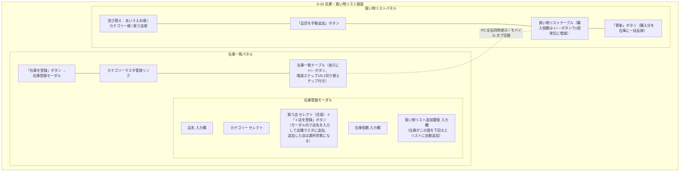

在庫一覧テーブルの列例：

| 品名 | カテゴリー | 買う店 | 在庫個数（－/＋ボタン、ステップ1 or 0.1切り替え） | 閾値 |
| --- | --- | --- | --- | --- |

買い物リストテーブルの列例：

| 品名 | カテゴリー | 買う店 | 購入済みチェック | 購入個数（－/＋ボタン、1個単位） | 手動削除ボタン |
| --- | --- | --- | --- | --- | --- |

---

## S-12 レシピ一覧画面

対応: [F09_kondate_recipe](features/F09_kondate_recipe.md)

```text
┌──────────────────────────────────────────────┐
│   [ すべて ] [ お気に入り ]   [ レシピを登録 ] │
├──────────────┬──────────────┬─────────────────┤
│ [サムネイル]   │ [サムネイル]   │ [サムネイル]     │
│ カレー ★      │ 肉じゃが       │ パスタ ★        │
└──────────────┴──────────────┴─────────────────┘
```

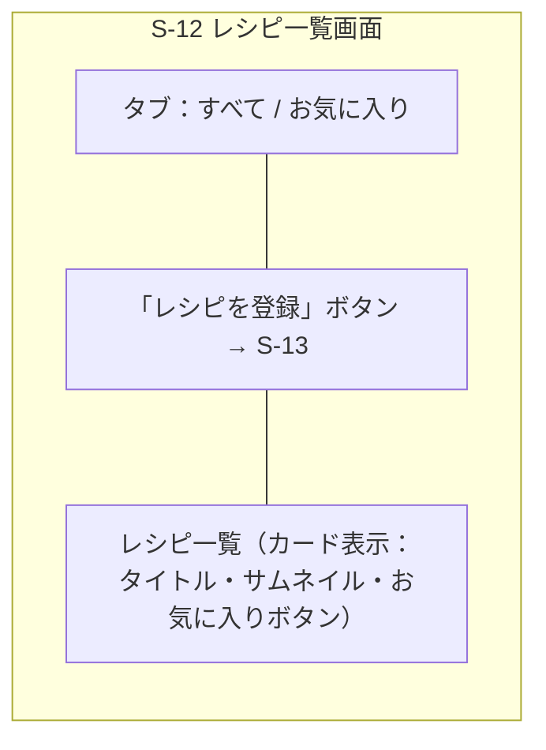

---

## S-13 レシピ登録モーダル

対応: [F09_kondate_recipe](features/F09_kondate_recipe.md)

```text
┌─────────────────────────────────┐
│ [手動] [手書き画像解析] [WEBレシピ]│
├─────────────────────────────────┤
│ タイトル [_______________]       │
│ 材料     [_______________]       │
│ 手順     [_______________]       │
│                                  │
│      [ 登録する ]   [ キャンセル ]│
└─────────────────────────────────┘
```

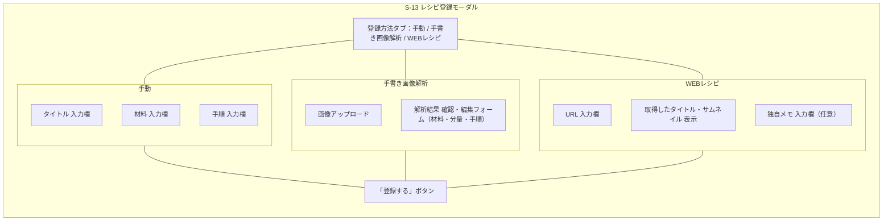

---

## S-14 献立表画面（週単位の作りたい料理リスト）

対応: [F10_kondate_menu](features/F10_kondate_menu.md)

献立は「その週に作りたい料理」のリストとして登録する。曜日への割り当ては行わない。献立を考える際に画面遷移せず登録できるよう、レシピ選択サイドパネル（PC）／下部ドロワー（モバイル）を常設する（[common-notes.md](common-notes.md) 9章）。

```text
┌────────────────────────────────┬─────────────────┐
│ [◀前週] 7/6〜7/12 の献立 [次週▶] │ レシピ選択 [＋レシピ登録]│
├────────────────────────────────┤ [検索_________]  │
│ 🍽 カレー              [削除]   │ ── 最近使った ──│
│ 🍽 肉じゃが            [削除]   │ ・肉じゃが        │
│ 🍽 魚料理（メモ）       [削除]   │ ・パスタ         │
├────────────────────────────────┤ ── お気に入り ──│
│ [自由メモで追加______] [メモを追加]│ ・カレー ★       │
│                                  │ ・肉じゃが ★      │
│ ※レシピ選択パネルをクリックすると │ （クリックすると   │
│   この週のリストに追加される      │  週のリストに追加）│
└────────────────────────────────┴─────────────────┘
　（モバイル幅ではレシピ選択パネルは下部ドロワーとして開閉）
```

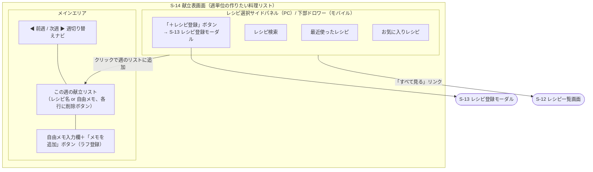

---

## S-15 口座・カード管理画面

対応: [F11_kakeibo_account](features/F11_kakeibo_account.md)

```text
┌──────────────────────────────────────────────┐
│ [ 口座を登録 ]        [ カードを登録 ]        │
├──────────────────────────────────────────────┤
│ ▼ ○○銀行（bank）　　残高: 123,000円           │
│     └ ○○カード                                │
│ ▼ PayPay（e_money）　残高: 3,200円             │
└──────────────────────────────────────────────┘
（残高は本人のみ表示。支出登録で当該口座を選択すると自動的に減算される）
```

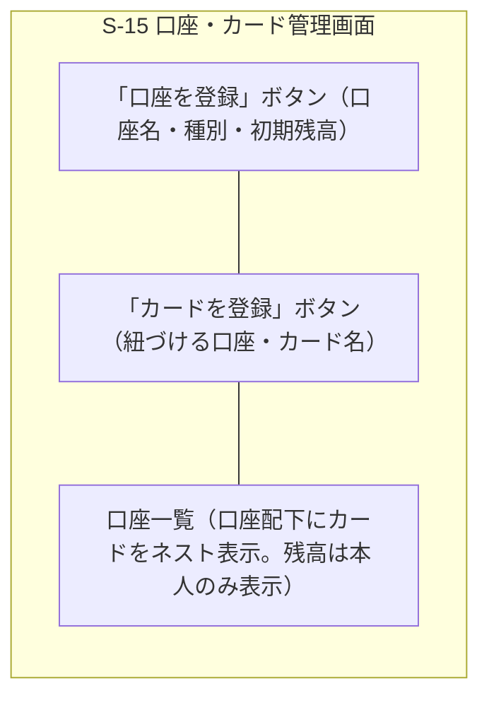

---

## S-17 パスワードリセット画面

対応: [F01_auth](features/F01_auth.md)

```text
┌─────────────────────────────────┐
│ Step1: メールアドレス            │
│  [_____________________________]│
│           [ 送信する ]           │
├─────────────────────────────────┤
│ Step2（メール内リンク遷移後）    │
│  新しいパスワード                │
│  [_____________________________]│
│           [ 変更する ]           │
└─────────────────────────────────┘
```

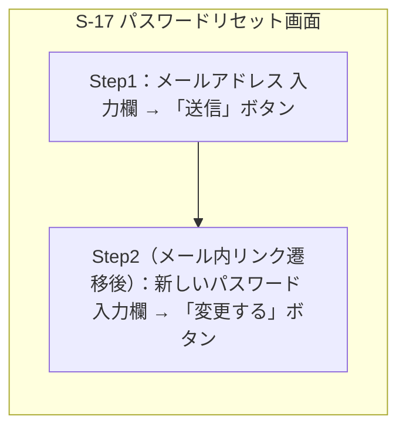

---

## S-18 イベント登録モーダル

対応: [F06_kakeibo_event](features/F06_kakeibo_event.md)

```text
┌─────────────────────────────────┐
│         イベントを登録           │
│ イベント名 [_____________]       │
│ 日付       [_____________]       │
│ ☑ 終日（デフォルトON）           │
│  開始時刻 [__:__] 終了時刻 [__:__]│
│  ※終日OFF時のみ表示。開始は必須、│
│   終了は任意（終了未定を許容）    │
│ 繰り返し   [なし▼]               │
│  （なし/毎日/毎週/毎月/毎年）    │
│ □ アプリ内通知を有効にする        │
│ デフォルト金額（任意）[________] │
│  ※支出登録時に金額欄へ自動入力  │
│ ☑ トップ画面のイベント別支出に   │
│   表示する（デフォルトON）        │
│ 公開範囲 (●世帯共有 ○個人)       │
│  ※個人は自分にのみ表示           │
│                                  │
│      [ 保存 ]    [ キャンセル ]  │
└─────────────────────────────────┘
```

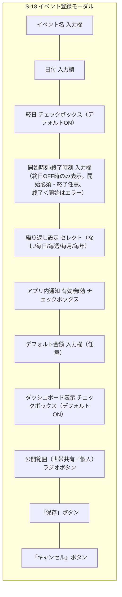

---

## S-19 日次詳細モーダル

対応: [F06_kakeibo_event](features/F06_kakeibo_event.md), [F03_kakeibo_expense](features/F03_kakeibo_expense.md), [F10_kondate_menu](features/F10_kondate_menu.md)

トップ画面（S-04）で日付をクリックすると開くハブモーダル。その日の詳細確認と、支出・イベント・献立の追加をまとめて行える。

```text
┌─────────────────────────────────┐
│         2026年7月10日            │
├─────────────────────────────────┤
│ 収支：－500円                     │
│                                  │
│ ▼ 支出一覧                       │
│  ・スーパー買い物  1,200円         │
│                    [ 支出を登録 ]│
│                                  │
│ ▼ イベント                       │
│  ・📌学習（毎日）20:00〜21:00     │
│                    [ イベントを追加 ]│
│                                  │
│ ▼ この週の献立                    │
│  ・カレー、魚料理（メモ）          │
│                [ この週の献立を編集 ]│
├─────────────────────────────────┤
│              [ 閉じる ]          │
└─────────────────────────────────┘
```

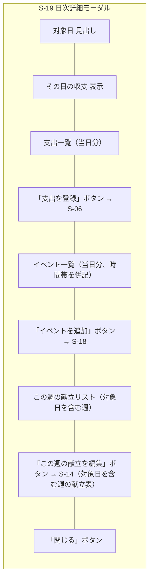

---

## S-21 設定画面

対応: 機能横断（ダッシュボード表示カスタマイズ）。表示設定は `user_settings` テーブル（[data-model.md](data-model.md)参照）にユーザーごとに保存する。

```text
┌─────────────────────────────────┐
│ 設定                             │
│                                  │
│ ■ ダッシュボードに表示する項目    │
│  ☑ 今日の状況                    │
│     ☑ 収支                       │
│     ☑ 今週の献立                 │
│     ☑ イベント                   │
│  ☑ 今月のお金                    │
│     ☑ 個人支出                   │
│     ☑ 世帯合計対象額             │
│     ☑ 未精算（受取・支払）        │
│     ☑ イベント別支出             │
│  ☑ 個人の財政                    │
│  ☑ 買い物・在庫                  │
│     ☑ 買い物リスト件数           │
│     ☑ 在庫不足件数               │
│     ☑ よく使う品目               │
│  ☑ カレンダー                    │
│     ☑ イベント                   │
│     ☑ 日次収支                   │
│                                  │
│            [ 保存 ]              │
└─────────────────────────────────┘
```

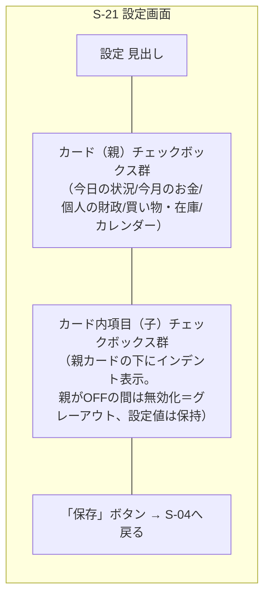

- ヘッダーナビゲーションの「設定」リンクから遷移する。
- 表示設定は「カード（親）」と「カード内項目（子）」の2階層で選択できる（`user_settings.dashboard_settings`、[data-model.md](data-model.md)参照）。
  - 親チェックOFF → カードごと非表示（子の設定値は保持され、親を再度ONにすると復元される）。
  - 子チェックOFF → カード内の該当行のみ非表示。
  - カレンダーの子項目は、日付セル内に表示する要素（イベント／日次収支）を制御する。日付とクリック（日次詳細モーダル）は常に有効。献立は週単位のため日付セルには表示しない。
  - 「個人の財政」は表示項目が1つ（口座残高合計）のため子項目を持たない。
- 設定はユーザーごとに保存され、他の世帯メンバーには影響しない。
- デフォルトは全カード・全項目表示。
